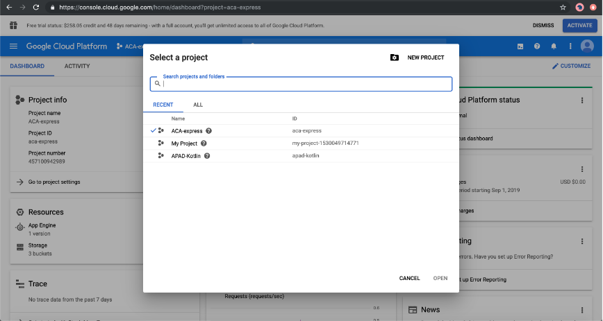

# App Deployment

*Happiness is a butterfly, which when pursued, is always just beyond your grasp, but which, if you will sit down quietly, may alight upon you. —Nathaniel Hawthorne*

## Recap

In JS311 we deployed Express apps to Google App Engine. We are going to do something very similar for our React apps. This pre-homework will show you how to combine your frontend and your backend into one working app.

## Overview

We learned in the last class why deploying our apps is a necessity. We want everyone on the internet to be able to access what we've created right? Now we also want to combine our frontend and backends and have both projects from JS311 and JS411 working in tandem.

## Deploying with GCP

Basically what we are going to do is make use of the knowledge we gained last time about what the build process does in `create-react-app`, and combine that with Express's `use.static` functionality to serve the built files.

We've created a [simple repo](https://github.com/AustinCodingAcademy/gcloud-express) for you to get started with. Let's practice these steps and then you will practice again by combining your app with your project from JS311.

- [ ] Clone the following [express repo](https://github.com/AustinCodingAcademy/gcloud-express)
- [ ] Copy your entire folder from your current React app into the `gcloud-express/` folder and rename the app: `client/`

> Hint: You might want to delete the `node_modules/` folder inside of your React app to make the copying quicker

- [ ] Navigate to the new `client/` folder inside of `gcloud-express/`
- [ ] If you removed the `node_modules/` folder you will want to re-install the dependencies by running `npm i` in the `client/` folder. After that's done, run `npm run build` to generate the static files.
- [ ] Now run `npm start` inside of `gcloud-express/` and you should see your app running in the browser
- [ ] The setup is complete and now it's time to deploy your application:

First, let's create a new project under the GCloud account that we set up in JS311. To do that, click on the project button as shown.


It will display a modal that looks like this:



- [ ] Click "New Project" in the upper right-hand corner and name the project `ACA-express`. If you have any trouble with that name try adding a random number after it.

- [ ] Once the project has been created there's only one thing left to do. Go to the terminal where the `gcloud-express` repo is and run the command `gcloud app deploy . --project=aca-express`.

  > Important: If you added a random number after your project name you will want to add it to this command as well

- [ ] If this is the first time you are running the command you will be asked to specify a region. Choose "us-east-1" which should be number 13. Then continue the upload process.

- [ ] Navigate to the dashboard page of "App Engine" (you can search for App Engine on the main Google Cloud page) and find your app's url. For example, `aca-express.appspot.com`. Open the app and you should see your project running.

 for creating a new project and then specify that project id in the `gcloud app deploy` command.

## Working with APIs

During your time at ACA you've learned how to use fetch and also axios to make API requests. At some point, you probably already tried to hit your JS311 APIs from your JS411 React app, but if you didn't we'll talk about it.

Prior to combining the two apps, if you wanted to hit your API from JS311 you needed the full gcloud url of that app engine project. It may have looked something like this: `my-project.appspot.com`. So if you wanted to hit an API you created to get users for example you would do a fetch like this:

=== "Example API Request"

    ```javascript
    fetch('https://my-project.appspot.com/users')
        .then(res => res.json())
        .then(data => {
            // do something with users data
        })
    ```

  > Note: You may not have a `users` endpoint, that was just an example

The only change here is that when the two Apps are combined, so you no longer need the whole URL and can simply run:

=== "Example API Request in same folder"

    ```javascript
    fetch('/users')
      .then(res => res.json())
      .then(data => {
          // do something with users data
    })
    ```

Since the frontend and backend are being served from the same place, Express knows how to handle this. The only situation that could arise is if you named a route the same thing in Express and React Router. For example if you had a page called `/users` on the frontend. Try to avoid that situation by calling it `/listusers` or something like that.

After this you should be good to go! If you have any issues deploying your app talk to the instructor. The hardest part is making sure your app runs locally. If it runs locally, deployment is fairly simple.

<!-- ! Video Contents: Vimeo, Clayton@ACA - TITLE - 411.1.1.* -->
<iframe src="https://player.vimeo.com/video/*" width="655" height="368"  frameborder="0" allow="autoplay; fullscreen" allowfullscreen></iframe>

## Practice It

We are going to follow the previous steps to include our React projects into our apps from JS311. There will be a couple small changes.

- [ ] Follow the previous steps to copy your JS411 React app into your JS311 Express app
- [ ] You will need to make two changes to your JS311 project.
- [ ] Include `app.use(express.static('./client/build'))` in the `express/index.js` file
- [ ] Add `"homepage": "."` to your JS311 `package.json` file
- [ ] Now run `npm start` in your JS311 project and it should serve up your React app just like last time. If so it's time to deploy.
- [ ] If you want to override/update your JS311 project with these changes you can simply run `gcloud app deploy` . which will upload to your default project. If you want it in a different project, follow the previous steps

## Additional Resources

We normally provided you with a link to the official documentation of any subject we teach in the pre-homework, but today we'll leave with you with a number of resources that may help you build your Capstone Project or other apps in your future.

- [ ] **[Migrate to AWS, a Cheaper Deployment Strategy for Students](https://www.notion.so/Connect-MySQL-workbench-to-AWS-RDS-Free-tier-a95068f5d6b84383ac0af2fd7bfe15f6)** - GCP is usually cheaper to get started with but you may soon lose credits. As an alternative one of our instructors, Matt Huntsberry, as put together a tutorial to help you host with AWS when your GCP credits run out.
- [ ] [Typography](https://femmebot.github.io/google-type/) - Seriously, if you have no eye for design but care that your app is beautiful you may want to use this site for some ideas and code.
- [ ] [Atomic Design](https://bradfrost.com/blog/post/atomic-web-design/) - When designing your app I hope you came across this website but if not here it is. A full idea of designing an application, atomically!
- [ ] [Front-End Design Checklist](https://codeburst.io/the-front-end-design-checklist-4dd15828fad) - Maybe you came across this too in your google-ing. Nonetheless, it is a rad resource for any developer of any experience.
- [ ] [API First Development](https://konghq.com/blog/three-ways-api-first-development-is-the-future-of-web) - Think your backend is less important? Think again.
- [ ] [Building with Angular Material Tutorial](https://auth0.com/blog/creating-beautiful-apps-with-angular-material/) - a clean crisp guide to Angular intricacies.
- [ ] [Front-End Designs](https://www.toptal.com/front-end/front-end-design-principles) - If you care about design and want to know more...
- [ ] [Google.io](https://auth0.com/blog/creating-beautiful-apps-with-angular-material/) - Shadow DOM, HTML Templates - Want to know more about the DOM and Shadow DOM? Ask google.
- [Planning a Front-End JavaScript Application](https://www.telerik.com/blogs/planning-front-end-javascript-application) - JavaScript is awesome and older developers are stupid. Make sure you get the real scoop on what JS can do and how you should approach it.
- [ ] [Human JavaScript](http://read.humanjavascript.com/ch00-foreword.html) - For your time after graduation when you're looking to get stronger in your skills. Get to reading this book!
- [ ] [Dispelling Bullshit](http://pragmatic-backbone.com/overview-and-bullshit-dispelling) - Angular, React, Backbone, Ember, Vue, it doesn't matter. Build and learn how to build well and you will do well!
