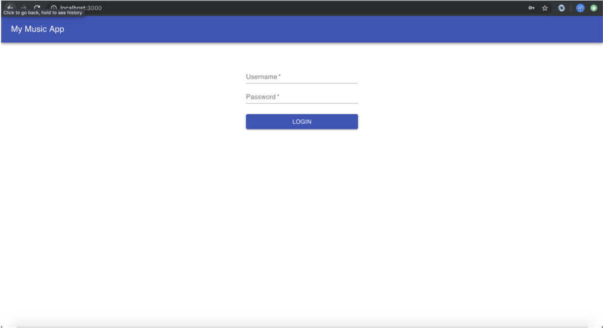
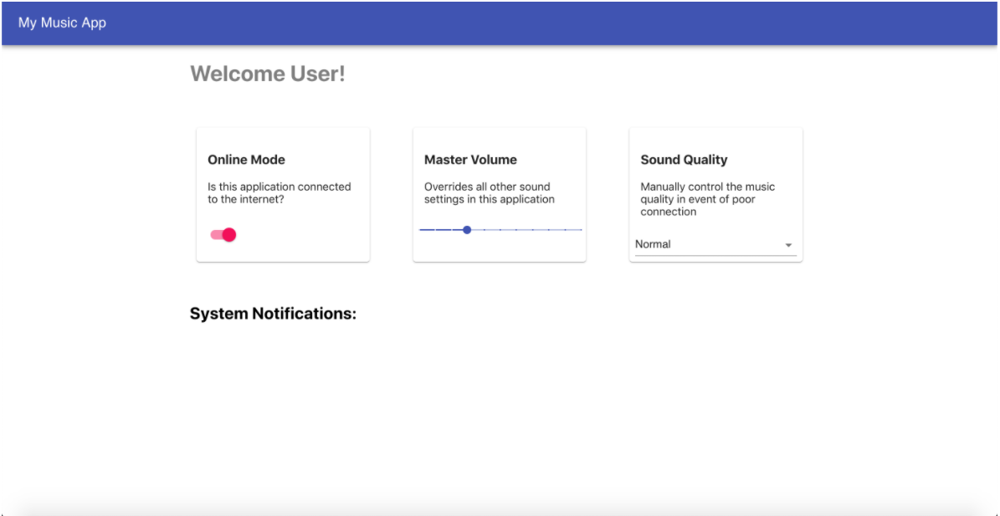

# Class 5: Music App pt 1 of 2

<!-- ! HIDE FROM STUDENT; INSTRUCTOR ONLY CONTENT -->
<!-- ## Instructor Only Content - HIDE FROM STUDENTS -->
<!-- ## BUILD CONFIDENCE!
 
You may not know it now, but confidence is by far the most important concept you will teach. It doesn’t matter if your students never remember the syntax to link a CSS file to an HTML file, if they come out of your class more confident than they came in you will have served them well! With confidence, students will be able to step into their application from the entry point to final return statement and work through any bug along the way. 

*Solve a bug for a student and they’ll code for a day. Teach them how to debug and they’ll code for life.*

 
- [ ] Set them up for success. Don’t challenge them too much at the beginning. They have plenty of time to learn everything you know and more, but when they’re just starting out you have to give them smaller challenges that build confidence so that they’re ready for the next challenge to conquer and go again for the next, and the next.

- [ ] Socratic Method. Encourage your students’ confidence growth by answering their questions with another question that provokes them to problem-solve. Give the clues that will lead them to realize the solution in their own mind. 

- [ ] Congratulate them! When they do find the solution you can congratulate them & give them a high-five! This emotional transfer acts like glue to set firmly the confidence gained in finding the solution.

- [ ] Use building blocks. When the students are met with a new challenge they don’t understand, think back to previous challenges that are similar or are a part of the new challenge. Use these pieces to build an understanding in the students so that you can light a path toward the solution rather than show them the solution.

In summary, our students must learn so much in such a short amount of time that the best education we can offer them is to learn how to think critically rather than to memorize syntax and aimlessly poke around at code. Teach them to program and they’ll eat for life. -->
<!-- ! END INSTRUCTOR ONLY CONTENT -->

*Once we believe in ourselves, we can risk curiosity, wonder, spontaneous delight, or any experience that reveals the human spirit. —E. E. Cummings*

## Greet, Outline, and Objectify

<!-- SMART: Specific, Measurable, Attainable, Relevant, and Timely. -->
<!-- https://examples.yourdictionary.com/well-written-examples-of-learning-objectives.html -->
  
*OBJECTIVE: Today the student will learn and practice to understand:*

* *Programming in a group*
* *Using React LifeCycle Methods*
* *Using styled components with Material UI*

*****

- [ ] Questions for Student-Led Discussion
- [ ] Interview Challenge
- [ ] Student Presentations
- [ ] Creation Time
    * [ ] `create-react-app` + repo + `git init` + `add origin`
    * [ ] Begin building a Music Client for next Checkpoint
- [ ] Push Yourself Further
<!-- - [ ] Interview Questions: Blog to Show You Know -->
- [ ] Exit Recap, Attendance, and Reminders

### Questions for Student-Led Discussion, 15 mins
<!-- This section should be structured with the 5E model: https://lesley.edu/article/empowering-students-the-5e-model-explained -->

[Questions to prompt discussion](./../additionalResources/questionsForDiscussion/qfd-class-5.md)

### Interview Challenge, 15 mins
<!-- The last two E happen here: elaborate and evaluate  -->
<!-- this sections should have a challenge that can be solved with the skills they've learned since their last class. -->
<!-- ! HIDDEN CONTENT: INSTRUCTOR ONLY -->
[See Your Challenge Here](./../additionalResources/interviewChallenges.md)
<!-- ! END HIDDEN CONTENT: INSTRUCTOR ONLY -->

### Student Presentations, 15 mins

[See Student Presentations List](./../additionalResources/studentPresentations.md)

## Creation Time, 60-90 mins

This week we will build our first application from scratch. It will be a music app with a few simple operations. During this process we will make use of **state**, **props**, **lifecycle methods**, **forms** and **styling with Material UI** to create a login screen and dashboard that interacts with user controls.

You will have both class days this week to complete the project and upload your GitHub URL to the assignment submission. Keep in mind that with this project, the goal is to use our existing knowledge of React to build something that looks very similar to the example images below. Unlike some homework assignments where the exact steps are laid out, this project is intentionally vague in some places. It's to get you to learn how to look up things and implement the right resources. That being said, hints will be given in various sections. Do your best and have fun!

=== "Example One"

    

=== "Example Two"

    

### Project Instructions

#### Setup

- [ ] You should have Create React App installed. If you don't, please do that now by running the following command in your terminal/command prompt: `npm i -g create-react-app`.

  > NOTE: No need to do this after Node 12, instead use npx (see below)

- [ ] We will be working from scratch so you will need to create your own GitHub repository for this project and call it `JS411-my-music-app`. Do that now.

#### Project Work

##### 1. Initializing

- [ ] Navigate to a directory of your choosing (wherever you want your project to be) and run the command `npx create-react-app my-music-app`.

- [ ] A new folder called `my-music-app` should have been created.

- [ ] Once your project(`my-music-app`) is created (with npx create-react-app using your terminal) you can navigate to that directory and run the commands `git init` and `git remote add origin <YOUR_GIT_REPOSITORY_URL>` to connect your local application to your remote repository.

- [ ] Now run `npm start` to see the default `create-react-app` code running.

- [ ] Additionally, install Material UI in this folder: [`npm i @material-ui/core`](https://www.npmjs.com/package/@material-ui/core).

##### 2. Login Screen

Next, you will want to get rid of the default contents inside of App.js of create-react-app and replace them with the login screen. From the examples, the first thing you are probably noticing is the navigation bar.

  > HINT: You can find the [App Bar Component](https://material-ui.com/components/app-bar/) on the Material UI page. There are examples for integrating it.

You will also want the `Button` and `TextField` components from Material UI. Search the site to find examples of those. If you want to add additional styling to these components, simply add the CSS to the App.css file for now. You can add a className on Material UI components just like you can with any other component.

  > HINT: Add a property called `loggedIn` to your `state` that has a Boolean value. It should be set to `false` as the default. When you click the button to login, set that variable to `true`. You will probably want to do some conditional rendering here to show the login screen if the user is not logged in or show something else otherwise. As a refresher...conditional rendering with a ternary operator looks like this:

=== "a Ternary Example"

    ```javascript
      render() {
        return this.state.loggedIn ? <Dashboard /> : (
          // the code for your login screen
        )
      }
    ```

=== "a Regular If/Else Example"

    ```javascript
      render() {
        if (this.state.loggedIn) {
          return <Dashboard />
        } else {
          return (
            // the code for your login screen
          )
        }
      }
    ```

As a final note for the login session, you can make both the username and password fields required but don't worry about any other validation here. You can put whatever you want in those fields, click 'login' and it will work. We can learn more about true authentication in later weeks.

##### 3. Components Folder

Make a folder called `components/` inside your `src/` folder to hold any other components you wish to make in the future. You will need at least one more for the dashboard page.

##### 4. Dashboard Component

Make a component called `Dashboard.js` inside the `components/` folder. You will want to create this component and then import it back into `App.js` to be conditionally rendered based on `login` like in the examples above. For now feel free to render something simple in this component like `<p>testing</p>` to see if it's working.

  > HINT: If you noticed that you lost the nav bar when you navigated to this component then it makes sense because it was probably hardcoded in the App.js file. Find a way to break it out into its own component (maybe NavBar.js) and wrap App component with it so that it always shows up.

Inside `Dashboard.js` you will want to create three cards; the `Card` component, as well as, its accompanying `CardContent` and `CardActions` can be found by looking in [Material UI docs](https://material-ui.com/components/cards/).

  > HINT: You might choose to use `flexbox` (or `grid`) to evenly space these three cards across the dashboard.

##### 5. Card 1 - Online Mode

This card will need access to the [Switch Component](https://material-ui.com/components/switches/). Think about setting a variable in state called `online` and having it be a Boolean value to represent the online status. When the switch is clicked, make sure the state gets updated: `false` to `true`.

##### 6. Card 2 - Master Volume

This card will need access to the [Slider Component](https://material-ui.com/components/slider/). Think about setting a variable in state called `volume` and having it be a number like `20`. When the slider is changed, update the state with the correct volume.

  > HINT: Set your volume on a scale of `0` to `100` with steps of `10` at a time.

##### 7. Card 3 - Sound Quality

This card will need access to the [Select Component](https://material-ui.com/components/selects/). Think about setting a variable in state called "quality" and having it be a number of 1, 2 or 3, representing "Low", "Normal" or "High" quality. When the select box is changed make sure the state gets updated.

##### 8. System Notifications

Create a state variable in the Dashboard component called `notifications` and make it an empty array. When any other piece of state changes (`online`, `volume`, `quality`) update the notifications array with the corresponding messages. Here are the rules to follow:

  - [ ] If the online status is "false" add the message `Your application is offline. You won't be able to share or stream music to other devices.`
  - [ ] If the volume exceeds 80, add the message `Listening to music at a high volume could cause long-term hearing loss.`
  - [ ] If the sound quality is changed to low, add the message `Music quality is degraded. Increase quality if your connection allows it.`

  > HINT: Consider using the `componentDidUpdate` lifecycle method so that you know whenever the component state has changed. You can access the previous state with the prevState variable. More information on this: [React `componentDidUpdate()`](https://reactjs.org/docs/react-component.html#componentdidupdate).

Make sure to map through these notifications and display them underneath a "System Notifications" heading.

> Remember: you also have next class to work on this. Start reading the next pre-homework to understand more about lifecycle methods.

## Exit Recap, Attendance, and Reminders, 5 mins

- [ ] Create Music App Assignment
- [ ] Prepare for next by completing all of your pre-class lessons
- [ ] Complete the feedback survey

<!-- <iframe id="openedx-zollege" src="https://openedx.zollege.com/feedback" style="width: 100%; height: 500px; border: 0">Browser not compatible.</iframe>
<script src="https://openedx.zollege.com/assets/index.js" type="application/javascript"></script> -->


<!-- TODO Create 3 question exit questions -->

<!-- TODO INSERT Student Feedback From -->

<!-- TODO INSERT *HIDDEN* Instructor Feedback Form -->

<!-- 
height/width = 1.777 ---- width="655" height="368"
cp workspace/resources/classOutlineTemplate.md docs/module-
 -->