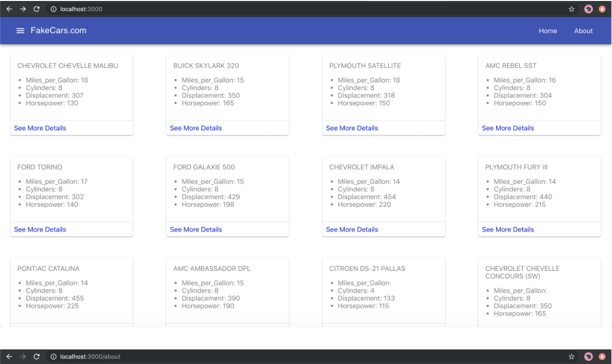
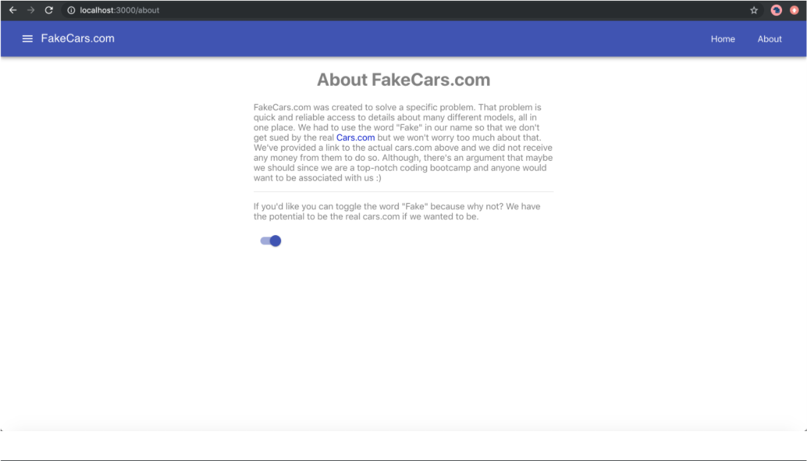
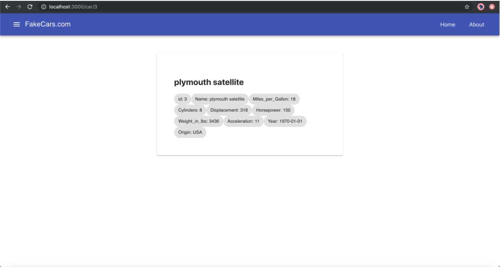

# Class 7: Fake Car Dashboard

<!-- ! HIDE FROM STUDENT; INSTRUCTOR ONLY CONTENT -->
<!-- ## Instructor Only Content - HIDE FROM STUDENTS -->
<!-- 

## KNOW YOUR STUDENT. KNOW THE CONTEXT.

Learning doesn’t happen in a vacuum. It’s progressively built on top of fundamental understandings over time and with effort. It can also be crafted to plan for future understandings. It’s all about context.

Obviously, your students will know more on Day 10 than they know on day 1 but the fact remains they still have a context for what they’re learning on Day 1. That context may be Object-Oriented Design or it may only be knowing how to search on Google, either way when you know their previous understandings you can relate it to what they’re currently learning and build upon their current knowledge.

In the beginning, relating programming concepts to your students can be challenging but a surefire way not to relate to their current understanding is to not ask them what they know. Learning about what their past careers are, what their hobbies are, their previous experiences, and what they know about programming so far will give you tools to use to help them understand the lesson.

- [ ] Get to Know Your Students

- [ ] Follow the Icebreaker Activity on Day 1 of 101

- [ ] Bring in a new “Meet & Greet” activity

- [ ] Read their blogs!

- [ ] Pay attention to their presentations

- [ ] Talk with your students before and after class. -->
<!-- ! END INSTRUCTOR ONLY CONTENT -->

*If you are working on something that you really care about, you don’t have to be pushed. The vision pulls you. —Steve Jobs*

## Greet, Outline, and Objectify

<!-- SMART: Specific, Measurable, Attainable, Relevant, and Timely. -->
<!-- https://examples.yourdictionary.com/well-written-examples-of-learning-objectives.html -->
  
*OBJECTIVE: Today the student will learn and practice to understand:*

* *client-side routing of a web app with React Router*
* *the NPM package React-Router with its dependencies and structure*

*****

- [ ] Questions for Student-Led Discussion
- [ ] Interview Challenge
- [ ] Student Presentations
- [ ] Creation Time
    * [ ] Get specs laid out
    * [ ] Fork & Clone [411_wk4_day1_react_router repository](https://github.com/AustinCodingAcademy/411_wk4_day1_react_router)
- [ ] Push Yourself Further
<!-- - [ ] Interview Questions: Blog to Show You Know -->
- [ ] Exit Recap, Attendance, and Reminders

### Questions for Student-Led Discussion, 15 mins
<!-- This section should be structured with the 5E model: https://lesley.edu/article/empowering-students-the-5e-model-explained -->

[Questions to prompt discussion](./../additionalResources/questionsForDiscussion/qfd-class-7.md)

### Interview Challenge, 15 mins
<!-- The last two E happen here: elaborate and evaluate  -->
<!-- this sections should have a challenge that can be solved with the skills they've learned since their last class. -->
<!-- ! HIDDEN CONTENT: INSTRUCTOR ONLY -->
[See Your Challenge Here](./../additionalResources/interviewChallenges.md)
<!-- ! END HIDDEN CONTENT: INSTRUCTOR ONLY -->

### Student Presentations, 15 mins

[See Student Presentations List](./../additionalResources/studentPresentations.md)

## Creation Time, 60-90 mins

Today we are going to practice what we learned last night about React Router. Below are some screenshots of a simple website for cars. We will finish this website by:

- [ ] adding routing with React Router,
- [ ] building a component for the cars detail page,
- [ ] and finally routing to the new component.

Take a look at the images below and notice the URLs in them. Apparently our web designers want these specific URLs for these components.

=== "FakeCars Image One"

    

=== "FakeCars Image Two"

    

=== "FakeCars Image Three"

    

### Project Instructions

Fork and clone the following [411_wk4_day1_react_router repository](https://github.com/AustinCodingAcademy/411_wk4_day1_react_router).

Follow the directions in the readme to complete the project and upload the link to your GitHub repository to Zollege. The project directions are also summed up below:

- [ ] Two components have already been created for you, `Home` & `About`.

- [ ] Look for the `Router.js` file under the `src/` folder. This file is basically empty besides a couple imports. You need to create a functional component called   in this file. It will return a `Switch` component that wraps two `Route`s. The routes should look like the following:
    * "/" -> Home
    * "/about" -> About

- [ ] Now we are going to take this `Router` and import it into `App.js`. Place it right underneath the `Navigation` component. You will need to `import BrowserRouter from "react-router-dom"` and use it to wrap both the `Navigation` and the `Router` components.

- [ ] If you were successful you should see a homepage with a lot of different car details on it. You should also be able to add `/about` to the end of the url to see the about page. Typing this path in the browser will soon get tiring so let's add them to the `Navigation` component as `<Link>`s. There are two commented areas for you to add Links. Create one `Link` to the `Home` page and one to the `About` page. If you forget how to do that, reference the [documentation here](https://reacttraining.com/react-router/web/api/Link) or look back at your pre-class lessons.

- [ ] Next we want to fill out the `Car` component in `src/Car.js` but first we will need to be able to see it and Link to it. Inside of `Router.js` import the `Car` component and create a route for it. The path should be able to accept an `id` for the specific car as well. For example: `/car/:id`.

  > NOTE: We didn't quite cover this last night but when you write `cars/:id` the router is looking for a specific number that corresponds with an item in the database, i.e. `/cars/6850`

- [ ] Once that is complete, go to the Home component and look for the comment regarding the "a tag". Change that to a Link component and have the `to` property be: `/car/${car.id}`. You can leave the text, `"See More Details"` the same.

  > Notice how you are routed to the `Car` component when you click on the `Link`. Try clicking on different cars. Do you notice that the `id` is different each time?

- [ ] Now that we can navigate to the `Car` component we want to fill out this page so that it looks nice and provides details about the specific car we passed in. To get the specific car, we need to access the `id` property from the path. We can do that by accessing it from props with: `props.match.params.id`. Note that if you would have called the parameter, `id`, something different in the router, say *"carId"*, then that would change how we access it here as well (`params.carId`). Before the return statement, create a variable called `id` and assign it the result from `props`.

- [ ] Now that we have the specific id, we need to find the car in the list that matches that id. You should know how to find items in an array by now so go ahead and find the specific car. Hint: the cars are in the "cars" variable at the top of the file.

- [ ] Create the `Car` component so that it looks like the last image above. To do that, `import` the material-ui components as specified at the top of the file. You will use the [material-ui documentation](https://material-ui.com/) to figure out how to style this page.

- [ ] Follow-up Video: [YT, Ben Awad - React Router v4 Tutorial](https://youtu.be/l9eyot_IXLY)

### Push Yourself Further

Follow along with [this tutorial](https://auth0.com/blog/react-router-4-practical-tutorial/) from Auth0. Keep in mind that they do things a little differently but it's good to know different ways to write routers.

## Student Feedback

<iframe src="https://docs.google.com/forms/d/e/1FAIpQLScjuL10i2xFGMWRwkjtgAL8F1Y5ipMPPjtTCDzkO1ZBcxUYZA/viewform?embedded=true" width="640" height="500" frameborder="0" marginheight="0" marginwidth="0">Loading…</iframe>

## Exit Recap, Attendance, and Reminders, 5 mins

- [ ] Prepare for next by completing all of your pre-class lessons
- [ ] Complete the feedback survey

<!-- <iframe id="openedx-zollege" src="https://openedx.zollege.com/feedback" style="width: 100%; height: 500px; border: 0">Browser not compatible.</iframe>
 -->

<!-- TODO Create 3 question exit questions -->

<!-- TODO INSERT Student Feedback From -->

<!-- TODO INSERT *HIDDEN* Instructor Feedback Form -->

<!-- 
height/width = 1.777 ---- width="655" height="368"
cp workspace/resources/classOutlineTemplate.md docs/module-
 -->