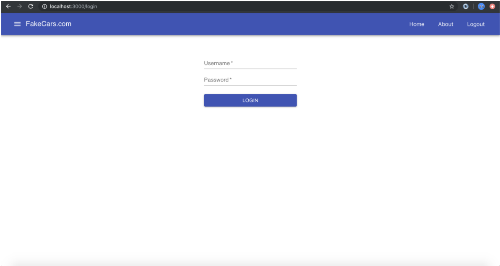

# Class 8: Protected Routes

<!-- ! HIDE FROM STUDENT; INSTRUCTOR ONLY CONTENT -->
<!-- ## Instructor Only Content - HIDE FROM STUDENTS -->
<!-- cp workspace/resources/classOutlineTemplate.md docs/module- -->
<!-- ! END INSTRUCTOR ONLY CONTENT -->

*It is always the simple that produces the marvelous. —Amelia Barr*

## Greet, Outline, and Objectify

<!-- SMART: Specific, Measurable, Attainable, Relevant, and Timely. -->
<!-- https://examples.yourdictionary.com/well-written-examples-of-learning-objectives.html -->
  
*OBJECTIVE: Today the student will learn and practice to understand:*

* *Using Boolean logic to allow a user access to specific components*
* *Setting cookies in the user's browser*

*****

- [ ] Questions for Student-Led Discussion
- [ ] Interview Challenge
- [ ] Student Presentations
- [ ] Creation Time
    * [ ] Fork and Clone the [411_wk4_day2_protected_routes](https://github.com/AustinCodingAcademy/411_wk4_day2_protected_routes) repo
    * [ ] Follow the instructions in the README to complete then turn in.
- [ ] Push Yourself Further
<!-- - [ ] Interview Questions: Blog to Show You Know -->
- [ ] Exit Recap, Attendance, and Reminders

### Questions for Student-Led Discussion, 15 mins
<!-- This section should be structured with the 5E model: https://lesley.edu/article/empowering-students-the-5e-model-explained -->

[Questions to prompt discussion](./../additionalResources/questionsForDiscussion/qfd-class-8.md)

### Interview Challenge, 15 mins
<!-- The last two E happen here: elaborate and evaluate  -->
<!-- this sections should have a challenge that can be solved with the skills they've learned since their last class. -->
<!-- ! HIDDEN CONTENT: INSTRUCTOR ONLY -->
[See Your Challenge Here](./../additionalResources/interviewChallenges.md)
<!-- ! END HIDDEN CONTENT: INSTRUCTOR ONLY -->

### Student Presentations, 15 mins

[See Student Presentations List](./../additionalResources/studentPresentations.md)

## Creation Time, 60-90 mins

Today we are going to practice what we learned about Protected Routes. We will create a login page, set cookies, and build protected routes to provide a more reliable login experience for the users of the cars application we worked on before.

- [ ] Fork and clone the following repository: [411_wk4_day2_protected_routes](https://github.com/AustinCodingAcademy/411_wk4_day2_protected_routes).
- [ ] Follow the directions in the README.md to complete the project.
`git status`, `add`, `commit`, `push` to your forked repo.
- [ ] Turn in the link of your forked repo.

- [ ] Follow-up Video: [YT, FreeCodeCamp.org - cookies vs sessionStorage](https://youtu.be/AwicscsvGLg)

### Push Yourself Further

- [ ] Read this [insanely cool article](https://www.netlify.com/blog/2017/01/19/setting-cookies-in-react/) on how one developer at Netlify used cookies to solve an on-boarding problem.

## Student Feedback

<iframe src="https://docs.google.com/forms/d/e/1FAIpQLScjuL10i2xFGMWRwkjtgAL8F1Y5ipMPPjtTCDzkO1ZBcxUYZA/viewform?embedded=true" width="640" height="500" frameborder="0" marginheight="0" marginwidth="0">Loading…</iframe>

## Blogs to Show You Know

[Blog Prompts](./../additionalResources/blogPrompts.md)

## Exit Recap, Attendance, and Reminders, 5 mins

- [ ] Create FakeCar-Login Assignment
- [ ] Create Class 8 Blog Assignment
- [ ] Prepare for next by completing all of your pre-class lessons
- [ ] Complete the feedback survey

<!-- <iframe id="openedx-zollege" src="https://openedx.zollege.com/feedback" style="width: 100%; height: 500px; border: 0">Browser not compatible.</iframe>
 -->

<!-- TODO Create 3 question exit questions -->

<!-- TODO INSERT Student Feedback From -->

<!-- TODO INSERT *HIDDEN* Instructor Feedback Form -->

<!-- 
height/width = 1.777 ---- width="655" height="368"
cp workspace/resources/classOutlineTemplate.md docs/module-
 -->