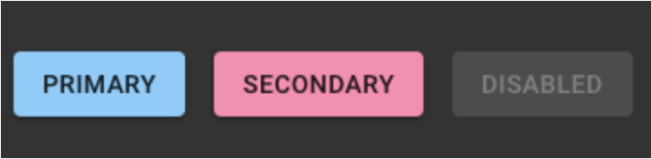
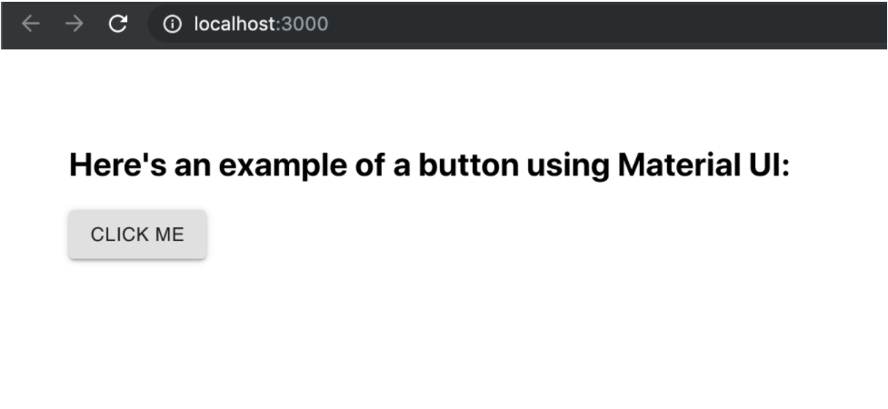

# Intro to Component Styling with Material-UI

*There is no success without failure. There is no failure without lesson. What is your lesson?*

## Review and Recap

We've built up some knowledge of React components and how they fit together using props. We've also explored how state works. That is the basic logic for creating applications but what about how they look? You should be familiar with CSS through 101 but today we are going to introduce a new styling tool... Material UI.

## Overview

There are [many different ways to style applications in React](https://codeburst.io/4-four-ways-to-style-react-components-ac6f323da822). You can use:

* CSS files that you've created and import them
* Third-party CSS (ex. Bootstrap), again import them and use their pre-built micro-components
* Styled components from various open source providers with libraries like **Material UI**

The reason we are introducing Material UI is because it is a robust, cross-platform component library backed by Google. It was written by two former Google UI engineers and designed by one of [Google's design teams](https://material-ui.com/discover-more/team/). Before you move on, watch the backstory to a major project called [Material Design by Google](https://youtu.be/rrT6v5sOwJg) which gave birth to [Material UI](https://material-ui.com/).

<!-- ! Video Contents: Vimeo, Clayton@ACA - 411-23-MaterialUIOverview - 411.2.1.1 -->
<iframe src="https://player.vimeo.com/video/492164671?color=2565EF&byline=0&portrait=0" width="655" height="368"  frameborder="0" allow="autoplay; fullscreen" allowfullscreen></iframe>

  > NOTE: In this video at 2:43 use this command to install: `npm install @mui/material @emotion/react @emotion/styled`

### More on Material-UI

We mentioned the words "component library". But what does that mean? Well...a component library is a set of pre-built components that satisfy some specific design requirement. For example...say I want all the buttons on my website to look the same (or similar). This is something that you usually want for consistency and good design. Well, Material UI provides a pre-built Button component that you can import into your code like this:

`import { Button } from '@mui/material';'`

These [buttons come with pre-determined styles](https://material-ui.com/components/buttons/) but can be further styled to your liking. See the code snippet and example screenshot below:

=== "the JSX"

    ```javascript
        <Button variant="contained" color="primary" className={classes.button}>
          Primary
        </Button>
        <Button variant="contained" color="secondary" className={classes.button}>
          Secondary
        </Button>
        <Button variant="contained" color="secondary" disabled className={classes.button}>
          Disabled
        </Button>
    ```

=== "the Result"

    

You've probably noticed the `import` statement above somewhere else and up until this point may have been wondering what Material UI is in the technical sense or how to use it. If so, I've got great news: it's simply an NPM package that we need to install. We do so by running this command: `npm install @mui/material @emotion/react @emotion/styled`. Material UI uses the peer dependency emotion as a styling engine.

More information can be found on this [NPM package at NPMjs.com](https://www.npmjs.com/package/@mui/material). Additionally, the documentation on all available components is available at the Material UI documentation. Be sure to use the navigation to look under the components folder. There is a *lot* of information available.

So that's enough about what Material-UI is. Let's see it in action:

=== "the JS"

    ```javascript
      import React from 'react';
      import { Button } from '@mui/material'

      const App = () => {
        return (
          <div style={{ padding: '50px' }}>
            <h2>Here's an example of a button using Material UI:</h2>
            <Button variant="contained">Click Me</Button>
          </div>
        )
      }

      export default App;
    ```

=== "the Result"

    

In the above component, we simply `import`ed the `Button` from `@mui/material` and then used it below our heading. We supplied the prop, `variant` with a value of `"contained"` to tell the `button` that we want the border around it. *Normally it comes without it.* You can look more into the options, examples & why `"contained"` creates a border in the [Button docs](https://material-ui.com/components/buttons/).

So what does that code equate to when we run it? Take a look at "the Result" tab above.

## In Summary

In conclusion, if you want to create a cool-looking, uniform experience across your application...use Material UI. See if they have a component for your needs. **Buttons**, **Checkboxes**, **Radio Buttons**, **Selects**, **Sliders**, **Text Fields** and more are all available for use.

We will use Material UI to style our App in this week's lesson so go get familiar with the [Docs](#know-your-docs).

## See It - Using Material-UI

<!-- ! Video Contents: Vimeo, Clayton@ACA - 411-24-UsingMaterialUI - 411.2.1.2 -->
<iframe src="https://player.vimeo.com/video/492174275?color=2565EF&byline=0&portrait=0" width="655" height="368" frameborder="0" allow="autoplay; fullscreen" allowfullscreen></iframe>

> NOTE: In this video at 4:49 you will see `makeStyles` but the preferred design pattern is higher order component:
   ```javascript
    const ExpandMore = styled((props) => {
         const { expand, ...other } = props;
         return <IconButton {...other} />;
    })(({ theme, expand }) => ({
      transform: !expand ? 'rotate(0deg)' : 'rotate(180deg)',
      marginLeft: 'auto',
      transition: theme.transitions.create('transform', {
        duration: theme.transitions.duration.shortest,
      }),
    }));
   ```
   > NOTE-2: If you want to use `makeStyles` you will to make sure it is in a `themeProvider` component see: [V4 to v5 migration](https://mui.com/material-ui/guides/migration-v4/):

   ```javascript
         // ...imports

      function AppContent(props) {
        const classes = useStyles(); // ✅ This is safe because it is called inside ThemeProvider
        return <Card className={classes.root}>...</Card>;
      }

      function App(props) {
        return (
          <ThemeProvider theme={theme}>
            <CssBaseline />
            <AppContent {...props} />
          </ThemeProvider>
        );
      }

     export default App;
   ```

## Practice It

<iframe src="https://codesandbox.io/embed/new?fontsize=14" title="new" allow="geolocation; microphone; camera; midi; vr; accelerometer; gyroscope; payment; ambient-light-sensor; encrypted-media" style="width:100%; height:500px; border:0; border-radius: 4px; overflow:hidden;" sandbox="allow-modals allow-forms allow-popups allow-scripts allow-same-origin"></iframe>

- [ ] Navigate to the following URL: [https://codesandbox.io/s/new?from-embed](https://codesandbox.io/s/new?from-embed).
- [ ] Under the "Dependencies" heading on the left side of the screen, click blue button that says "Add Dependency"
- [ ] Search for "@mui/material" exactly as written. It will be the top one. Click it to install it.
- [ ] Search for "@emotion/styled" exactly as written. It will be the top one. Click it to install it.
- [ ] Search for "@emotion/react" exactly as written. It will be the top one. Click it to install it.
- [ ] Now on line 3 of the code editor type `import { Button } from '@mui/material'` and press ++enter++.
- [ ] After line 11 (the `h2`), add the following: `<Button>Click Me</Button>`. You should see a button appear.
- [ ] Now on line 3 put a comma after the word `Button` and type `TextField` to `import` the `TextField` component.
- [ ] Above the button insert the following: `<TextField label="Enter some text" />` and below that line add `<br />` for now just to give some separation.
- [ ] Do you see the text field? Try typing in it just to get a sense of its style.
- [ ] You're done! Easy styles and components for React with Material-UI.

## Additional Resources

- [ ] [YT, CodingTheSmartWay.com - Getting Started with Material-UI](https://youtu.be/o1chMISeTC0?t=3)
- [ ] [YT, Google Design - What is Material Design](https://youtu.be/rrT6v5sOwJg)
- [ ] [Blog, CodeBurst - Four Ways to Style React Components](https://codeburst.io/4-four-ways-to-style-react-components-ac6f323da822)

## Know Your Docs

Be sure to reference the Material Documentation on Usage to see how others have used it with React, Next.js, Gatsby, Parcel, and more.

- [ ] [NPM Docs - Material-UI](https://www.npmjs.com/package/@mui/material)
- [ ] [Material-UI Docs - Home Page](https://material-ui.com/)
