# Authentication with Firebase

So far you've learned a great deal about how to think programmatically, how to build web pages, websites, and now web apps with React. You've covered so much but there is a small piece we need to solve for you to fully build a web app and that's authentication. 

Authentication, as you've just learned, is the process of verifying the identify of a user via multiple methods including email/password, google/facebook account, phone number or individual links. This process all happens on the back-end and can get complicated (not that you can't build your own...but you're only learning front-end programming here right now). 

Enter Firebase. Firebase will act as our database and server while providing authentication, authorization and user management. It's a simple, easy, and free tool you can capitalize on to build incredible apps with.

## Why firebase

<!-- Add intro about Authentication -->
Firebase is a Backend-as-a-Service (BaaS) a [Google cloud service](https://techcrunch.com/2014/10/21/Google-acquires-firebase-to-help-developers-build-better-realtime-apps/#:~:text=Google%20Acquires%20Firebase%20To%20Help%20Developers%20Build%20Better%20Real%2DTime%20Apps,-Frederic%20Lardinois%40fredericl&text=google%20today%20announced%20that%20it,store%20and%20sync%20data%20instantly.) for developers to utilize all behind-the-scenes aspects of a web or mobile application so that they only have to write and maintain the frontend. Increasingly, more of software engineering complexity is moving from the back end to the frontend. Firebase allows all in one back end solution for Android, iOS, and the web so that all 3 can share 1 backend. Moreover, Firebase has a generous [free/demo](https://firebase.google.com/pricing) tier no charge if less than 1 gigabyte in storage. BaaS solutions are very attractive for companies. there are many BaaS services and FireBase is one of the most widely used service. Here's a list of [companies](https://blog.back4app.com/which-companies-use-firebase/) that use Firebase. 

	
## How to use FireBase

The following is a follow-along where you'll build an app with Firebase. This will set you up for the next class and prepare you for building your Capstone App,.

### Create a Front-End with React

- [ ] The first step is to create a new React app in your `devFolder`:
  > `npx create-react-app learn-firebase`
- [ ] Install firebase your new React app:
  > `cd learn-firebase`
  > `npm i firebase` 

### Create a Back-End with Firebase 

#### Step-by-Step Setting up a Firebase Back-End App

  - [ ] 1. Start by signing up for an account on [Firebase](https://firebase.Google.com/). 
    > You may have to create a Google account if you do not have one. *Remember, the service is [free](https://firebase.Google.com/pricing) for up to 1 gigabyte of storage.*
  - [ ] 2. Once you've signed in with your Google account click the "Get Started" button on the main firebase page.
  - [ ] 3. Click the "Create a Project" button and name it `learn-firebase` then click "Continue".
  - [ ] 4. We will not use Google analytics for this project but it's okay to leave it as the default setting.
  - [ ] 5. From the drop down select your "Default Account" for Firebase and press "Create Project".
  - [ ] 6. Click "Continue" after the project is initialized
  - [ ] 7. On the main Firebase Console page, find the Gear Icon in the top-left click it and select "Project Settings"
  - [ ] 8. Under "Your Apps" at the bottom of the page, you will see no projects and several icons click the one for Web `</>`
  - [ ] 9. Under "Register app" give your app a nickname like `firstFirebase App` then click "Register app" 
  - [ ] 10. If you didn't earlier, run the `npm install firebase` command to install the Firebase package into your React app.
  - [ ] 11. Then create a config file called `firebaseConfig.js` - run `touch src/firebaseConfig.js`. 
  - [ ] 12. Now copy/paste all the code you see on the screen into this new `firebaseConfig.js` file. And ++cmd+s++
  - [ ] 13. Then click "Continue to Console"
  - [ ] 14. On the main console, you'll see "Authentication" in the navigation menu on the left. Click it.
  - [ ] 15. And click "Get Started"
  - [ ] 16. Then choose "Email/Password"
  - [ ] 17. Slide the slider to "Enable" the click "Save"

#### Screenshots of Setting up a Firebase Back-End App

=== "2. Get Started"

    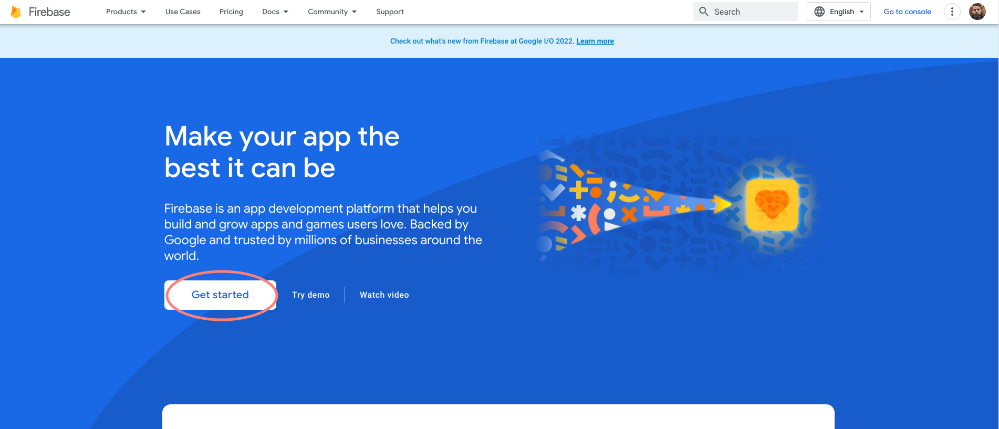

=== "3. Create"

    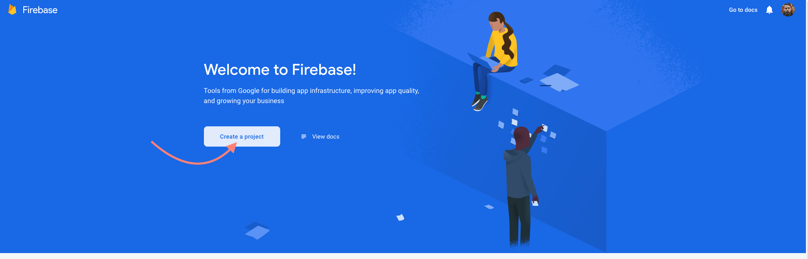

=== "3.5. Create & Name"

    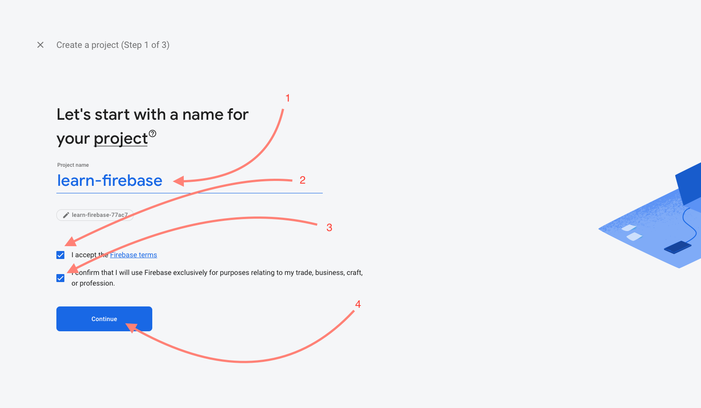

=== "4. Analytics"

    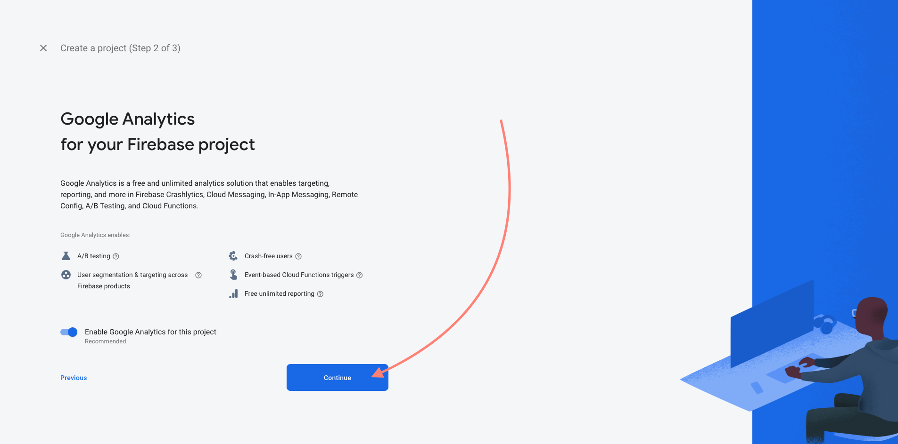

=== "5. Set Account"

    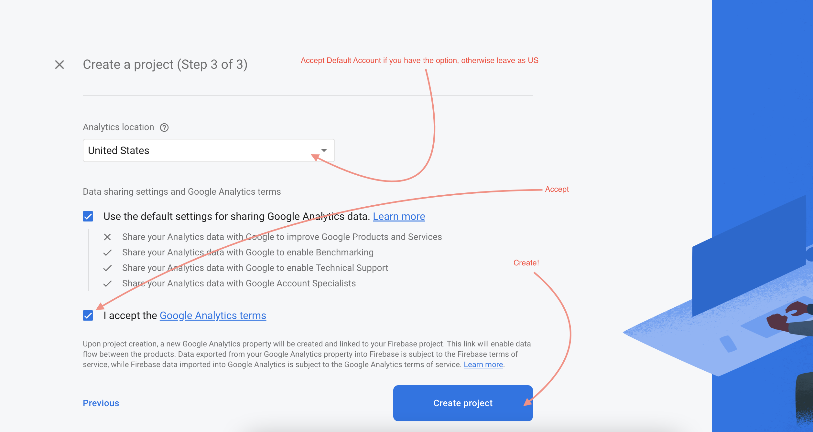

=== "6. Initialize & Continue"

    

=== "7. Change Project Settings"

    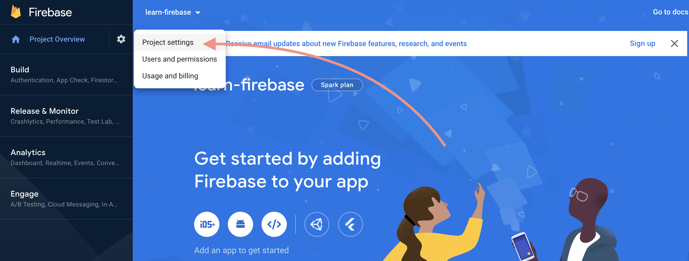

=== "8. Set Platform"

    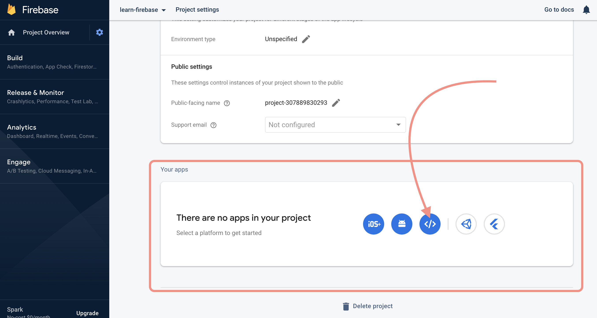

=== "9. Nickname & Register"

    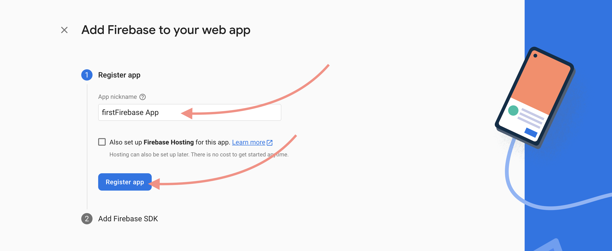

=== "10 & 11. Create Config File"

    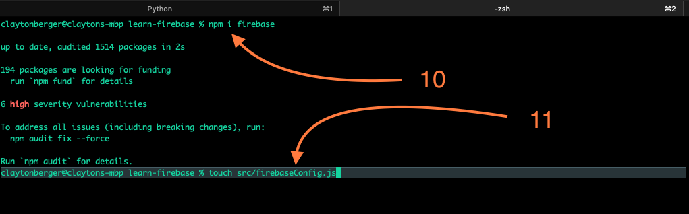

=== "12. Build Configuration"

    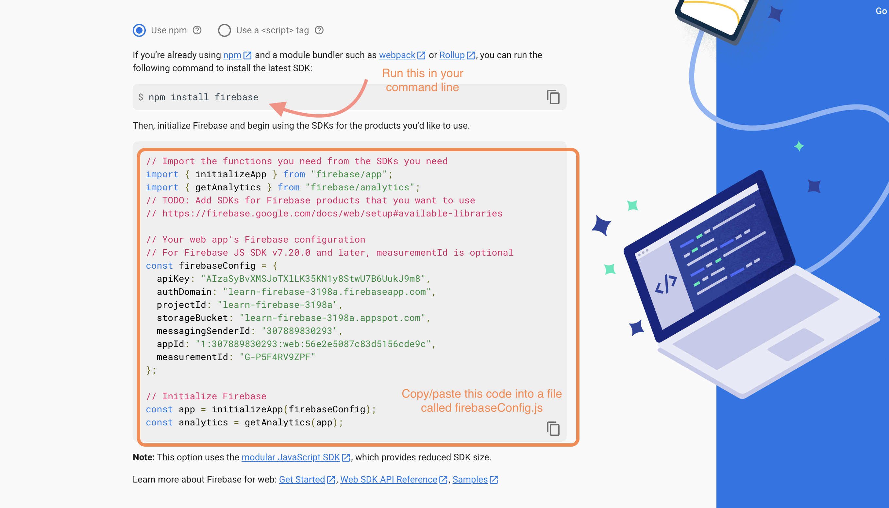

=== "13. Back to Console"

    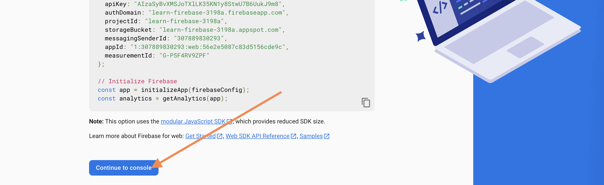

=== "14. Setup Authentication"

    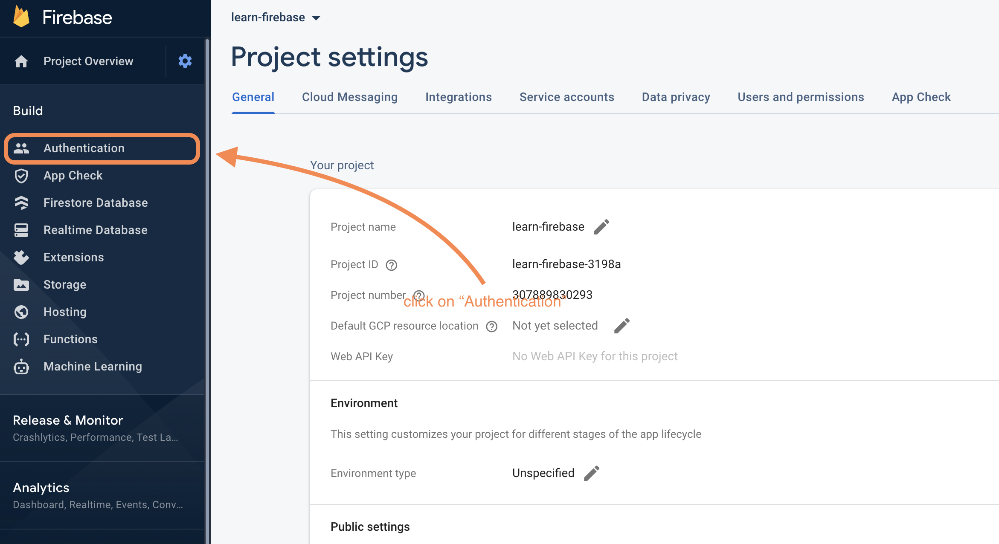

=== "15. Get Started on Auth"

    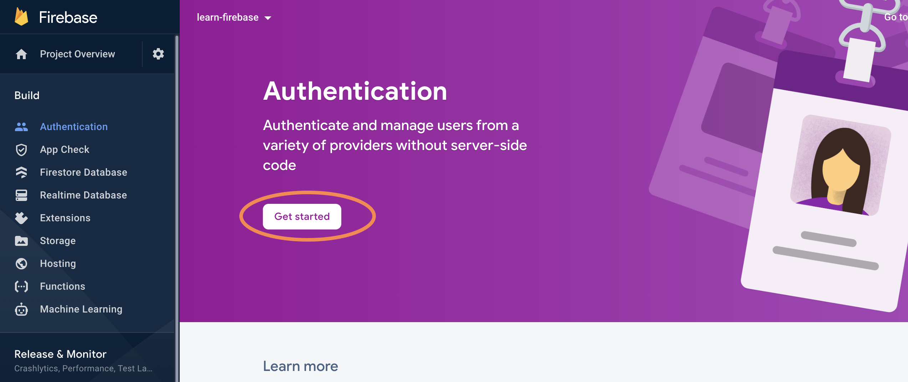

=== "16. Auth Method"

    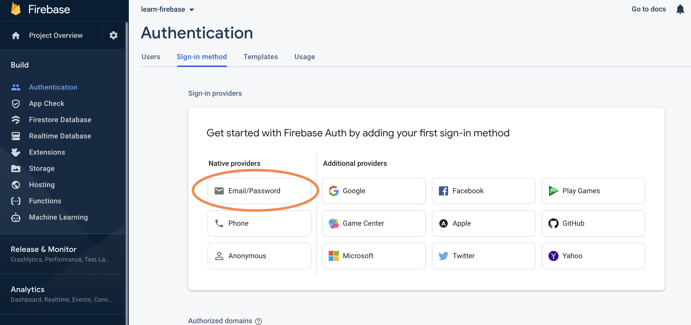

=== "17. Enable + Save"

    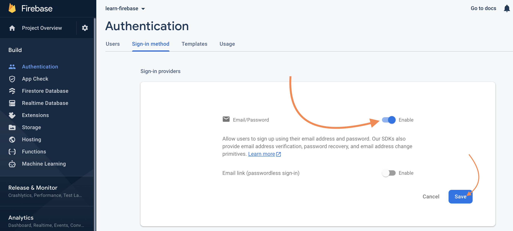

### Hide Configuration in `.env`

When hosting any app anywhere on the web we want to use a `.env` file, as a place to put *sensitive* environment specific data about how to build the app including database names, API_keys, users and ports, etc. With a `.env`, our React app will build with the sensitive information hidden to humans (except us) but still exposed wherever it's needed on the app using `process.env`.

  > NOTE: *A `.env` file is a common procedure for hiding sensitive information and exposing the information only when needed. To learn more about this check out the [Additional Resources](#additional-resources) below.*

The final step to safeguarding our sensitive information is to include the `.env` file in a `.gitignore` file so our git software will *ignore* the `.env` file and not push it up to the repo when we commit changes, thus keeping it private from people looking at our code. 

  > NOTE: *You can have git ignore any file that is unnecessary to the build of the app by including the file or folder in the `.gitignore` file. For good boilerplate files to ignore, checkout the [Additional Resources](#additional-resources) below.*

Later, when we host this app live to to world we'll need to manually transfer the data in the `.env` to the service we use to host, likely Firebase.

#### How to Hide

- [ ] To start, `cd` into the root directory of your app and run `touch .env` to create the new file. (*You're likely already in the root directory after the steps above.*)
- [ ] Do the same thing to create a `.gitignore` file - `touch .gitignore`
- [ ] Now go ahead and add `.env` to that file so git will ignore the `.env` file.
- [ ] Inside the `.env` copy/paste the data from your `firebaseConfig` object in the `firebaseConfig.js` file.
- [ ] Now follow the video and use the code snippets below to complete the conversion.

##### Transfer & Convert the Sensitive Data

Earlier you copy/pasted a config file from the Firebase dashboard into a `firebaseConfig.js` file. You're now going to move the data from the `const firebaseConfig` object into the `.env` file but change the property names and the syntax into YAML. Then, change out the values in the `firebaseConfig` object of the `firebaseConfig.js` file to read the same values but through the `process.env` so the values are hidden from others but exposed to the app. Check out the video for more details.

=== "Video Transfer to `.env` File"

    <div style="padding:75% 0 0 0;position:relative;"><iframe src="https://player.vimeo.com/video/723102090?h=7e98b416a6&amp;badge=0&amp;autopause=0&amp;player_id=0&amp;app_id=58479" frameborder="0" allow="autoplay; fullscreen; picture-in-picture" allowfullscreen style="position:absolute;top:0;left:0;width:100%;height:100%;" title="Firebase-TranferDataToEnvFile.mp4"></iframe></div><script src="https://player.vimeo.com/api/player.js"></script>

=== "`.env` File Starter Code"

    ```yaml
    REACT_APP_FIREBASE_KEY=
    REACT_APP_FIREBASE_DOMAIN=
    REACT_APP_FIREBASE_PROJECT_ID=
    REACT_APP_FIREBASE_STORAGE_BUCKET=
    REACT_APP_FIREBASE_SENDER_ID=
    REACT_APP_FIREBASE_APP_ID=
    REACT_APP_FIREBASE_MEASUREMENT_ID=
    ```

=== "New `src/firebase-config.js`"
    
    ```javascript
    import { initializeApp } from "firebase/app";

    // Firebase offers many tools with it's SDK (Software Development Kit)
    // One of them is `getAuth` but there are others, see them at:
    // https://firebase.google.com/docs/web/setup#available-libraries
    import { getAuth } from "firebase/auth";

    // Your web app's Firebase configuration
    const firebaseConfig = {
        apiKey: process.env.REACT_APP_FIREBASE_KEY,
        authDomain: process.env.REACT_APP_FIREBASE_DOMAIN,
        projectId: process.env.REACT_APP_FIREBASE_PROJECT_ID,
        storageBucket: process.env.REACT_APP_FIREBASE_STORAGE_BUCKET,
        messagingSenderId: process.env.REACT_APP_FIREBASE_SENDER_ID,
        appId: process.env.REACT_APP_FIREBASE_APP_ID,
        // For Firebase JS SDK v7.20.0 and later, measurementId is optional
        measurementId: process.env.REACT_APP_FIREBASE_MEASUREMENT_ID
    };

    // Initialize Firebase and store in a variable called `app`
    const app = initializeApp(firebaseConfig);

    // create a connection for the app with the getAuth tool.
    const auth = getAuth(app);

    export default auth
    ```

> NOTE: *By prefixing the environment variables with `REACT_APP_` you don't have to install `dotenv`, instead [React automatically reads them as environmental variables](https://create-react-app.dev/docs/adding-custom-environment-variables/).*

### How to Authenticate with FireBase

The code below is a simple sign-up and logout for the start of any app using Firebase as the back-end authentication. Replace the code in your `src/App.js` file with the code below and run `npm start` to test it out.

```javascript
// App.js
import React, { useState } from 'react';
import auth from './firebaseConfig'; // credentials provided by firebaseConfig file from above
import { createUserWithEmailAndPassword, signOut } from 'firebase/auth' // import firebase dependency 

function App() {
  const [registeredEmail, setRegisteredEmail] = useState("");
  const [registeredPassword, setRegisteredPassword] = useState("");

  const register = async () => {
    try { 
      // TRY CATCH MUST BE USED ASYNC/AWAIT WHEN WORKING WITH FIREBASE
      const user = await createUserWithEmailAndPassword(
          auth,
          registeredEmail,
          registeredPassword
      );
      console.log(user);
    } catch (error) { // Give the user indication they need to try again and why
      // INVALID EMAIL
      // MISSING PASSWORD
      console.log(error.message);
      clearForm()
    }
  };

  const logout = async () => {
    await signOut(auth);
  };

  // clear the form inputs
  const clearForm = () => {
    document.getElementById("user-form").reset()
  }

  console.log("auth.currentUser", auth.currentUser);

  return (
    <div >
      <h3> Register User </h3>
      <form id="user-form" >
        <input
          placeholder="Email..."
          onChange={(event) => {
              setRegisteredEmail(event.target.value);
          }}
        />
        <input
          type="password"
          placeholder="Password..."
          onChange={(event) => {
              setRegisteredPassword(event.target.value);
          }}
        />
        <button onClick={register}> Create User</button>
        <button onClick={logout}> Sign Out </button>
      </form>  
    </div>
  ); 
}

export default App;
```

The data is stored on Firebase based on the credentials in the config file. See the results in the FireBase Dashboard under "Authentication". 

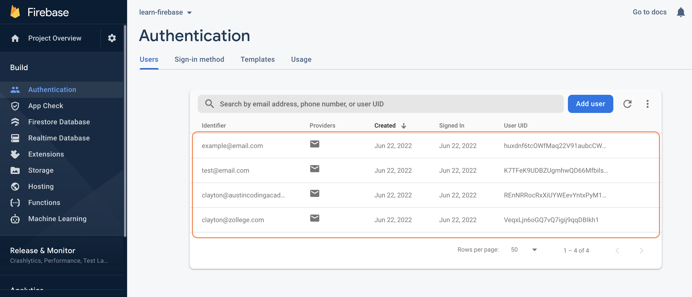

In addition you will see `auth.currentUser` is logged at in the console of your browser.

## Additional Resources

Look at the documentation below and play around with the code and FireBase Authentication console. During the next in-class project you will implement logging in and protected routes for FireBase.

- [ ] [React Firebase Authentication Tutorial](https://www.youtube.com/watch?v=9bXhf_TELP4)
- [ ] [Generator, TOPTAL .gitignore File - For Mac Users](https://www.toptal.com/developers/gitignore/api/node,macos,vs,dotenv)
- [ ] [Generator, TOPTAL .gitignore File - For Windows Users](https://www.toptal.com/developers/gitignore/api/dotenv,windows,visualstudiocode,node)

## Know Your Docs

- [ ] [FireBase - Training Docs](https://firebase.Google.com/docs/auth)
- [ ] [Firebase - Email/Password Authentication](https://firebase.Google.com/docs/auth/web/password-auth)

