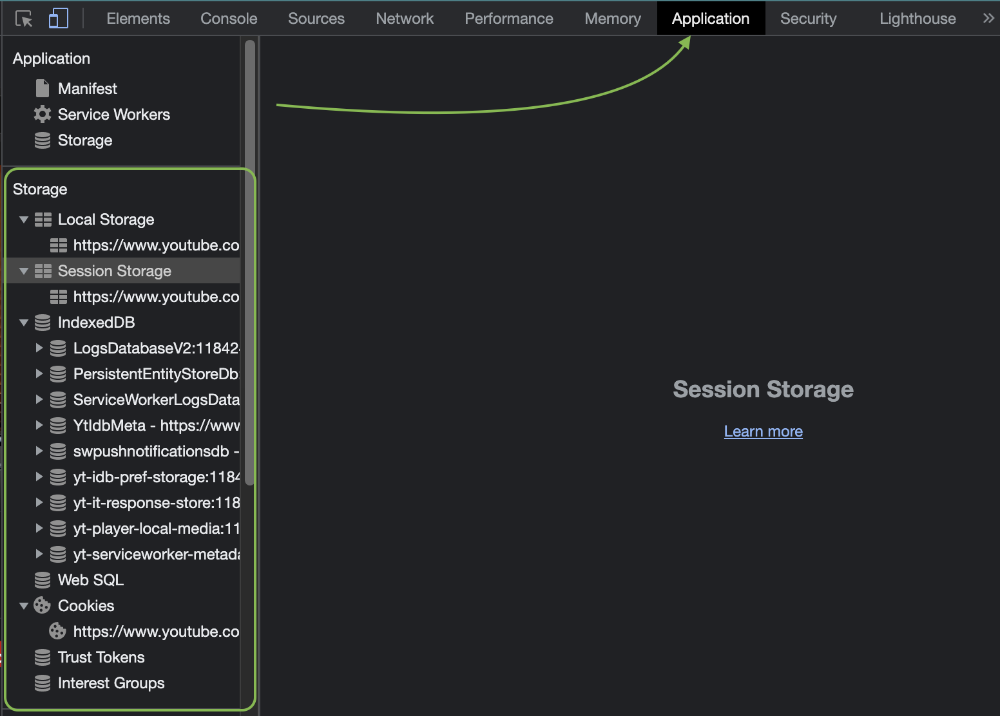
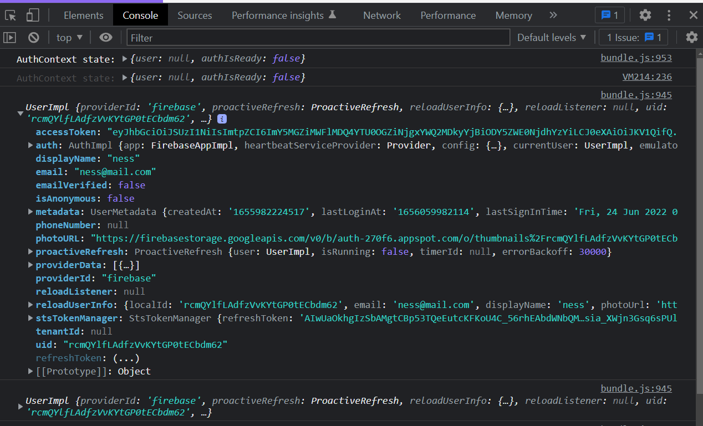
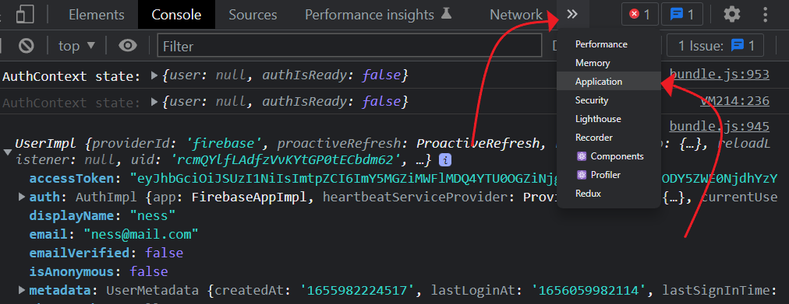
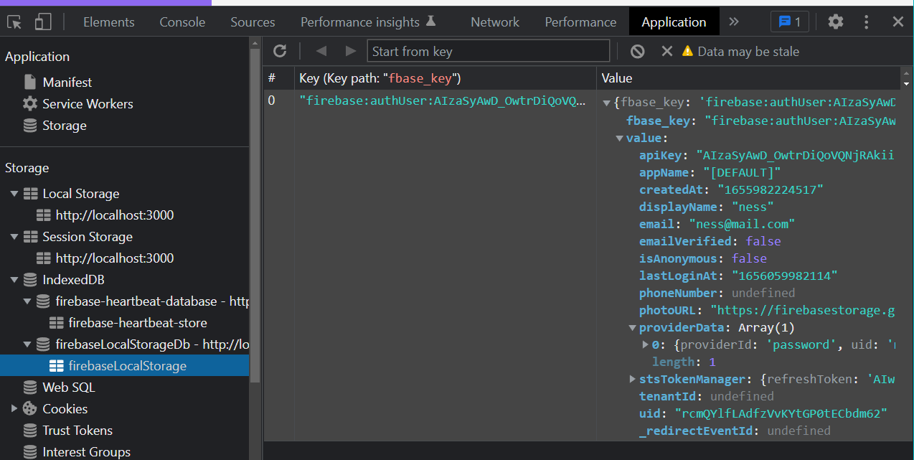

# Firebase Authentication and Protected Routes

<!-- TODO NEEDS AN OVERVIEW VIDEO -->
Now that we have a grasp on authentication procedures and know how to build protection around sensitive components like `Account` and `Dashboard`, let's put them together so a user can sign-in to our app and when they do they can see these "sensitive" components with their information in them.

To make this happen we'll need to create a function that "watches" when a user becomes authenticated. In the last project you implemented a sign-in procedure that stores the user's information but now we need another function that watches that action and gives the okay for the rest of the components to be rendered. AND, when the user signs off this same function will disconnect our app from the Firebase database. We'll call this function the observer function or listening function.

## Authentication State Observer

In our code we'll name this "listening" function `onAuthStateChanged()`. 
  
  > See, Firebase has a lot of awesome functions in their library that make our job as developers easier to implement authentication. 

This `onAuthStateChanged()` function from **Firebase** will keep an eye-on whether or not someone has logged-in or -out and. Let's take a look at how that works.

### Implement `onAuthStateChanged()`

In your [Authenticate with Firebase](./implement-fireBase.md) project, add the following code to your App component. 

=== "Add `onAuthStateChanged()` to `App.js` to Setup Authentication"

    ```javascript
    // be sure to import useEffect
    import React, {useState, useEffect} from 'react';
    
    // auth and createUser imports go here
    
    import {  onAuthStateChanged } from 'firebase/auth'

    function App() {
      // All of the previous Hooks: registeredEmail/Password, 
      //  setEmail/Password go here
      const [user, setUser] = useState({});
      
      // Your register(), logout(), clearForm() methods & the 
      //  console.log("auth.currentUser") go here.

      useEffect(()=> {
        const unsubscribe = onAuthStateChanged(auth, (currentUser) => {
            console.log("currentUser", currentUser);
            setUser(currentUser);
          });

        console.log("unsubscribe", unsubscribe);

        return unsubscribe 
        // We only want 1 instance of the user connected to 
        //  the database this cleans up and disconnects the
        //  observer function when component is unmounted.
      }, [])

      return (
        <div >
        // Rest of form and inputs go here
        </div>
      )
    }

    export default App;
    ```

#### What's going on with this "Observer" Function? 

The `useEffect()` hook is called during the initial mounting of the component. It will create a reference, named `unsubscribe`, to the function `onAuthStateChanged()` which is the observer function.

Inside of this observer function we pass two arguments: `auth` and a anonymous function. `auth` is coming from our `src/firebase-config.js` file when we wrote:

```javascript
const auth = getAuth(app);

export default auth
```

Notice the function used there: `getAuth()` and the argument passed to it: `app`. `app` is an object that represents your Firebase app. It's created by passing your unique `firebaseConfig` object to the `initializeApp()` function.

```javascript
const app = initializeApp(firebaseConfig);
```

From there the `onAuthStateChanged()` function's second argument is an anonymous function which is passed a parameter called `currentUser`. This `currentUser` represents any user who logs in. 

Next, this anonymous function logs to the console our `currentUser` but more importantly calls `setUser` to set the `user` as `currentUser`. 

The `user` object is then tracked in state and can be passed around your app via props to check for authorized access. Just like the `checkAuth()` function from the [Protected Routes lesson](./protectedRoutes-intro#the-checkauth-function), we'll use this check to see if the user is allowed to see that page they're requesting.

The beauty of having this "observer" function is that we now have a **single source of truth** telling our app who is logged in and when but also, it now has an active observer function that is able to `unsubscribe`/disconnect our app from Firebase when needed(when a user logs-off). 

Lastly, the `onAuthStateChanged()` returns an `unsubscribe` function we save to a variable called: `unsubscribe`. This will allow the `useEffect()` hook to run `unsubscribe()` as a [cleanup function]("https://blog.logrocket.com/understanding-react-useeffect-cleanup-function/) whenever the component unmounts, effectively deleting the connection to Firebase.

That was a lot so don't get intimidated if it didn't sink in the first time.

### Implement into Protected Route

Now that we understand this observer function, let's make it change views when it notices a user has logged-in or -out.

Let's start with our `ProtectedRoute` component(function) then we'll move to the `Router` component. While learning about [Protected Routes](./protectedRoutes-intro.md) we saw code that looked like this:

=== "A Simple Protected Route - `ProtectedRoute.js`"

  ```javascript
  import { Navigate } from "react-router-dom";

  const ProtectedRoute = (props) => {

    export const { component: Component, ...rest } = props;
    
    return (
      checkAuth() === true ? ( <Component {...rest} /> ) : ( <Navigate to="/login" /> )
    );
  };
  ```

In it we need to replace the current "dummy" logic of `checkAuth()` with something a little more useful:

=== "Protected Route based on User - `ProtectedRoute.js` w/o comments"

    ```javascript
    import { Navigate } from "react-router-dom";

    export const ProtectedRoute = (props) => {
      const { component: Component, user, ...rest } = props;

      return !!user ? <Component {...rest} /> : <Navigate to="/" />;
    };
    ```

=== "Protected Route based on User - `ProtectedRoute.js` w/comments"

    ```javascript
    // import the Navigate function to change the user's address bar
    import { Navigate } from "react-router-dom";

    // create a function called ProtectedRoute that will determine if a user 
    //  is logged in or not and serve up the component they asked for or 
    //  Navigate them to the Home/Login component
    export const ProtectedRoute = (props) => {
      // `props` captures anything passed to this function for it's parent
      
      // destructure the props so the pieces can easily be referenced: 
      //   `component:` will equal `Component` and `user:` will equal 
      //   `user` but spread(...) the `rest` of the props out as well.
      const { component: Component, user, ...rest } = props;

      // if there is a `user` return the `Component` requested but if 
      //  not (:) `Navigate` them to the Home("/")
      return !!user ? <Component {...rest} /> : <Navigate to="/" />;
    };
    ```

- [ ] Navigate to your ProtectedRoute component `/component/ProtectedRoutes.js`
- [ ] In your destructured object that is coming from `props`, include the `user` property which will be passed down by it's parent container(`Router`).
- [ ] Instead of that simple `checkAuth()` function, we are going to check whether the `user` object, which is being passed down from the `onAuthStateChanged` function, actually exists as an object with data about the user, or does the object not exist and is actually `null` a.k.a. "we do not have an authenticated user". We do this by checking the `!!` **double bang operator**.

  > NOTE: `!!` is a **[double bang](https://betterprogramming.pub/javascript-bang-bang-i-shot-you-down-use-of-double-bangs-in-javascript-7c9d94446054)**. It's used when you want the *falsey* value of something. Try entering `!null` in your Chrome console and you'll get `true`. 

  > NOTE-2: Since the user object will either be `null` or an object, we want to get the *falsey* value if the user is truly `null`. So we will use `!!null`, since it is easier to reason that we want a `null` value to represent `false`.

### Implement into Router

Now that we have our `ProtectedRoute` looking for a `user` object, we can bring it into our `Router` function to be used to protect certain routes!

=== "Use the `ProtectedRoute` in `Router` - Router.js w/o comments"

    ```javascript
      import { Routes, Route } from 'react-router-dom';
      import { ProtectedRoute } from './components/ProtectedRoute';
      import Home from "./components/Home";
      import Dashboard from "./components/Dashboard";

      const Router = (props) => {
        
        const {user} = props;
        
        return (
          <Routes>
              <Route exact path="/" component={<Home/>} />
              <Route 
                path='/dashboard' 
                element={<ProtectedRoute user={user} component={Dashboard} />} 
              />
          </Routes>
        )
      }
      
      export default Router;
    ```

=== "Use the `ProtectedRoute` in `Router` - Router.js w/comments"

    ```javascript
      import { Routes, Route } from 'react-router-dom';
      // bring in the ProtectedRoute function so it can be used.
      import { ProtectedRoute } from './components/ProtectedRoute';
      // bring in all of the components that can be routed to
      import Home from "./components/Home";
      import Dashboard from "./components/Dashboard";

      // give the parameter `props` to the `Router` so it has a reference to 
      //   an arguments passed to it from up the chain.
      const Router = (props) => {
        
        // In the `props` will be a property called `user` because it was sent
        //   by `onAuthStateChanged` from `App.js`. We'll capture the user by 
        //   destructuring props. When you wrap it in  `{ }` you can extract  
        //   any property names the same as your variable, i.e. user: user
        const {user} = props;
        
        return (
          <Routes>
              <Route exact path="/" component={Home} />
              <Route 
                path='/dashboard' 
                // The `element` property will get the value of `ProtectedRoute` 
                //   with two properties: `user` and `component`. The value of 
                //   `user` will be sent to the `ProtectedRoute` function via 
                //   props and read by the ternary operator (? :), and IF there 
                //   is a user (`!!user`) then the `Dashboard` component will 
                //   be rendered. If not `"/"` will be sent to the address bar. 
                //   Thus, protecting the Dashboard.
                element={<ProtectedRoute user={user} component={Dashboard} />} 
              />
          </Routes>
        )
      }

      export default Router;
    ```

- [ ] Navigate over to your `Router` component in your main `src/Router.js` file.
- [ ] We will destructure `user` object from the `props` object being passed, as we have done before.
- [ ] Last, just make sure you include that `user` as a property to be passed down to our `ProtectedRoute` component so it can be read by the logic of the `ProtectedRoute`

If you followed along correctly, the `<Dashboard />` component will be protected and only be shown based on some condition like is there a user? Next will be learning to authenticate users by credentials!

## Additional Resources

- [ ] [YT, Web Dev Simplified - Firebase And Routing Context API Hook best practice](https://youtu.be/PKwu15ldZ7k?t=964)
- [ ] [Blog, Log Rocket - Understanding React’s useEffect cleanup function](https://blog.logrocket.com/understanding-react-useeffect-cleanup-function/)
- [ ] [Article, Medium - What is the Double bang (!!) operator in JavaScript?](https://javascript.plainenglish.io/what-is-double-bang-operator-in-javascript-90fc67ead5a4)
- [ ] [Article, web.dev - Working with IndexedDB](https://web.dev/indexeddb/)

## Know Your Docs

- [ ] [React Docs - Context API](https://reactjs.org/docs/context.html)
- [ ] [Firebase Docs - Set an authentication state observer and get user data](https://firebase.google.com/docs/auth/web/start#set_an_authentication_state_observer_and_get_user_data)
- [ ] [Firebase Docs - Auth Package](https://firebase.google.com/docs/auth/web/start#set_an_authentication_state_observer_and_get_user_data)


<!-- Move this stuff about indexDB to in the middle of implementing onAuthChange -->
<!-- You've just learned about [Protected Routes](./protectedRoutes-intro.md) and how to use cookies to store a JWT that proves when a user is authenticated. Every browser has ways to store user data including local storage, session storage and cookies. To see them you can right-click and use the inspect tool in our Chrome browser, then go to the **Application** tab. Under storage you will see the many storage options, each with their own pros and cons. For example, cookies are fast and small simple strings and is accessible only through the domain that saved them there, i.e. each web app or site.



## Cookies vs IndexDB

While cookies is a very common place to store user info, Firebase uses something called **[indexedDB]("https://web.dev/indexeddb/)** which is an asynchronous storage of objects indexed by keys.

When protecting routes, the concept of **cookies** and **indexedDB** is similar, just implemented differently in the code. Let's take a look at what that may look like. Open up your **learn-firebase** app from the previous lesson: [Authentication with Firebase](./implement-fireBase.md), and sign up a new user. When inspecting your console, look for the `console.log(auth.currentUser)` results. You should see an object holding data about the user that is currently logged-in. We can also use the **Application** tool in our integrated terminal to see the results of our currently logged-in user under the `indexedDB` section.

=== "Console Log Results"

    

=== "How to see IndexedDb"

    
    
=== "indexedDb Results"

    

> NOTE: If you do not see **Application** listed at the top of the integrated terminal, you will need to click on the drop-down arrow to see more options. -->