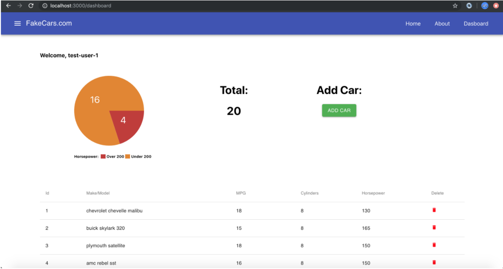

# Class 10: Day 3, FakeCars - Authorization

<!-- ! HIDE FROM STUDENT; INSTRUCTOR ONLY CONTENT -->
<!-- ## Instructor Only Content - HIDE FROM STUDENTS -->
<!-- cp workspace/resources/classOutlineTemplate.md docs/module- -->
<!-- ! END INSTRUCTOR ONLY CONTENT -->

*Little things make big days.*

## Greet, Outline, and Objectify

<!-- SMART: Specific, Measurable, Attainable, Relevant, and Timely. -->
<!-- https://examples.yourdictionary.com/well-written-examples-of-learning-objectives.html -->
  
*OBJECTIVE - Today the student will learn and practice to understand:*

* *Authorizing users*

*****

<!-- https://studio.zollege.com/container/block-v1:ACA+JS411+09282020_JS411_C6+type@vertical+block@5e26c53f4d6a44ba96ed552e94ac1bb1 -->

- [ ] Questions for Student-Led Discussion
- [ ] Interview Challenge
- [ ] Student Presentations
- [ ] Creation Time
    * [ ] Follow Day 3 Authentication instructions in [this repo](https://github.com/instructorKC/411_protected_routes_with_firebase)
    <!-- * [ ] Fork & Clone the [411_wk5_day2_mapdispatchtoprops Repo](https://github.com/AustinCodingAcademy/411_wk5_day2_mapdispatchtoprops) -->
- [ ] Push Yourself Further
- [ ] Interview Questions: Blog to Show You Know
- [ ] Exit Recap, Attendance, and Reminders

### Questions for Student-Led Discussion, 15 mins
<!-- This section should be structured with the 5E model: https://lesley.edu/article/empowering-students-the-5e-model-explained -->

[Questions to prompt discussion](./../additionalResources/questionsForDiscussion/qfd-class-10.md)

### Interview Challenge, 15 mins
<!-- The last two E happen here: elaborate and evaluate  -->
<!-- this sections should have a challenge that can be solved with the skills they've learned since their last class. -->
<!-- ! HIDDEN CONTENT: INSTRUCTOR ONLY -->
[See Your Challenge Here](./../additionalResources/interviewChallenges.md)
<!-- ! END HIDDEN CONTENT: INSTRUCTOR ONLY -->

### Student Presentations, 15 mins

[See Student Presentations List](./../additionalResources/studentPresentations.md)

## Creation Time, 60-90 mins

Follow Day 3 Authentication instructions in [this repo](https://github.com/instructorKC/411_protected_routes_with_firebase).

<!-- Today we are going to practice what we've learned with **Redux Actions** and `mapDispatchToProps`. We will use both of those to create a more interactive dashboard and watch as all the data on the site is related.

### Project Instructions

- [ ] Fork and clone the following repository: [411_wk5_day2_mapdispatchtoprops](https://github.com/AustinCodingAcademy/411_wk5_day2_mapdispatchtoprops)

Follow the directions in the `README` to complete the project and upload the link to your GitHub repository to Zollege. The project directions are also summed up below: -->

#### Getting Familiar with the Source Code (DON'T SKIP THIS)

We're continuing to make make the Cars App more robust. This time we've added a pie chart, total, and the ability to add and remove cars. Take a minute to go through the following files (under the components folder):

* `Dashboard.js`
* `Chart.js`
* `Total.js`
* `AddCar.js`

Also, make sure to run the app and go to the dashboard page to see these components in action. Keep in mind, there are things that aren't connected yet. That's what you've been hired to do!

<!-- ALL REDUX STUFF

### Project Work

- [ ] The first thing we need to do is create an `actions.js` file inside the `redux/` folder.

#### `addCar`

- [ ] Now, let's create an action creator called `addCar` that takes one parameter called `car`. Have it return an object who's type is `ADD_CAR` and its `value:` is the `car` parameter.

- [ ] Now we need to go to our `reducers.js` file and update the `cars` reducer. To start, give it a second parameter called `action`. This will represent whichever `action` is passed in on `dispatch()`. Now it's time to change this function and give it a switch/case statement. You can reference prior material for this but ultimately we want to switch on `action.type`, provide a case for `ADD_CAR` that returns a copy of the `state` array plus the new car (`[ ...state, action.value]`) and has a default case that simply returns the state for the `mapsStateToProps` function to use.

- [ ] We will be dispatching this action from the `AddCar` component so let's go hook that up now. Notice there is a Form that is collecting the Input data. It happens in a dialog box that appears when you click the "Add Car" button on the dashboard page.

- [ ] We need to create a smart container for this "dumb" component so that we can hook it up to Redux action creators. Create a file called `AddCar.js` inside the `containers/` folder.

- [ ] Import the `{ connect }` function at the top of the file like we have in the other containers. Then, import the `AddCar` component from the `components/` folder. We also need to import the actions, so `import { addCar } from the "redux/actions"` file.

- [ ] Now we are going to write a `mapDispatchToProps` function. Remember, it takes one argument called `dispatch` and it returns an Object who's keys are the props you want to pass to the "dumb" component. It makes sense to create a key called `addCar` and we'll set its value to a function that *dispatches* our `addCar` action creator. It looks like this: `(car) => dispatch(addCar(car))`. The `car` on the left will be passed from our component when we call this function during the Form submission. It will then be passed onto the inner `addCar` function.

- [ ] Remember to `connect` this function to the `AddCar` component and `export` it.

    > A little tip this time, since there is no `mapStateToProps` function we need to pass null in its place. This is because the `connect` function expects the **MSTP** functions as the first parameter, ([see the docs](https://redux.js.org/recipes/usage-with-typescript#typing-the-connect-higher-order-component)). So our export will look like this: `export default connect(null, mapDispatchToProps)(AddCar)`

- [ ] Now we will go to the `Dashboard` component and swap out the import at the top so that it calls the new `AddCar` smart "container" instead of the regular "dumb" component.

- [ ] Finally, go to the `AddCar` component and find the `handleSubmit` function. Pass that payload to our prop function. Basically, call `this.props.addCar(payload)`. Underneath that, call `this.setState({ open: false })` to close the dialog box. The new car should be added to the bottom of the list.

#### removeCar

- [ ] Ok we can add cars to our table but now we need to be able to remove them. There's a delete column on the table with a little "trash can" icon and when we click that we're going to want to remove an item from the list. The first step is adding a new action. *Hopefully we're getting some of this repetition into our heads.*

- [ ] Go to `redux/actions.js` and create a new function called `removeCar`. You can copy/paste (++opt+shift+down++) directly from the `addUser` function, however we want to change the parameter from `car` to `index` in both places. Also, (this may seem like a given) change the type to "REMOVE_CAR".

    > Why are we changing `car` to `index`? Because it's an easy way to remove an item from an array. If we know it's `index`, we can splice it. So this time we are going to pass an `index` value to the `removeCar` prop.

- [ ] Once that's done it's time to update our reducer again. Go to `redux/reducers.js` and make another case statement for `REMOVE_CAR`. In this one, create a copy of the state (`newState`) and then `.splice()` the `index` out of it. Finally, `return` the `newState`. 

    > If you forget, the "splice" function takes a starting index and a number of items to delete as its parameters so it will look like this: `splice(action.value, 1)` where `action.value` is the `index` we are passing.

- [ ] Ok, since the button we want to tie this to is in the `Dashboard` component and it already has a container . . . we don't need to create a new one. We do, however, need to go to `containers/Dashboard.js` and add the `mapDispatchToProps` function though. Do that right below that `mapStateToProps` one. This function should return an object with a key of `removeCar` and a value of `(index) => dispatch(removeCar(index))`. Also, don't forget to import that `{ removeCar }` action at the top of the file. We also need to ensure that we pass the `mapDispatchToProps` function to `connect`.

- [ ] Now that everything is hooked up we need to use our new action. In the `Dashboard.js` component, create an `onClick` method on the Icon (the last TableCell) that is a function. It should call `props.removeCar` with the `index` as the argument. The current `index` can be found in the beginning of the `map` function. Its value is `idx`.

- [ ] When you click the trash can icon the corresponding row should be removed. Is it working? If not, ask the your classmates to look over the code with you.

#### Pie Chart & Total

- [ ] Now that we have that working we are going to practice what we learned last class and add containers and `mapStateToProps` functions for the Chart and Total components. Why? Because we want these to always have the current `cars` information. We'll see how this is useful in a second.

- [ ] Create a file called `Total.js` underneath the "containers" folder and create a `mapStateToProps` function. You can use the `Car.js` file as an example and simply change the component from `Car` to `Total`.

- [ ] Next, go to the `Dashboard` COMPONENT and change the `import` for `Total` to reference the container instead of the component. Ex. `import Total from '../containers/Total'`

- [ ] Finally, go to the `Total.js` file under the components folder and change the number `4` to `{props.cars.length}`. The total should now display "20".

- [ ] Go ahead and add and remove items from the table. Notice the total update in real time. This is something that wouldn't have been possible with normal React state because the information for `Total` lives in a different component. Components are meant to be re-usable so if we ever wanted to put this `Total` somewhere else in our application we could just import it and use it like in `Dashboard` and it will always have the correct cars data.

- [ ] Now we need to do the same thing for the `Chart` component. Create a file called `Chart.js` under containers and hook up the `mapStateToProps` function so that it has access to the `cars` prop. You can copy from `Total` and change the component names.

- [ ] Once again in `Dashboard` component, change the `Chart` `import` so that it points to the container.

- [ ] Finally, in `components/Chart.js` above the return statement, create two variables called `over` and `under`. Use the `filter` method to filter the `props.cars` for `car`s whose horsepower match the criteria. Then use those values in the corresponding Pie Chart. They will be `over.length` and `under.length`.

- [ ] You should see 4 (in red) over 200 and 16 (in orange) under 200. But wait . . . since this data is connected to Redux it will change according to our actions. So go ahead and delete 3 cars whose horsepower is under 200. Did you see the chart change? Again, since Dashboard, Chart and Total are all referencing the same data . . . they will always be in sync. The addition of the Pie Chart will always equal the total.

- [ ] One more thing, when you remove a car from the list you can also go to the homepage and notice that its card has also been removed. Pretty cool, huh? It's all tied together.

- [ ] Follow-Up Video: [YT, Net Ninja - Redux: mapDispatchToProps](https://www.youtube.com/watch?v=40pWMVMnftc) -->

<!-- TODO - Can we make this lesson less hand-holdy and require the students to create? -->
<!-- 
### Push Yourself Further

- [ ] Go back and finish this [this tutorial](https://medium.com/@notrab/getting-started-with-create-react-app-redux-react-router-redux-thunk-d6a19259f71f) from last class if you haven't already. You may have gotten stuck on some of the topics like `mapDispatchToProps` after last class but you shouldn't anymore. -->

## Student Feedback

<iframe src="https://docs.google.com/forms/d/e/1FAIpQLScjuL10i2xFGMWRwkjtgAL8F1Y5ipMPPjtTCDzkO1ZBcxUYZA/viewform?embedded=true" width="640" height="500" frameborder="0" marginheight="0" marginwidth="0">Loading…</iframe>

## Blogs to Show You Know

[Blog Prompts](./../additionalResources/blogPrompts.md)

## Exit Recap, Attendance, and Reminders, 5 mins

- [ ] Create Day 3 Authorization assignment + turn in PR
- [ ] Create Class 10 Blog Assignment
- [ ] Prepare for next by completing all of your pre-class lessons
- [ ] Complete the feedback survey

<!-- <iframe id="openedx-zollege" src="https://openedx.zollege.com/feedback" style="width: 100%; height: 500px; border: 0">Browser not compatible.</iframe>
 -->

<!-- TODO Create 3 question exit questions -->

<!-- TODO INSERT Student Feedback From -->

<!-- TODO INSERT *HIDDEN* Instructor Feedback Form -->

<!-- 
height/width = 1.777 ---- width="655" height="368"
cp workspace/resources/classOutlineTemplate.md docs/module-
 -->