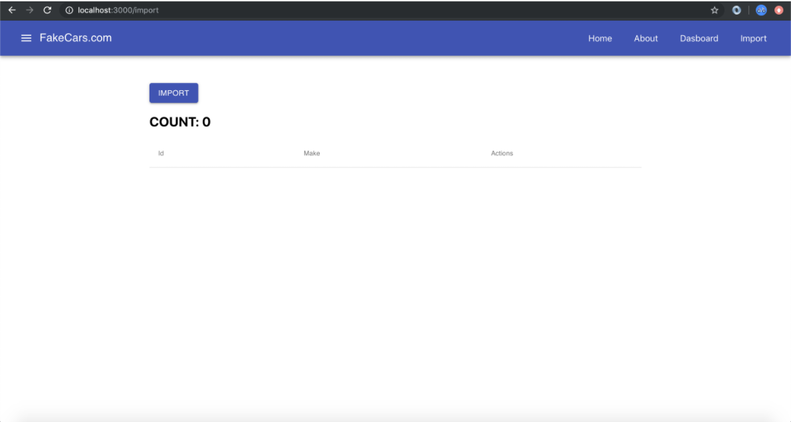

# Class 11: Redux Thunk

<!-- ! HIDE FROM STUDENT; INSTRUCTOR ONLY CONTENT -->
<!-- ## Instructor Only Content - HIDE FROM STUDENTS -->
<!-- cp workspace/resources/classOutlineTemplate.md docs/module- -->
<!-- ! END INSTRUCTOR ONLY CONTENT -->

*Do something today that your future self will thank you for.*

## Greet, Outline, and Objectify

<!-- SMART: Specific, Measurable, Attainable, Relevant, and Timely. -->
<!-- https://examples.yourdictionary.com/well-written-examples-of-learning-objectives.html -->
  
*OBJECTIVE: Today the student will learn and practice to understand:*

* *Asynchronous calls with Redux-Thunk*

*****

- [ ] Questions for Student-Led Discussion
- [ ] Interview Challenge
- [ ] Student Presentations
- [ ] Creation Time
    * [ ] Fork and Clone the [Redux-Thunk Repo](https://github.com/AustinCodingAcademy/411_wk6_day1_redux_thunk)
- [ ] Push Yourself Further - Material UI Practice w/ Pagination
- [ ] Exit Recap, Attendance, and Reminders

### Questions for Student-Led Discussion, 15 mins
<!-- This section should be structured with the 5E model: https://lesley.edu/article/empowering-students-the-5e-model-explained -->

[Questions to prompt discussion](./../additionalResources/questionsForDiscussion/qfd-class-11.md)

### Interview Challenge, 15 mins
<!-- The last two E happen here: elaborate and evaluate  -->
<!-- this sections should have a challenge that can be solved with the skills they've learned since their last class. -->
<!-- ! HIDDEN CONTENT: INSTRUCTOR ONLY -->
[See Your Challenge Here](./../additionalResources/interviewChallenges.md)
<!-- ! END HIDDEN CONTENT: INSTRUCTOR ONLY -->

### Student Presentations, 15 mins

[See Student Presentations List](./../additionalResources/studentPresentations.md)

## Creation Time, 60-90 mins

Today we are going to create a mock-import utility that we can use in our cars application. We will use Redux Thunk to hit an API that brings back cars data. We will then allow the user to delete each import. We also want to keep a current count of the imported cars. Some images below will show what the webpage should look like.

### Examples

=== "One"

    

=== "Two"

    

=== "Three"

    

### Project Instructions

- [ ] Fork and clone the [Redux-Thunk Repo](https://github.com/AustinCodingAcademy/411_wk6_day1_redux_thunk)

- [ ] Follow the directions in the `README.md` to complete the project. The project directions are also summed up below:

A lot of the Material UI documentation has been updated to support the new React feature called Hooks. We will not dive deep into the topic in this class but watch this video to understand what's going on because you likely ran across some documentation regarding hooks while building out your table for the import page, and as you move forward in your new career you will **very** likely see hooks.

- [ ] Follow-Up Video: [YT, TraversyMedia - React Hooks Intro](https://youtu.be/mxK8b99iJTg)

### Push Yourself Further

When you've finished the project for this class you'll notice that the table is very long and you have to scroll for a bit before you get to the bottom of it. Imagine if it were 2 or 3 times that size. Imagine if there were 1000 rows. This provides a bad user experience. Reference the documentation from Material UI below and see if you can add pagination to the import table.

- [ ] [Material UI Pagination](https://material-ui.com/components/tables/#custom-table-pagination-action)

## Student Feedback

<iframe src="https://docs.google.com/forms/d/e/1FAIpQLScjuL10i2xFGMWRwkjtgAL8F1Y5ipMPPjtTCDzkO1ZBcxUYZA/viewform?embedded=true" width="640" height="500" frameborder="0" marginheight="0" marginwidth="0">Loading…</iframe>

## Exit Recap, Attendance, and Reminders, 5 mins

- [ ] Create Redux-Thunk Assignment
- [ ] Prepare for next by completing all of your pre-class lessons
- [ ] Complete the feedback survey

<!-- <iframe id="openedx-zollege" src="https://openedx.zollege.com/feedback" style="width: 100%; height: 500px; border: 0">Browser not compatible.</iframe>
 -->

<!-- TODO Create 3 question exit questions -->

<!-- TODO INSERT Student Feedback From -->

<!-- TODO INSERT *HIDDEN* Instructor Feedback Form -->

<!-- 
height/width = 1.777 ---- width="655" height="368"
cp workspace/resources/classOutlineTemplate.md docs/module-
 -->