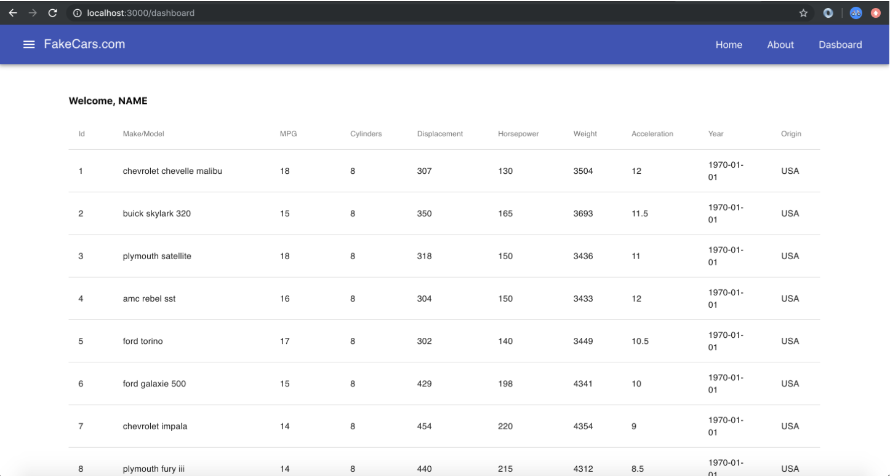

# Class 9: Redux, mapStateToProps

<!-- ! HIDE FROM STUDENT; INSTRUCTOR ONLY CONTENT -->
<!-- ## Instructor Only Content - HIDE FROM STUDENTS -->
<!-- cp workspace/resources/classOutlineTemplate.md docs/module- -->
<!-- ! END INSTRUCTOR ONLY CONTENT -->

*Success doesn’t just find you. You have to go out and get it.*

## Greet, Outline, and Objectify

<!-- SMART: Specific, Measurable, Attainable, Relevant, and Timely. -->
<!-- https://examples.yourdictionary.com/well-written-examples-of-learning-objectives.html -->
  
*OBJECTIVE: Today the student will learn and practice to understand:*

* *Global state over an application using Redux*

*****

- [ ] Questions for Student-Led Discussion
- [ ] Interview Challenge
- [ ] Student Presentations
- [ ] Creation Time
    * [ ] Fork & Clone the [Wk5 Day1 Repo](https://github.com/AustinCodingAcademy/411_wk5_day1_mapstatetoprops)
- [ ] Push Yourself Further
<!-- - [ ] Interview Questions: Blog to Show You Know -->
- [ ] Exit Recap, Attendance, and Reminders

### Questions for Student-Led Discussion, 15 mins
<!-- This section should be structured with the 5E model: https://lesley.edu/article/empowering-students-the-5e-model-explained -->

[Questions to prompt discussion](./../additionalResources/questionsForDiscussion/qfd-class-9.md)

### Interview Challenge, 15 mins
<!-- The last two E happen here: elaborate and evaluate  -->
<!-- this sections should have a challenge that can be solved with the skills they've learned since their last class. -->
<!-- ! HIDDEN CONTENT: INSTRUCTOR ONLY -->
[See Your Challenge Here](./../additionalResources/interviewChallenges.md)
<!-- ! END HIDDEN CONTENT: INSTRUCTOR ONLY -->

### Student Presentations, 15 mins

[See Student Presentations List](./../additionalResources/studentPresentations.md)

## Creation Time, 60-90 mins

Today we are going to practice what we learned with Redux and mapStateToProps. We will use mapStateToProps functions to create containers and then reference the global state in our components.

- [ ] Fork and clone the following repository: [411_wk5_day1_mapstatetoprops](https://github.com/AustinCodingAcademy/411_wk5_day1_mapstatetoprops).
- [ ] Follow the directions in the `README` to complete the project and upload the link to your GitHub repository to the appropriate assignment. The project directions are also summed up below:

### Follow-Up

Two things before you watch this video:

1. This guy is writing the component and container is the same file. He explains it. We aren't following that pattern you might see code organized this way in the future.
2. We don't need `bindActionCreators`. You'll see him import it.

[YT, Thenewboston, ReactJS/Redux Tutorial](https://youtu.be/IIMUXbkKzW0)

### Push Yourself Further

- [ ] Follow along and build with [this Medium tutorial about React with Redux Thunk](https://medium.com/@notrab/getting-started-with-create-react-app-redux-react-router-redux-thunk-d6a19259f71f). He is introducing a couple topics we haven't talked about yet (in relation to Redux) like thunk but don't worry we will get to that stuff soon.

<!-- ## Blogs to Show You Know

[Blog Prompts](./../additionalResources/blogPrompts.md) -->

## Student Feedback

<iframe src="https://docs.google.com/forms/d/e/1FAIpQLScjuL10i2xFGMWRwkjtgAL8F1Y5ipMPPjtTCDzkO1ZBcxUYZA/viewform?embedded=true" width="640" height="500" frameborder="0" marginheight="0" marginwidth="0">Loading…</iframe>

## Exit Recap, Attendance, and Reminders, 5 mins

- [ ] Create *** Assignment
<!-- - [ ] Create Class * Blog Assignment -->
- [ ] Prepare for next by completing all of your pre-class lessons
- [ ] Complete the feedback survey

<!-- <iframe id="openedx-zollege" src="https://openedx.zollege.com/feedback" style="width: 100%; height: 500px; border: 0">Browser not compatible.</iframe>
 -->

<!-- TODO Create 3 question exit questions -->

<!-- TODO INSERT Student Feedback From -->

<!-- TODO INSERT *HIDDEN* Instructor Feedback Form -->

<!-- 
height/width = 1.777 ---- width="655" height="368"
cp workspace/resources/classOutlineTemplate.md docs/module-
 -->