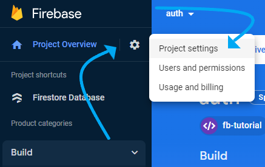
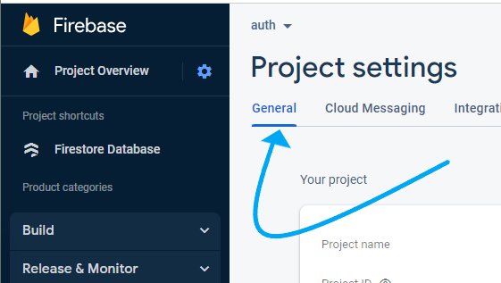
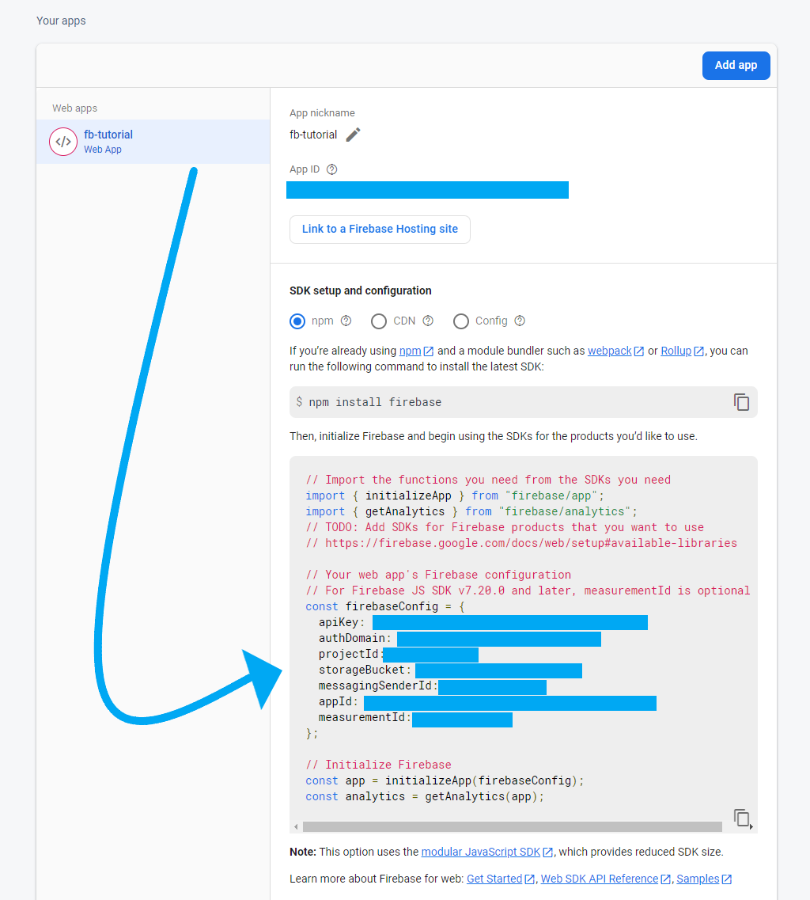
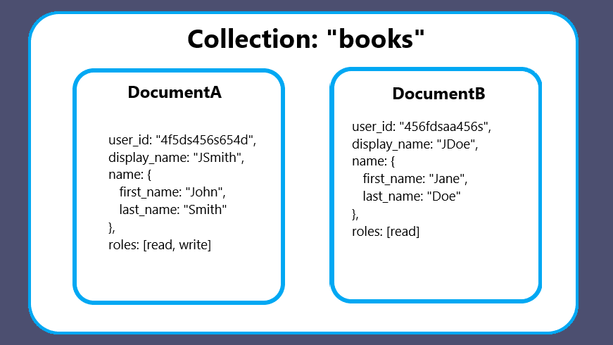
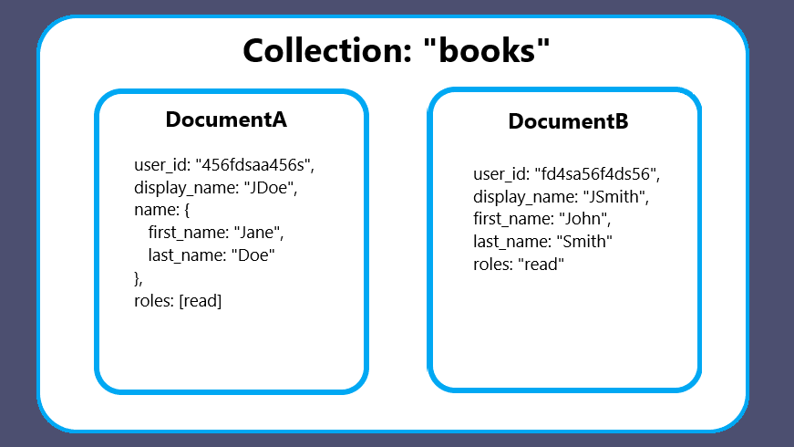

# **_C_**reate and **_R_**ead - FireStore

## Overview
So now we have become familiar with FireBase's awesome service, FireStore, where we can create and store our very own database. If you followed along in the previous lesson, you should have initiated your database and created your first **collection** along with its first document. Hopefully you also add in a couple extra documents yourself since we are now going to *read* those documents from the client side. Although we created some data using the FireStore dashboard, we also want to be able to create data from the client.

In this lesson, we are going to go more into depth about those basic CRUD operations we spoke about in the previous lesson. Remember, **CRUD** is the acronym to **_C_**reate, **_R_**ead, **_U_**pdate, and **_D_**elete data. We are going to connect our database instance with a React app and go over these CRUD operations together.

## Connect React App & FireStore

We are going to begin by first **R**eading some data, so I encourage you to make sure you have some data stored in a collection on your FireStore database instance, and if not, you can skip down to the [**C**reate portion of this lesson](#create) to create some data. But, in order to begin, we need to go back into our Firebase **config** file and create some new instances, so lets start there.

### Config

At this point, you should have already set up a configuration file before. We are going to be using that same file for most things Firebase related, including both `Auth` and now `Firestore`. If you are starting a new project, we can use the same information from our previous config file, assuming you are still working on that same Firebase project, or update the configuration information with any new information.

You can also find this information on your [Firebase console](https://console.firebase.google.com/u/0/) under your projects settings, under the `General` settings tab.

=== "Finding Configuration File - 1"
    

=== "Finding Configuration File - 2"
    

=== "Finding Configuration File - 3"
    

On your config file, we simply need to add two things. We want to import `getFireStore` from `firebase/firestore`, then we want to create an instance of our database (`db`) using `getFirestore`. Then we're going to export this so we can use it in other files of our project, where we will be making requests to our database.

Your configuration file should look like this:

```javascript
import { initializeApp } from "firebase/app";
import { getAuth } from "firebase/auth";
import { getFirestore } from "firebase/firestore";

const firebaseConfig = {
  apiKey: process.env.REACT_APP_API_KEY,
  authDomain: process.env.REACT_APP_AUTH_DOMAIN,
  projectId: process.env.REACT_APP_PROJECT_ID,
  storageBucket: process.env.REACT_APP_STORAGE_BUCKET,
  messagingSenderId: process.env.REACT_APP_MESSAGING_SENDER_ID,
  appId: process.env.REACT_APP_APP_ID,
  measurementId: process.env.REACT_APP_MEASUREMENT_ID,
};

// initialize  firebase
const app = initializeApp(firebaseConfig);

// initialize auth
export const auth = getAuth(app);

// initialize FireStore
export const db = getFirestore(app);
```

- [ ] Be sure to add: `import { getFirestore } from "firebase/firestore"`
- [ ] Then add: `export const db = getFirestore(app)`

## **_R_**ead / GET

Now that we have instantiated our `db` with our Firebase project, we can now use that instance to make requests to that database. Remember those documents you created in the previous lesson? Let's see if we can make a request to our DB and **R**ead those documents.

In order to get a **list** of all the **documents** of a **collection**, we need to first `import` some functions from the `firebase/firestore` library. We are going to import `collection` to make a reference to the **collection** we are trying to request data from, and `getDocs` to get a list of all documents in that **collection**.

=== "Getting a List of Documents"

    ```javascript
    // import our 'db' instance from our 'config' file
    import { db } from './firebase/config'

    // import collection and getDocs from 'firebase/firestore
    import { collection, getDocs } from "firebase/firestore";

    // Create a reference to the db and the collection we want to use, this 
    //  example is the "video_games" collection. Please substitute this with
    //  a collection in your database.
    const collectionRef = collection(db, "video_games")

    // Now that we have a reference, let's get all the documents from that 
    //  collection `getDocs` returns a promise, so lets wait for it to resolve
    const results = await getDocs(collectionRef)

    // We now need to go through each document in our results and invoke a 
    // function that is returned to us from FireStore to actually see the data
    results.docs.forEach(doc => {

      // for each 'doc', we'll console log an object with it's own id and spread
      // the object that is returned to us by called the 'doc.data()' function
      //  with our actual data
      console.log({
        id: doc.id,
        ...doc.data()
      })
    })

    // See next slide to see a more robust example using React...

    ```

=== "`useEffect` Example"

    ```javascript
    import React, { useEffect, useState } from "react";
    import { collection, getDocs } from "firebase/firestore";
    import { db } from "../firebase/config";

    const List = () => {

        const [data, setData] = useState(null);

        useEffect(() => {
            const getCollection = async () => {
                const ref = collection(db, "video_games");
                let { docs } = await getDocs(ref);
                let list = []
                docs.forEach((doc) => {
                    list.push({
                        id: doc.id,
                        ...doc.data()
                    })
                });
                setData(list)
            };

            getCollection()
        }, []);

        // We're using useEffect here so we can monitor any changes 
        //  made to our 'data' state
        useEffect(()=>{
            console.log('effect:', data)
        }, [data]) // data inside our dependency array

        return <div>This is the listing page</div>;
    };

    export default List;
    ```

Once you get your list, make sure you render your `List` component to map through the data and display the list however you'd like.

Next, we are moving on to **_C_**reating data.

## **_C_**reate / POST

Creating new data for our FireStore DB is pretty simple. You will take everything you have learned about React thus far, such as setting some _state_ and handling _events_, and implement FireStore's simple methods to write some new data.

Again, we will be using our `db` instance, and we'll be importing two things from `firebase/firestore`, `addDoc` and `collection`. We can also import `Timestamp` if we are using FireStore's own version of `Timestamp`. 

> NOTE: We could create our own timestamp in JS but would just need to do a little extra work to convert our regular timestamp to the FireStore `Timestamp`.

Follow along with the high overview example below, followed by a practical React use case.

=== "Creating a Document"

    ```javascript
    // import our 'db' instance from our 'config' file
    import { db } from './firebase/config'

    // import collection, addDoc, and Timestamp from 'firebase/firestore
    import { collection, addDoc, Timestamp } from "firebase/firestore";

    // Again, we will create a reference, but this time we will be doing 
    //  something a little different. When we refer to a collection that DOES 
    //  NOT EXIST in the DB, one will be created for us. This makes it simple 
    //  to add a collection from anywhere. In this example, we'll be creating
    //  a new table called 'books
    const collectionRef = collection(db, "books")

    // Now we have a reference to a collection (that is yet to exist). Let's 
    //  create a new document in this new collection by using our `addDoc`
    //  function. Again, this returns a Promise, so let's wait for it to resolve.
    //  `addDoc` takes two parameters, the collection and an Object with the new
    //  data we want to add to the document. FireStore can take most data types 
    //  so adding nested arrays or objects is valid.
    await addDoc(collectionRef, {
        title: "The Lord of the Rings",
        author: "J. R. R. Tolkien",
        characters: ["Frodo", "Gandalf", "Smeagol"],
        // Use Timestamp to convert a Date string to a FireStore Timestamp
        publish_date: Timestamp.fromDate(new Date("1954-07-27"))
    })

    // If successful, `addDoc` should have had created a new collection and 
    // added our new document to that collection.

    // See next slide to see a more robust example using React...

    ```

=== "Create a Document using React w/Comments"

    ```javascript
    import React, { useEffect, useState } from "react";
    import { collection, addDoc, Timestamp } from "firebase/firestore";
    import { db } from "../firebase/config";

    const Add = () => {

      // Make sure you implement some state to keep track of your inputs.
      const [body, setBody] = useState({
        title:'',
        author: '',
        publish_date:'',
        characters: []
      });

      // This state below is in charge with helping with the 'characters' 
      //    array in our body. Keep in mind we have a 'body.characters' array
      //    and 'character' string, these are both different. This state below
      //    is simply a placeholder for our character input which we push to
      //    the 'body' state, shown a little later...
      const [character, setCharacter] = useState('')

      // This event handler function will allow us to "push" a string to our
      //    characters array inside our body.
      const addToArrayHandler = () => {
        // Copy current state and assign object to a variable "newBody"
        const newBody = { ...body };
        // Push new character into newBody.characters array
        newBody.characters.push(character);
        // Set our "body" state with our "newBody" object we created with 
        //  our new data.
        setBody(newBody);
        // Set the character state to an empty string to await another input
        setCharacter("");
      };

      // Finally we have the 'submit' function which add the document to our 
      // FireStore collection
      const handleSubmit = async (e) => {
        e.preventDefault()
        console.log(body)
        const ref = collection(db, "books")
        // We will use a try/catch block here in case we run into any errors
        try {
            await addDoc(ref, {
                ...body,
                // overwrite our "publish_date" as a FireStore Timestamp
                publish_date: Timestamp.fromDate(new Date(body.publish_date))
            })
        } catch(error) {
            console.log(error)
        }
        // Reset state to it's initial state if we want to add a different 
        // input after
        setBody({ title:'', author: '', publish_date:'', characters: [] })
      }

      // We're using useEffect here so we can monitor any changes made to our 
      // 'body' state
      useEffect(() => {
        console.log('effect:', body)
      }, [body]) // body inside our dependency array

      return(
        <form onSubmit={handleSubmit} >
          <input 
            type="text" 
            value={body.title} 
            onChange={(e)=>{
              setBody({...body, title: e.target.value})
            }} 
          />
          <input 
            type="text" 
            value={body.author} 
            onChange={(e)=>{
              setBody({...body, author: e.target.value})
            }} 
          />
          <input 
            type="date" 
            value={body.publish_date} 
            onChange={(e)=>{
              setBody({...body, publish_date: e.target.value})
            }}  
          />
          {/* This will list out any added characters in your body separated by 
          a comma and a space. */}
          <p>Currently added Characters: {body.characters.join(", ")}</p>
          <span>
            <input 
              type="text" 
              value={character} 
              onChange={(e)=>{setCharacter(e.target.value)}} 
              />
            <button type='button' onClick={addToArrayHandler} >Add</button>
          </span>
          <button type="submit" >Submit</button>
        </form>
      );
    };

    export default Add;
    ```

=== "Create a Document using React w/o Comments"

    ```javascript
    import React, { useEffect, useState } from "react";
    import { collection, addDoc, Timestamp } from "firebase/firestore";
    import { db } from "../firebase/config";

    const Add = () => {
        const [body, setBody] = useState({
            title:'',
            author: '',
            publish_date:'',
            characters: []
        });

        const [character, setCharacter] = useState('')

        const addToArrayHandler = () => {
            const newBody = { ...body };
            newBody.characters.push(character);
            setBody(newBody);
            setCharacter("");
        };

        const handleSubmit = async (e) => {
            e.preventDefault()
            console.log(body)
            const ref = collection(db, "books")
            try {
                await addDoc(ref, {
                    ...body,
                    publish_date: Timestamp.fromDate(new Date(body.publish_date))
                })
            } catch(error){
                console.log(error)
            }
            setBody({ title:'', author: '', publish_date:'', characters: [] })
        }

        useEffect(()=>{
            console.log('effect:', body)
        }, [body]) 

        return(
            <form onSubmit={handleSubmit} >
                <input 
                    type="text" 
                    value={body.title} 
                    onChange={(e)=>{
                        setBody({...body, title: e.target.value})
                    }} 
                />
                <input 
                    type="text" 
                    value={body.author} 
                    onChange={(e)=>{
                        setBody({...body, author: e.target.value})
                    }} 
                />
                <input 
                    type="date" 
                    value={body.publish_date} 
                    onChange={(e)=>{
                        setBody({...body, publish_date: e.target.value})
                    }}  
                />
                <p>Currently added Characters: {body.characters.join(", ")}</p>
                <span>
                    <input 
                        type="text" 
                        value={character} 
                    onChange={(e)=>{setCharacter(e.target.value)}} 
                    />
                    <button type='button' onClick={addToArrayHandler} >Add</button>
                </span>
                <button type="submit" >Submit</button>
            </form>
        );
    };

    export default Add;
    ```

Nice! We created some data and stored it in our FireStore DB. You can create as many _collections_ as needed, all with their own documents that serve the needs of your App. You might want to store a _collection_ of _books, cars, video games, blog posts, users_... you get the point. As we move on through this course, keep your Capstone idea in mind as you will be creating these _collections_ in a similar manner.

## Document-Oriented Database

At this point, it's important to talk about **consistency** in our data. Since FireStore is **NOT** a **Relational Database** such as **SQL**, which stores data into tables, columns, and rows, FireStore is a little more relaxed when it comes to creating data; meaning you can create multiple documents of various shapes (different values and data types). FireStore is a **NoSQL**, document-oriented database, which allows us to have different fields in a document within a collection, meaning, the documents can have completely different data from one to the next. Although you are *allowed* to do this, it is important to keep in mind that you want consistent data through your data so you can depend on on the data structure of each document to be like the last. In addition, this can create errors down the line when you are expecting a certain field in every document and all of a sudden a document doesn't have an expected field. Check out the images below:

=== "Consistent Collection"
     
    
    > NOTE: Keeping your database consistent will better help serve your app's when you are building the client-side. So, if a field expects an Object or an Array, make sure to be specify that it does when creating new documents from the client-side. This will make for a reliable data structures and better flow.

=== "Inconsistent Collection"
    
    
    > NOTE: Do you see the difference between "DocumentA" and "DocumentB"? The fields are different! Although very similar this can create lots of havoc for you later down the line. Even though you *can* create different data structures across the documents in a collection, this is **strongly** discouraged as you might run into unexpected later. Your app will be designed to render the data from these collections, and they will need to be consistent, dependable, and reliable across the board in order to function properly.

As the saying goes, **"Just because you can, doesn't mean you should"**, applies to the way we model our documents inside our collections. Even though we can create completely different documents, do we really want to? Most of the data that will be stored into a FireStore DB will come from our client-side, where we will specify exactly what will be going into every document as it is created by the user. So there should not be much to worry about, after all, we are developers.

## Summary

We should now have a basic understanding on how to **_C_**reate and **_R_**ead documents. We have covered the _"CR"_ in **_CRUD_** in this section.

Next, we learn the **_U_**pdate and **_D_**elete portion.

## Additional Resources

- [ ] [YT, Firebase - How to Structure Your Data | Get to know Cloud FireStore #5](https://www.youtube.com/watch?v=haMOUb3KVSo)
- [ ] [YT, Firebase - Maps, Arrays and Subcollections, Oh My! | Get to know Cloud FireStore #4](https://www.youtube.com/watch?v=o7d5Zeic63s)
- [ ] [Blog, Soft Author - Raja Tamil - Firebase 9 FireStore GET ALL DOCUMENTS Data From A Collection](https://softauthor.com/firebase-firestore-get-documents-data-in-collection/)
- [ ] [Blog, Soft Author - Raja Tamil - Firebase V9 FireStore Add Document Data Using addDoc()](https://softauthor.com/firebase-firestore-add-document-data-using-adddoc/)
- [ ] [YT, PedroTech -CRUD Tutorial Using React + Firebase | Firebase 9 and FireStore Tutorial](https://www.youtube.com/watch?v=jCY6DH8F4oc&t=2244s)
- [ ] [YT, CodeWithChris - Firebase FireStore Tutorial - Data Model (Lesson 2)](https://medium.flutterdevs.com/firebase-data-modeling-tips-2fc61724743a)
- [ ] [YT, Fireship - FireStore Data Modeling - Five Cool Techniques](https://www.youtube.com/watch?v=OunS3tLLrPY)
- [ ] [Blog, Naveen Srivastava - Firebase Data Modeling Tips](https://medium.flutterdevs.com/firebase-data-modeling-tips-2fc61724743a)

## Know Your Docs

- [ ] [Firebase Documentation - Cloud FireStore Data model](https://firebase.google.com/docs/firestore/data-model)
- [ ] [Firebase Documentation - Supported data types](https://firebase.google.com/docs/firestore/manage-data/data-types)
- [ ] [Firebase Documentation - Choose a data structure](https://firebase.google.com/docs/firestore/manage-data/structure-data)
- [ ] [Firebase Documentation - Get data with Cloud FireStore](https://firebase.google.com/docs/firestore/query-data/get-data)
- [ ] [Firebase Documentation - Add data to Cloud FireStore](https://firebase.google.com/docs/firestore/manage-data/add-data)
