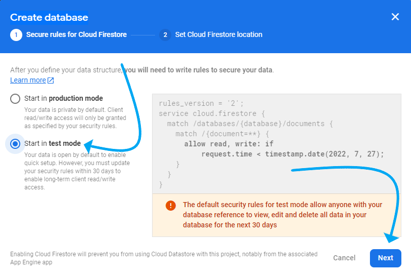

# CRUD Overview

_Nothing contributes so much to tranquilize the mind as a steady purpose—a point on which the soul may fix its intellectual eye. —Mary Shelley_

## Overview

For the past couple of days, we have been learning a lot about **Firebase**, **Auth** services specifically, to store authenticated Users on the cloud somewhere. These next couple of lessons will introduce a new service from **Firebase** called [**Firestore**](https://firebase.google.com/docs/firestore) that will allow us to store data to a database. This data will be stored as records called "**collections**", and these collections will have several records within the collection called **documents**. We will be creating a client side **UI** which will enable us make queries to this database of `collections` to not only read these `documents`, but display it to the user as well. We will also be implementing a way to to `create`, `update`, or `delete` these `documents` or `collections` on our Database.

But, before we get into **Firestore**, we want to talk about fundamentals of **Database Management Systems** and the basic operations we use to obtain and mutate/_change_ data. By the end of your course and by graduation you will have built a full-stack CRUD app.

So what is **CRUD**?

## Create Read Update and Delete / _CRUD_

**CRUD** is an acronym that stands for **C**reate, **R**ead, **U**pdate, and **D**elete. In its simplest forms, any Software Application that consists of these four basic operations can be considered a `CRUD` application.

At a higher level, Crud apps consist of three major parts: the database, UI/_user interface_, and API's.

### What is a Database

Almost everything we do on the internet, from the pictures we view, blogs we read, and all Wikipedia pages, all store their information somewhere. These bits of information have to be stored somewhere, that's where databases come into play. A **Database** helps us store and organize our data, enabling us to easily read, create, update, and delete that data. The database is where our **Data** will be stored.

A **DBMS/_DataBase Management System_** is a service in which we use to **create** and **manage** our database. We will be using **Firebase's Firestore** as our **DBMS**, but there are also several other services in which we can host our Database.

There are also several types of **DataBase Management Systems** that can be categorized in the way in which they store data. The more popular types include **_Relational Databases_** **(SQL)** and **_Document Stores_** **(NoSQL)**. As you may have alreaedy guessed, having learned about collections and **documents**, Firestore is a **NoSQL DBMS**.

We will spare you the details about every database service available, but if you are interested in learning more, [check this out](https://budibase.com/blog/best-database-management-software/).

### The UI / _User Interface_

The **_UI_** or _user-interface_ will include everything we have learned about building applications in React so far as a way for users to interact with our database. Let's say, for example, we have an app that stores a _collection_ of a users favorite games or books. When that user signs up, we want our App to direct the user to their Dashboard and maybe render that specific user's current list of favorite games. The user themselves aren't making the request, that request is programmed to happen when that user signs in. When it comes to creating or updating data, the user will usually interact with _forms_ (`onSubmit`) or _buttons_ (`onClick`) that interact with the database based on those events. We will program or application to handle these events and make them interact with our **_DB_** accordingly. We can also provide a search bar for the user to make special queries to our database that filters specific data the user is looking for. We will learn more about how to do that with Firestore as we progress through the course.

### APIs

APIs are how most developers create full-stack web applications. Usually, this is an application separate from our client-side which allows us to make special **_HTTP requests_** to our database, also known as a _server-side application_. Those special requests are known as **_routes_**, and they will be responsible for what functions need to be performed when activated. Those functions may vary depending on the needs of the app, but they are usually designed to carry out the four basic CRUD operations: Create, Read, Update, and Delete. Web applications that separate client and server side are considered [**REST API's**](https://www.codecademy.com/article/what-is-rest), "_REpresentational State Transfer_". We do not to go deep into details for this, but just know this is a very common practice.

While creating server-side apps have become increasingly easier, we will not need to create a separate server since Firebase provides a way for us to build a full-stack application all on the client-side. We will be using the [Firestores "_Software Development Kit_" / **SDK**](https://firebase.google.com/docs/firestore/client/libraries), combined with [Firestore Security Rules](https://cloud.google.com/firestore/docs/security/get-started) and [Firebase Auth](https://firebase.google.com/docs/auth/) services.

## Intro to Firestore

Great, so we now have an idea what a CRUD application is, so let's get started. In order for us to interact with a Database, we first need to create it. We should already have a project created on Firebase, so lets continue to work on that same one.

### Creating our First Collection

Navigate to your current project on Firebase and follow the instructions below to get started on creating your first Firestore Database instance.

=== "Creating the Database"

    

    - [ ] On the [Firebase Dashboard](https://console.firebase.google.com/), click on Firestore tab listed in the column on the left.
    - [ ] Next, click on the **"Create database"** button. A *modal* / small window should have popped asking you to set some rules. Check next slide...

=== "Enabling Test Mode"

    

    - [ ] We will be selecting **test mode** to continue building our app while in development.

        >NOTE: It is important to make sure to change this before taking our app into production. We will talk about setting rules later in this course before we host our application on a live server. Test mode is strictly for development.

    - [ ] Click "*next*" to proceed and go to the next slide...

=== "Set Location"

    

    - [ ] Now, we need to set our location in which our database will be stored. Choose the appropriate location that will best serve for our intended audience.

        >NOTE: If you are in the US, you would choose US.

    - [ ] Click "*next*" to proceed and it should take you to the Firestore Dashboard. Proceed to the next slide...

=== "Firestore Dashboard"

    

    Now that we are on the Dashboard screen, we have successfully created our DB instance. Now we need to give it some data by creating our first ***collection***. Think of a ***collection*** as a organized set of data where every ***document*** listed under these ***collections*** are created with a **Unique Identifier**, a ***"UID"***.

    - [ ] Click on "***Start Collection***"
    - [ ] Proceed to the next slide...

=== "First Collection"

    

    These ***collections*** can be specific to the type of data you are trying to store. If you are trying to store more info about a **User**, you would create a collection called `users` that would have a ***document*** for every user that signs up for your service. If you wanted to store a ***collection*** of **books**, the ***collection*** could be called `books`. In this example, I will be creating data that represents a list of video games.

    - [ ] Give your new collection a name, this can be anything you want for demonstration purpose, or something that you have in mind for your Capstone Project.
    - [ ] Click "next" and proceed to the next slide...

=== "First Document"

    

    We should now be prompted to provide our new **collection** our first **document**. Every document will have a **unique identifier** and the data we store inside it will be similar to that of a javascript object, **key-value pairs**, where an *object key* would represent the *field*. These **fields** will allow for several data types, but for now, we will focus on the basic **string** and simple **timestamp**. This example is working with video games, so make sure to make it relevant to your database.

    - [ ] Click on *"Auto-ID"* to generate a ***Unique ID*** for this **document** to be referred to as.
    >Every **document** needs a Unique Identifier and it is always best practice to allow firestore to create the UID for us.

    - [ ] Add a *field* name with the data type of *string*
    >The first field we want to add can be the name or "title" that represents the document. These fields can be named whatever they want, and should be dependent on what your data represents.

    - [ ] Add a value to your first field. This example will be: *title: "Super Mario Bros"*
    - [ ] Add another field by pressing the "+" icon.
    - [ ] Add another *field* name with the data type of *string*, this example will be "*genre*"
    - [ ] Add a value to your second field. This example will be: *genre: "Platform"*
    - [ ] Add a *field* name with the data type of *timestamp*
    >The next field in this example represents the games "*release_date*" and the value will be of type **"timestamp"**.

    - [ ] Choose "*timestamp*" as the data type.
    - [ ] Select an appropriate time in relation to your data, this example is relevant to the game.
    >NOTE: Leaving the time blank will default to 12:00:00am.

    When using [Firestore's "timestamp"](https://firebase.google.com/docs/reference/js/v8/firebase.firestore.Timestamp), it is important to note that the data will be stored in a unique way which we will need to later modify to make it more readable to the human eye.

    - [ ] Proceed to the next slide...

=== "First Document - _Continued_"

    

    Let's add some more fields and try out some other data types available for us to store. In this slide, we will be talking about the *"array"* and *"map"* datatypes in Firestore. The array type is exactly like the arrays we are familiar with. You can list multiple values inside an array. This example will be listing a simple array with the field name "*protagonists*" for this game. The *map* is harder to understand, but think of it as a sub collection inside our document. It is similar to an object with nested key-value pairs inside of it. If it doesn't make sense now, that's ok. This section serves as only an introduction to the capabilities of Firestore, and it will become clearer as we continue to build our database.

    - [ ] Add a *field* name with the data type of *map*, this example will be characters
    - [ ] Inside our new *sub collection* inside our characters *map*, add another field name with the data type of *array*. This example, we will start with a *protagonist* sub collection.
    - [ ] Add as many values with the data type of *string* to create a simple array of string values. This example will list 3 different characters.

    So far, if we read our data in javascript, Firebase would compile our document to look like this object:
    ```javascript
    {
        title: Super Mario Bros,
        release_date: {
            // This is how Firebase will translate the timestamps
            seconds: 12310564564,
            nanoseconds: 456423123441
        }
        // This is the map of characters with and array or protagonists
        characters: {
            protagonists: ["Mario" , "Luigi", "Toadstool"]
        }
    }
    ```
    As we can see, a *map* sort of looks like a key-value pair whose value is another object. Let's look at another example.

    - [ ] Proceed to the next slide...

=== "First Document - _Continued-2_"

    

    Our data can be as simple or as complicated as we want. Depends on the needs of your application. We will show one last example of what nested data would look like inside firebase. We will again be working with our characters *map*, but now we are going to further nest another *map* / sub-collection inside our characters sub-collection. We will build 2 more arrays, one list with a field name "*bosses*" and another with field name "*enemies*"

    - [ ] Inside the "*characters*" or similar field you may have created, add two more field.
    - [ ] Name the first field, in this example it will be "bosses".
    - [ ] Give this array some values.
    - [ ] Name the second field, in this example it will be "enemies".
    - [ ] Give this array some values.

    If we saw our data compiled to javascript, our characters example would look like this at this point:
    ```javascript
    {
        // ... previous data
        characters: {
            protagonists: ["Mario" , "Luigi", "Toadstool"],
            antagonists: {
                bosses: ["King Koopa"],
                enemies: ["Koopa Troopa", "Hammer Bro", "Goomba"]
        }
    }
    ```
    Not too bad, we just created our first document!

    - [ ] Finally, save your data
    - [ ] Proceed to next slide...

=== "Results"

    

    Great job! If you are seeing this page, you should be able to see your data listed in your collection. Feel free to add more documents and/or collections as your desire. This data will initialize our data with some dummy data to play around with as we move on into explaining CRUD operations in the next section.

Awesome! So we now have a working DBMS, we created our first collection, and we even added our first document. Although we just created some data, we are going to further explain the 4 CRUD operations using the Firestore SDK instead of writing it ourselves on the Firestore Dashboard. Remember, this database is meant to store user inputs, dependent on the apps needs, of course. Our next step is to build a UI using the 4 basic operations we discussed earlier: Create, Read, Update, and Delete.

## Additional Resources

- [ ] [YT, Your IT Class - REST Vs CRUD - Explained with usecase in 5 Minutes](https://www.youtube.com/watch?v=Pz1IcBjOxj8)
- [ ] [Blog, budibase - What is a CRUD app and how to build one | Ultimate guide](https://budibase.com/blog/crud-app/)
- [ ] [Blog, budibase - 14 Best Database Management Software to use in 2021](https://javascript.plainenglish.io/what-is-double-bang-operator-in-javascript-90fc67ead5a4)
- [ ] [Article, codecademy.com - What is REST?](https://www.codecademy.com/article/what-is-rest)

## Know Your Docs

- [ ] [Firebase Docs - Cloud Firestore](https://firebase.google.com/docs/firestore)
- [ ] [Firebase Docs - Cloud Firestore Data model ](https://firebase.google.com/docs/firestore/data-modela)
- [ ] [Firebase Docs - Supported data types ](https://firebase.google.com/docs/firestore/manage-data/data-types)
- [ ] [Firebase Docs - SDKs and client libraries ](https://firebase.google.com/docs/firestore/client/libraries)
