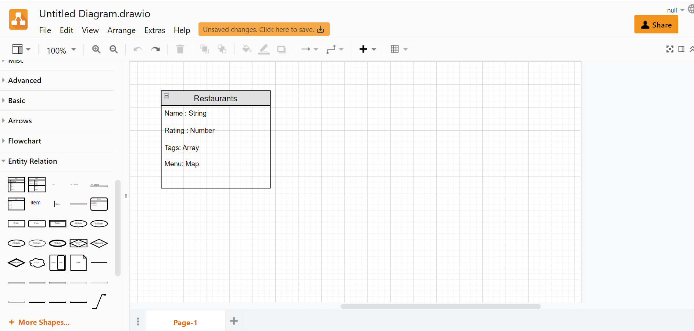
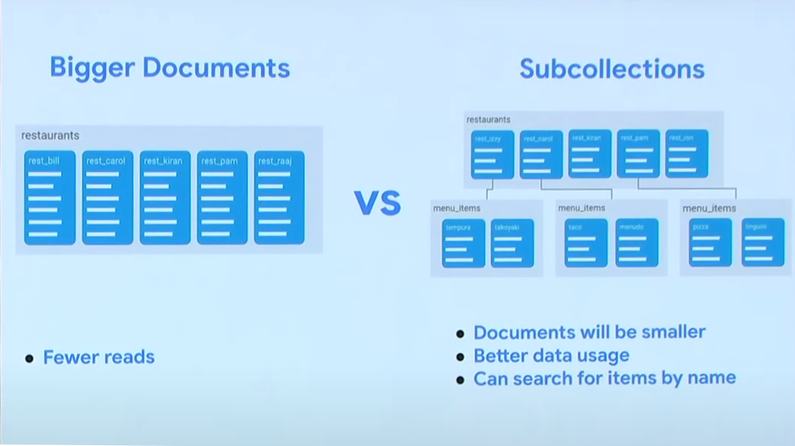
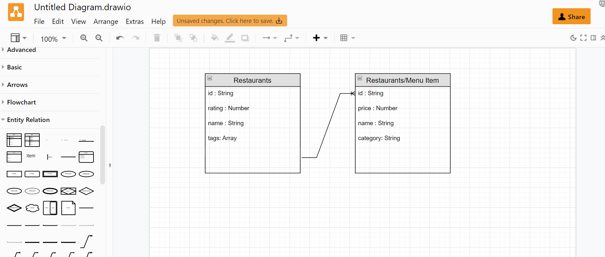
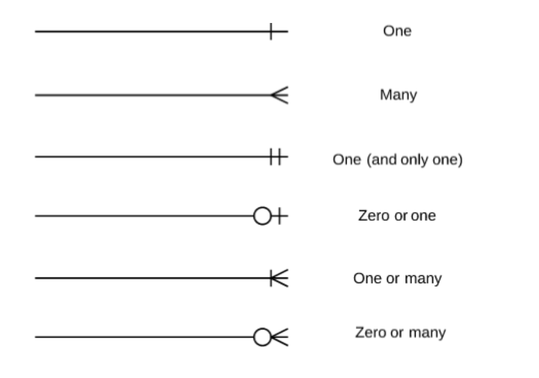
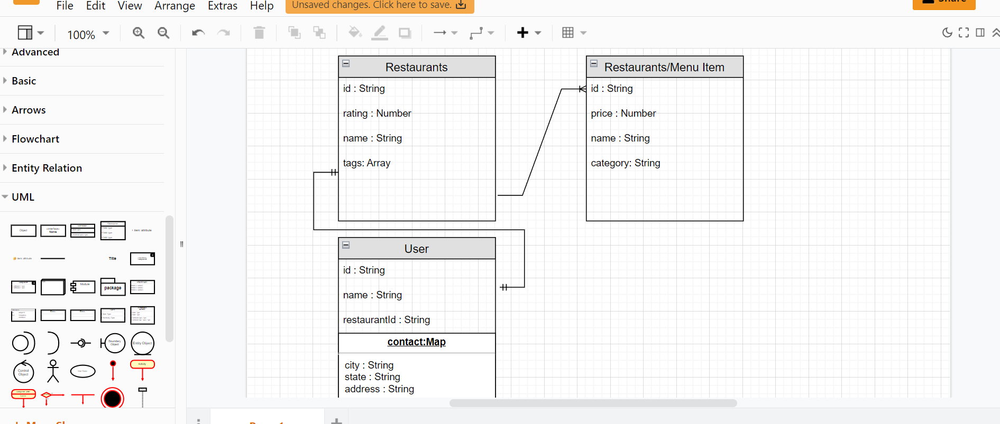

# Data Modeling with ER Diagrams

*Strong lives are motivated by dynamic purposes. —Kenneth Hildebrand*

## Overview

At this point we have most of the knowledge needed for creating a CRUD app. Now we're going to learn the process of organizing our data and dive into **Entity Relationship Diagrams** (ERD).

## Why Use Data Modeling?

Data modeling is the process of creating a model that represents the relationships between the different types of data in your database. Even though **NoSql** is a non-relational database we may sometimes have data that is related. **NoSql** databases are capable of relational data but, it is not a requirement like **SQL**. The data model emphasizes what data is needed and how it should be organized in a visual manner. In a nutshell, we want to make sure all (*or most*) of our data objects are accurately represented well before we write any code! This will save some headaches down the road.

One of the most common ways to do this is through the use of an **ERD** (Entity Relationship Diagram).

You may be thinking to yourself, "Greaaat...but why would I do this?" Here's a couple reasons why to use a data model. Using data models are much easier than changing your real database. Planning ahead will help keep your new database from becoming disorganized, or incorrect. When creating a database it's easier for you to review a data model than review a a database design. In most cases it is harder to describe a database to your someone than simply showing them a model that represents the database. These data models help improve organization and communication within your team.

## The Setup

We are going to go through the process of creating a data model for a **Restaurant Ordering App**. 

- [ ] First you need to go to [Draw.io](https://www.draw.io/) for out **ERD** (Entity Relationship Diagram). 
- [ ] Select Where you want to save it. Many options from github repository to your local hard drive, or any of the others.    Select decide later if you just want to dive right in. 
- [ ] On the left hand side scroll the menu down to Find the "Entity Relation" tab.
<!-- INSERT IMAGE OF DRAW ENTITY RELATION -->

## The process

We will think about our data step by step. The First functionality we want is for a user to be able to search restaurants and click a button to look at the menu. We will start with a data model for the "restaurant" collection.

#### UML Notation

Entity Relationship Diagrams are written in **[UML Notation](https://www.tutorialspoint.com/uml/uml_basic_notations.htm)** to visualize the relationships between tables. **UML** stands for **Unified Modeling Language** and it is basically the go-to for designing object-oriented systems.

- [ ] Follow Along and do the same as the image below and Model the data for our "restaurant" collection  [Draw.io](https://www.draw.io/) for our **ERD** (Entity Relationship Diagram). 
- [ ] Select the icon labeled "list" under "Entity Relation". We will represent a "restaurant" collection with several fields a user would expect when searching for a restaurant with their appropriate data types that will correspond with the FireStore database.



<!-- INSERT IMAGE OF DRAW ENTITY RELATION -->

- [ ] Now think about this from the user's perspective. You only want to send the data that is immediately relevant. Sending extra data can be slow and costly. What data is unneeded for the initial search and would take up to much space? Look at the data in the picture that you put in your **ER diagram**. Which one of the 4 (Name,Rating,Tags,Menu) should be separated out from the search?
<details><summary>Reason for Separation</summary>
Receiving the menu data at this point is unneeded since we want the user to click on a button for then menu and at that point we could query the menu items from the database.
</details>

### Put Data in a Sub Collection

It is not always the right way there are pros and cons but in general each potential separate user action with our data should be in its own collection. So Searching for restaurants and pressing a button to look at the menu are two separate actions and putting the "menu item" data in a sub collection collections of "restaurant" makes the most sense for this use case. 

When a user clicks the button on the chosen restaurant we can easily return just the restaurant's corresponding menu items since we already have the reference and id to the document in "restaurant" collection. This saves us from having to return every menu item from every restaurant returned from a search result.




Here is how we would model it in our ER Diagram. Follow along and make your diagram look the same. Notice We have the label "Restaurants/Menu item" This shows Menu Item is a sub collection of Restaurants. Notice that there are several relationship lines to pick (**One-to-One**, **One-to-Many** ect..). Zoom in on the picture with your browser ++ctrl++ ++plus++  if unable to see.




Also, notice the added id field. Remember each document put in the collection will have a corresponding id that can be setup to be added automatically when FireStore adds a new document. In addition, it is important to note that The id field in FIreStore is also a string.

### Cardinality

The lines correspond with **cardinality**. Cardinality refers to the type of relationships that we maintain between our entities. These types of relationships are how we can enforce data integrity throughout our database. For example, Each restaurant has many menu items(**One-to-Many** relationship). But what cardinality is really talking about is the maximum or minimum number of relationships that can be maintained between two entities. For example, a `user` can have multiple `userContacts` but only one `usersAddress`.


## Relationships Explained

- [ ] **One-to-One**: This relationship can be summed up as one table to another table allowing only one connection each. Such as a User table having a One-to-One relationship for a drivers license table. The user can only have one drivers license so it would be applicable to use the One-to-One relationship.

- [ ] **One-to-Many**: An example of a One-to-Many relationship would be a Users table and an Orders table. The User can have as many Orders as they want but each Order could only have one User; using a One-to-Many relationship would work perfectly.

- [ ] **Many-to-One**: this can be understood as the opposite of the previous. Let's say we have a Bank Account table & a Users table. Each User could have many Bank Accounts but each Back Account would have only one User.

- [ ] **Many-to-Many**: An example of this would be a Course table to a Student table. Each Course can have many students and each Student can have many Courses.

- [ ] Find the elements you need under the "Entity Relation" tab on the left toolbar.



When a user orders they are going to pick one restaurant to order from on a per transaction basis. So add a user to the data. The user has a **One-to-One** relationship with a restaurant. Bellow Under "User" collection the Contact data is The **map data** type. It is found in FireStore and is what we would call an object in javaScript. And we would expect to find a object with `{state, city, address}` ect... You will find it under the "UML" menu tab labeled "object"



We have now molded our data based on our user interactions. Restaurants will be returned from a search query. When a user clicks a restaurants menu button the corresponding "menu item" sub-collection will be returned. When a user selects a restaurant to order from the restaurant's ID will correspond **One-to-One** with a user and be saved in the `restaurantId` field of the "User".


## Determining Our Data Model

Most of the information above assumes you already have a working database, or at least a couple tables. We've talked about how to read/interpret our diagrams and in our homework assignment today we will work on creating an ER diagram, but let's take a second to talk about modeling the data that these diagrams come from.

  > NOTE: data modeling is a broad subject. We will discuss only what's most important for us at this level.

Let's now assume that we are starting completely from scratch. We do not have a database set up at this point but we know we are going to use **NoSQL**. We will want to take the following actions:

1. **Understand the company's industry**
  We need to know what we are building. Having an understanding of our business model will help us determine what our entities will be.

1. **Identify our entities**
  What collections do we think we will need to create? If I am in the eCommerce space I will probably want a collection called `customers`.

1. **Identify our attributes**
  Now that we have our tables it's time to determine what fields should exist on those tables. Every "customer" should definitely have an `id`, but what else? We might want to know the customers' first and last names and probably some contact information.

1. **Identify our relationships**
  We have a "customers" table and because we know that customers will place orders, we've also gone ahead and created an "orders" collection. Each table has its own set of attributes but how are they related? What's the cardinality? Well . . . if we assume that any customer can have multiple orders (that would make sense, right?) then we know that we have established a "one-to-many" relationship.

This is the thought process you will go through as you develop **NoSQL** databases on your own. It may seem simple or it may seem complicated but data modeling is an important part of the development process and a good skill to have. Always begin by drawing it out on paper so you have a good visual understanding of your database's needs.

## Model a piece of data in code with Schema.

Schemas are objects that define the structure of the data. We use it in our code to determine how our data is laid out before we enter it into the database. Previously just used  object literals `{}`. The disadvantage of this is we have to keep checking  back to all the places we have modified or inserted using the same setup in the same collection. With a schema we can setup a standard process for how our data is structured and put in safeguards like default values. We can do this by using classes to create objects we will put into our database. The class would Represent how a piece of data wold look in the collection. Bellow is an example of a "User" collection.


```javascript
// Models/schema.js
class User {
  constructor(name, restaurantId,city,state,address) {
    this.name = name || "";//if name is null/undefined or does not 
                            //exist empty  string will be the default
    this.restaurantId = restaurantId || "0"; 
    this.contact = getContact(city,state,address);

  // Default values if none are provided
    function getContact(city = "",state = "",address = ""){
  /// more predictability in code
     return {city,state,address}
    }
  }
}

const userOne = new User( 'Ted', 78, 'Lake Stevens', 'WA');
console.log(userOne);
//{ name:'Ted',restaurantId: 78,
//  contact: {city:'Lake Stevens', state:'WA', address: "" }
// }

const userTwo= new User( 'Max', null , 'Denver', 'CO', '14221 sun set');
console.log(userTwo);
// { name:'Max',restaurantId: 0, 
//   contact: {city:'Denver', state:'CO', address: '14221 sun set' }
// }


//// add in FireBase FireStore database
await addDoc(userCollectionRef, userOne)

```

## Practice It

Prompt 1: You will practice by going back to your firebase assignments project and changing one of or more of the object literals `{}` you put in the database with a schema. Go to one of the Previous 1-4 day assignments and create a `Models/schema.js` folder and file create a class that follows your data from a collection and export the class. Then import and call that class and input the data like above and use that to put in the database instead of a object literal `{}`.

prompt 2: Right now in our Restaurant example we are only saving the `restaurantId` when a user picks a restaurant to order from. However we are not saving the chosen menu items. You have two choices: make another map object to save the item choices in the "User" collection or make a new "transaction" sub-collection of "User" to save all transaction data and chosen menu items. Do one of them and 
explain/think about why you did one over the other.

## Additional Resources

- [ ] [Cloud Firestore Data Modeling ](https://www.youtube.com/watch?v=lW7DWV2jST0)
- [ ] [Article, TutorialsPoint - UML Notation](https://www.tutorialspoint.com/uml/uml_basic_notations.htm)
<!-- - [ ] [YT, tuber - title]() -->

## Know Your Docs

- [ ] [LucidCharts Docs - ER Diagrams](https://www.lucidchart.com/pages/er-diagrams)


