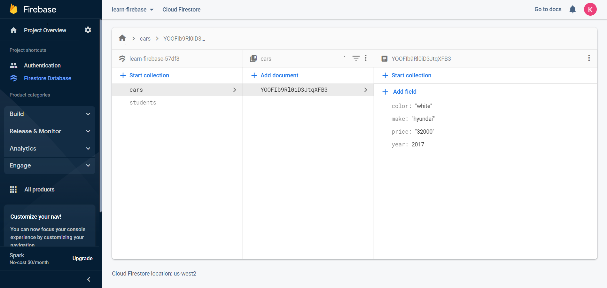

## What is A Database

A database is an organized set of data stored and accessed electronically. It helps provide a layer of persistence to our applications. That means, even if our application breaks or is shut down, we can still access the data. Next time the app starts up, it should be able to pick up where it left off.

We can integrate **Firebase** with our data through a service from **Firebase** called [**Firestore**](https://firebase.google.com/docs/firestore). This is how users will interact with our dateset. We can also use the **Firebase** console in our google cloud account to visualize the data and query it. This becomes very useful for planning, organizing and debugging our data. There are different types of  **Database Management Systems** available to us but in this course we will use what is called a, **NoSQL** database.

 

You have been working in the “cloud” with FireBase. The “cloud” is just a collection of servers that [stores](https://www.vox.com/2015/4/30/11562024/too-embarrassed-to-ask-what-is-the-cloud-and-how-does-it-work) your data and is maintained by google like the one pictured above.


## NoSQL vs SQL?

When developers say “NoSQL database,” they are usually referring to any non-relational database.
**NoSQL** databases are databases that store data in a format other than the relational table a **SQL** database would use.

**SQL** relational databases must be in a rigid  structure in regards to how data is related to one another other. For example, all of Bobs data would be located on the same row of the table.

| id | email | age | name | password |
| - | - | - | - | - |
| 001 | bob@email.com | 55 | Bob B | wonderful55 |
| 002 | sarah@email.com | 75 | Sarah F | turtleLove1955 |
| 003 | emily@email.com |  25 | Emily T | rainbowHearts33 |

**NoSQL** on the other hand is more open ended and can be structured with no regard to the relationships of the data. **NoSQL** is comprised of collections of **documents** but, you know them as **objects** and they function exactly the same way as **objects** you have used in the past.  Also, The key value pairs can contain any value and it is up to the developer to decide how to organize it.  Here is an example of **NoSQL** Data.


=== "NoSQL “cars” collection"
    
    ```javascript
     [{
    "_id" : ObjectId("600c626932e0e6419cee81a7"),
    "year" : "2017",
    "make" : "hyundai",
    "color" : "white",
    "km" : 22000,
    "price" : 32000
    },
    {
    "_id" : ObjectId("45c626932e0e6419cee8gfg0"),
    "year" : "2010",
    "make" : "ford",
    "color" : "red",
    "km" : 29000,
    "price" : 42000
    }]
    ```
Above we have an array of **documents/objects** stored in the database.  When we read data from our database we will get back **documents** that are just **objects** and if we get more then one they will be in an array. After we **read** or **write** the data in our database we must use the tools we learned from 211 to interact with the **objects** and **arrays** our data is structured in: `.push()`.`splice()`, `.map()` ect…


## Read vs Write


#### READ

A **read** operation means we are fetching or reading some data from the database. You can think of this like the GET requests we learned about previously. In **NoSQL**, this manifests itself in the form of functions from **FireBase**. 

=== "App.js"
    
    ```javascript
    import { collection, getDocs} from '@firebase/firestore'
    /// Data is saved in collections. Access collections with FireBase methods.
    const carsCollection = collection(db, 'cars');
    // All the data from ‘cars’ collection is retrieved from the databases
    const data = await getDocs(carsCollection);
    ```

#### WRITE
A write operation is something that creates, updates or deletes data. These could correspond to our POST, PUT and DELETE. The FireBase functions that represent these actions are: `addDoc()`, `updateDoc()`, `deleteDoc()`.
=== "App.js"
    
    ```javascript
    import { collection, addDoc} from '@firebase/firestore'
    const carsCollection = collection(db, 'cars');    
    ///Use an object to write to the database and store it in a collection as a document 
    const newCar = { year: newYear, price: newPrice, make: newMake,color:newColor };
    await addDoc(carsCollection,newCar);
    ```
    Now here is the data from the **Firebase** console. It is stored in the "cars" collection as a document in the **Firestore** database
 

## Additional Resources

- [ ] [How do NoSQl databases work?](https://www.youtube.com/watch?v=0buKQHokLK8)
- [ ] [MongoDb NoSQL vs SQL](https://www.mongodb.com/nosql-explained/nosql-vs-sql)


## Know Your Docs

- [ ] [Firebase Docs - Cloud Firestore](https://firebase.google.com/docs/firestore)
- [ ] [Firebase Docs - Cloud Firestore Data model ](https://firebase.google.com/docs/firestore/data-modela)
- [ ] [Firebase Docs - Supported data types ](https://firebase.google.com/docs/firestore/manage-data/data-types)
- [ ] [Firebase Docs - SDKs and client libraries ](https://firebase.google.com/docs/firestore/client/libraries)
