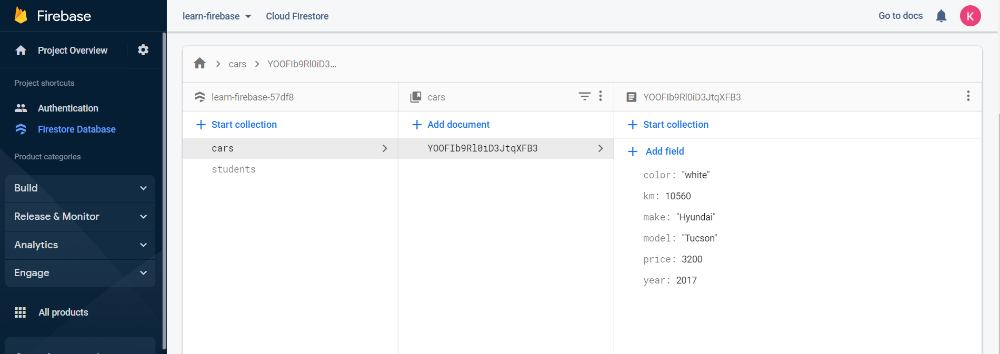

## What is A Database

A database is an organized set of data stored and accessed electronically. It helps provide a layer of persistence to our applications. That means, even if our application breaks or is shut down, we can still access the data next time the app starts up; and all devices (clients) accessing the database should see the exact same data.

Since we've been working with Firebase to implement our Authentication and server needs, let's use another one of their services called [**Firestore**](https://firebase.google.com/docs/firestore) to manage our dataset. **Firebase** also has a console that will allow us to visualize the data and query it. This becomes very useful for planning, organizing and debugging our data. There are different types of  **Database Management Systems** available to us but in this course we will use what is called a, **NoSQL** database.

## The Cloud

Side-note, while working with Firebase, Google Drive, OneDrive, or Dropbox we're working in what we collectively call "The Cloud”. It is here we should demystify this term. "The Cloud” is just a collection of servers(computers without screens, mice or keyboards) that [store](https://www.vox.com/2015/4/30/11562024/too-embarrassed-to-ask-what-is-the-cloud-and-how-does-it-work) your data. The pictures below are examples of server farms, aka "The Cloud".

=== "The Cloud 1"

    

=== "The Cloud 2"

    

=== "The Cloud 3"

    

## NoSQL vs SQL?

When developers say “NoSQL database,” they are usually referring to any **non-relational database**: like MariaDB, MongoDB, etc.
<!-- **NoSQL** databases are databases that store data in a format other than the relational table a **SQL** database would use. -->

### SQL - Structure Query Language

**Relational Databases** like **SQL**, are highly structured in the way their data is entered. Instead of having objects that represent bits of data like noSQL databases, SQL databases have **entities**, and each entity has fields that describe that entity. You can think of a spreadsheet table to visualize this.

Below we see columns: `id`, `email`, `age`, `name`, `password`. Each of these are the "fields" of the entity. They describe the data collection. The rows of this column are the **entries**. There are three rows in this table, thus there are three entries in the database. The table describes a single entity.

| id | email | age | name | password |
| - | - | - | - | - |
| 001 | bob@email.com | 55 | Bob B | wonderful55 |
| 002 | sarah@email.com | 75 | Sarah F | turtleLove1955 |
| 003 | emily@email.com |  25 | Emily T | rainbowHearts33 |

Additionally, we call entities in SQL **tables**. **Tables** describe types of data like Users, Products, Addresses, and Companies, etc. Tables help us compartmentalize and organize data but can be linked to one another so they have a relationship, i.e. a relational database. For instance, addresses have similar properties like street number, street, city, state and zip. But our Customers and our Employees and our Companies could all share the same Addresses at some point. So, we keep our Addresses stored in one table and our Customers in another, our Employees in another table and our Companies in another but we relate them to the individual Addresses as needed. This way we don't duplicate data or need to pull out more data than we need for every call to the server. 

There are some upsides to this way of organizing data but there are some downsides, one of them is the steep learning curve. It can be daunting to plan out the structure of a relational database without prior experience. So let us begin with a NoSQL solution first.

### NoSQL

**NoSQL** is more open ended and can be structured with no regard to the relationships of the data. **NoSQL** is made up of **collections** of **documents**. These documents represent what you know as **Objects** and they function exactly the same way as **objects** you've been using so far.  

Like the "entries" in SQL, these **documents** represent each object of data in the database. Instead of having columns/fields, each document has **properties** (just like JavaScript Objects). And again, we call them key-value pairs.

The **collection**, we mentioned is just a simple Array. *(The SQL equivalent would be an "entity" or "table").* Look below at the NoSQL Cars Collection. This is an Array of two Objects, aka a collection of two documents. In this way we can think of our "tables" as collections; just a way to collect related data.

=== "NoSQL Cars Collection"
    
    ```javascript
     [{
    "_id" : ObjectId("600c626932e0e6419cee81a7"),
    "year" : 2017,
    "make" : "hyundai",
    "color" : "white",
    "km" : 22000,
    "price" : 32000
    },
    {
    "_id" : ObjectId("45c626932e0e6419cee8gfg0"),
    "year" : 2010,
    "make" : "ford",
    "color" : "red",
    "km" : 29000,
    "price" : 42000
    }]
    ```

When we read data from this type of database we will get back a **collection**/Array **documents**/Objects. You'll find the methods you learned in JS211(`.push()`.`splice()`, `.map()` ect…), will come in-handy when accessing this data.  

You might be wondering how we would keep our data organized and structured like a SQL database if there is now way to enforce how Objects/Documents are created in a NoSQL database, and you would be right to think this. We don't want our database to have lots of similar documents without predictable "shape", i.e. same property names and same data types in each value. This would make for a very unpredictable application. To solve this we'll introduce **schemas** which are like templates for how each document should be created. We'll definitely learn more about this later but for now you can visualize a possible schema for the dataset above with the example below:

=== "Document Schema Example"
    
    ```javascript
    {   
        "_id" : required unique Integer,
        "year" : required Integer,
        "make" : required Text string,
        "color" : required Text string,
        "km" : required Integer,
        "price" : required Integer
    }
    ```

Above you see that each property requires a value to be entered and each value has a data type it has to match. When then is enforced it will give the user an error telling them the document didn't get stored to the database. More on this later.

Let's now figure out how to enter and retrieve data from the database(DB). 

## Read & Write to the DB

### READ

A **read** operation means we are fetching or reading some data from the database. You can think of this like the GET requests we learned about previously. In our **NoSQL** solution with Firebase, this manifests itself in the form of functions like `getDocs` and `collection` from **FireBase**. 

<!-- TODO Make this code functional -->

=== "Example of fetching data from a DB in App.js"
    
    ```javascript
    import {db} from './firebase-config'
    // first import the functions
    import { collection, getDocs} from '@firebase/firestore'
    
    // Then use the `collection` to specify and store a reference to the data you want
    const carsCollection = collection(db, 'cars');

    // The following would be inside an await function to your async function(`useCallback()`)

    // Use the `getDocs` function to retrieve data, pass in the `carsCollection` variable to tell it what DB and what collection to retrieve.
    const data = await getDocs(carsCollection);
    ```

> NOTE: this code snippet is not functional by itself. You will need to add this to the rest of your component.

### WRITE

A **write** operation is something that **c**reates, **u**pdates or **d**eletes data. These could correspond to our POST, PUT and DELETE methods. The FireBase functions that represent these actions are: `addDoc()`, `updateDoc()`, `deleteDoc()`.

=== "Example of adding data to a DB inApp.js"
    
    ```javascript
    import {db} from './firebase-config'
    // first import the functions
    import { collection, addDoc} from '@firebase/firestore'

    // Then use the `collection` to specify and store a reference to the data 
    //  you want
    const carsCollection = collection(db, 'cars');    
    
    // Use a new object to build the document to be stored
    const newCar = { 
        year: 2017, 
        price: 3200, 
        make: "Hyundai", 
        model: "Tucson", 
        color: "white", 
        km: 10560 
    };
    
    // The following would be inside an await function to your async 
    //  function(`useCallback()`)
    
    // use the `addDoc` function send the new object to be stored as a 
    //  document in the cars collection
    await addDoc(carsCollection, newCar);
    ```

> NOTE: this code snippet is not functional by itself. You will need to add this to the rest of your component.

If you look at your **Firebase** console you'll see a new document has been stored in the "cars" collection as a document in the **Firestore** database.

<!-- TODO Replace this image with new one from Kyle -->



## Additional Resources

- [ ] [How do NoSQl databases work?](https://www.youtube.com/watch?v=0buKQHokLK8)
- [ ] [MongoDb NoSQL vs SQL](https://www.mongodb.com/nosql-explained/nosql-vs-sql)

## Know Your Docs

- [ ] [Firebase Docs - Cloud Firestore](https://firebase.google.com/docs/firestore)
- [ ] [Firebase Docs - Cloud Firestore Data model ](https://firebase.google.com/docs/firestore/data-modela)
- [ ] [Firebase Docs - Supported data types ](https://firebase.google.com/docs/firestore/manage-data/data-types)
- [ ] [Firebase Docs - SDKs and client libraries ](https://firebase.google.com/docs/firestore/client/libraries)
