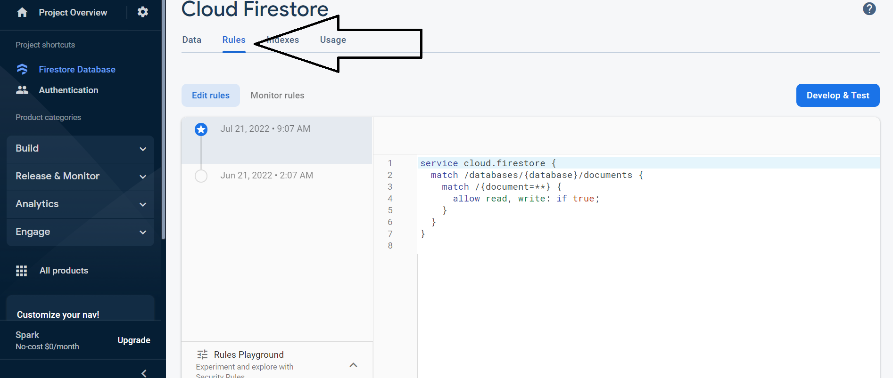

# FireBase Rules

Firebase Security Rules prevent your data being accessed by malicious users. You can write rules that protect your app's data to the level of granularity that your specific app requires. Every collection can have its own rules and determine authorization access to write and read data.


## Writing Rules

Here is an example of a rule that allows complete access to all your data. This is useful for testing or if the data is not sensitive in nature. Especially allowing just public read access is a common use case. However, it should be done on a collection by collection basis not all of them.
This: `match /databases/{database}/documents`
Says when the database is accessed and matches the dynamic variable for the `{database}` .(FireStore in our case) and any `/documents` that are read or written will be allowed `/{document=**}`. Your rules may already be like this depending if you selected starting with production mode or testing. Also, after 30 days in test mode firebase will lock down all your data if you do not write any custom rules like this or the ones we will get to below. Make sure to save/publish when making a change to rules.


```javascript
service cloud.firestore {
    match /databases/{database}/documents { 
        match /{document=**} {
        allow read, write: if true;
        }
    }
}

```



## Control Access with Rules

We will be continuing to work from [Authorization with FireBase](authorizationWithFirebase.md). It should be the same learning app we have been using the whole time. If you do not already have one create a `components` folder in `src`. Then create a new file called `StudentRecords.js`.  Then copy and paste the component below into that file. Lastly, `import` this component some where of your choice where you want to play with it. If you are not sure just `import` it into your `App.js` component. Now put  `<StudentRecords/>` somewhere in your html/jsx.


=== "src/components/StudentRecords.js"
```javascript
   // src/components/StudentRecords.js
   import React, { useState } from 'react';
   import { collection, getDocs, addDoc} from '@firebase/firestore'
   import {db} from './../firebase-config'
   

   export default function StudentRecords() {
    const [newName, setStudentsName] = useState("");
    const [newGrade, setGrade] = useState(""); // A,B,C,D,F

    const createStudent = async () => {
        const studentsCollectionRef = collection(db, 'grades');
        try {
            await addDoc(studentsCollectionRef, { name: newName, grade: newGrade})
        } catch (error) {
            console.log("error from StudentRecords.js", error);
        }
    }

    return (
      <div>
        <input onChange={(event) => setStudentsName(event.target.value)} placeholder="Name" type="text" />
        <input onChange={(event) => setGrade(event.target.value)} type="text" placeholder="Grade" />
        <button onClick={createStudent}>Create student</button>
      </div>
    )
   }

```

We are creating a grades collection where we will use the `<StudentRecords/>` component to add grades but only for logged in users. Replace any current rules already there with the rules below. Make sure to save/publish when making a change to rules. 

### Control data when logged in or out

```javascript
service cloud.firestore {
 match /databases/{database}/documents {
    match /grades/{grade} {
        allow read, write: if request.auth.uid != null;    
    }
 }
}

```
We see the familiar `match /databases/{database}/documents` as described above. Now we have added `match /grades/{grade}`.
This rule we write will only apply to the "grades" collection and `{grade}` dynamically represents a grade document. Here
`allow read, write: if request.auth.uid != null;` We say if the request from the front end contains the auth object's user id (uid) then we know the user is logged in and can have read and write permissions. Test this out try to use your new `<StudentRecords/>` while logged in and then logged out. Have the console open. If you are logged out you should see a logged error message "Missing or insufficient permissions" however if you are logged in you should now see the entry in the database under the grades collection. Remember make sure you are running both your react app and your **serverless functions**. 


### Control data based on the user role

Replace the current rules from above with the ones below. Here `allow read: if request.auth.uid != null;` we are letting a user read the data in our "grades" collection if they are logged in. Then `allow write: if request.auth.token.teacher == true;  ` if the user has the role of a teacher our backend will let them write to our database.  Test this out try the `<StudentRecords/>` while logged in as a teacher and then logged in as a student. Have the console open. If you are logged out you should see a logged error message however if you are logged in you should now see the entry in the database under the grades collection. Make sure you are running both your react app and your **serverless functions**. Remember `createRole(user, 'teacher');` is where you type in a hardcoded value for the user's role. Make sure to save/publish when making a change to rules. 

```javascript
service cloud.firestore {
 match /databases/{database}/documents {
    match /grades/{grade} {
       allow read: if request.auth.uid != null;
       allow write: if request.auth.token.teacher == true;    
    }
 }
}

```
## Push Yourself Further
1. Create a html Element that will conditionally render and display with a message letting the user know they are not authorized when your function catches an error.
2. Add the functionality to read and display students and grades once placed in the database.

## Additional Resources

- [ ] [Security Rules!](hhttps://www.youtube.com/watch?v=eW5MdE3ZcAw)

## Know Your Docs

- [ ] [FireBase - Rules](https://firebase.google.com/docs/rules)
