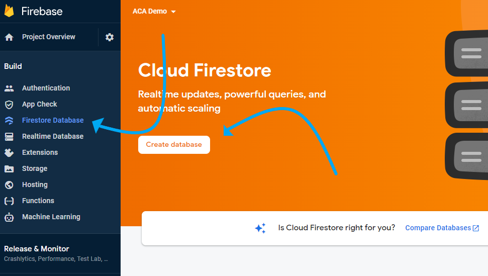
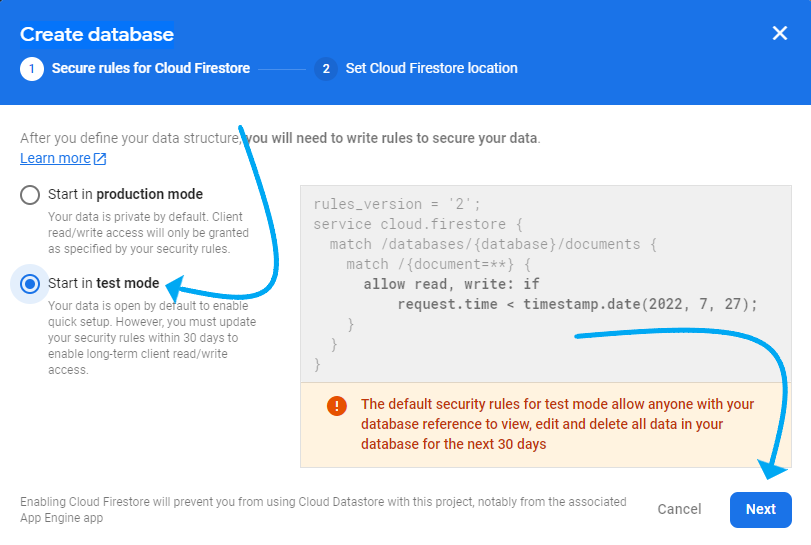
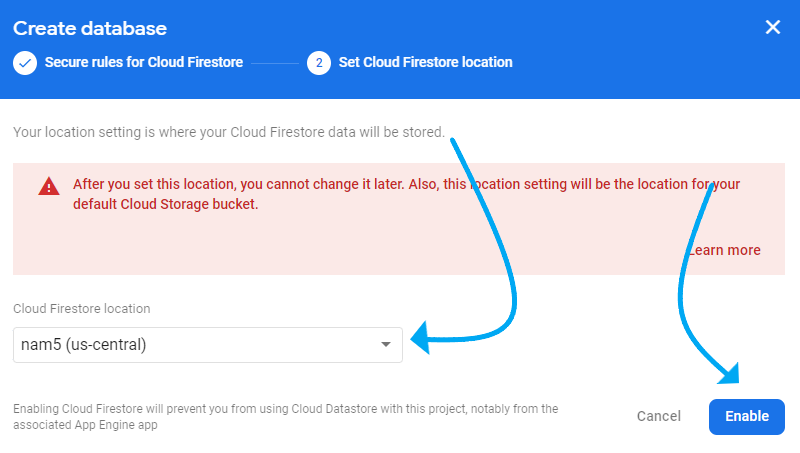
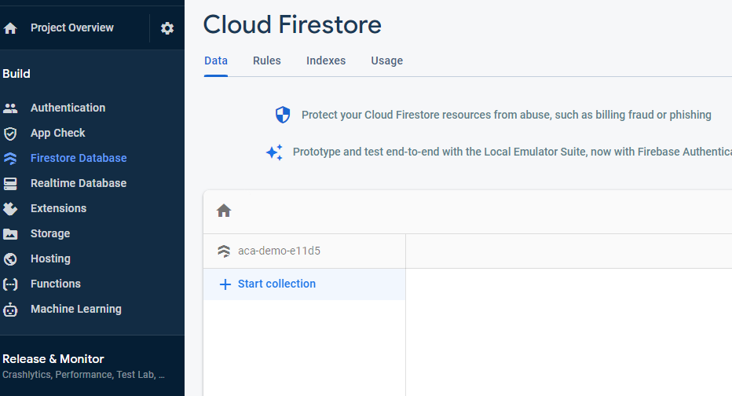
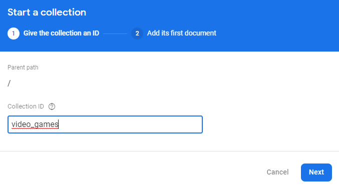
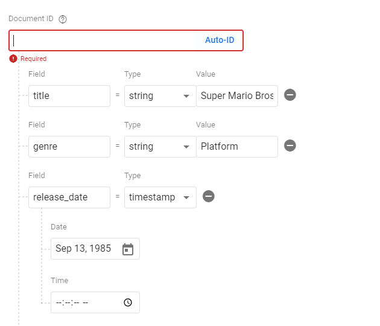
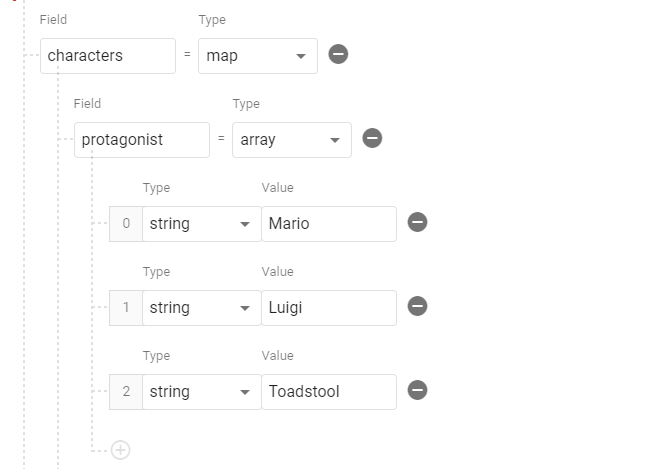
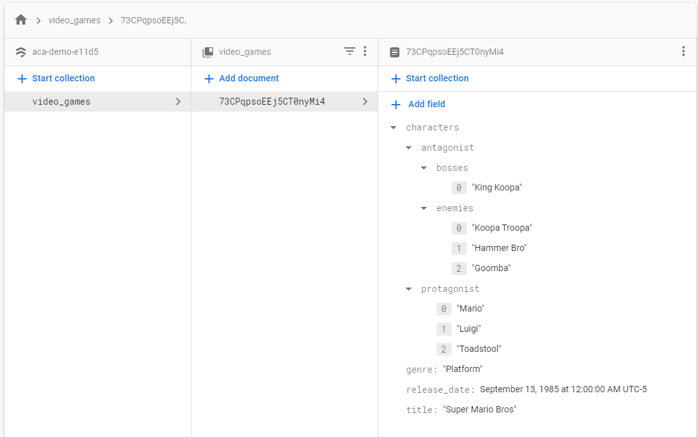

# Intro to Firestore
_"Beauty is no quality in things themselves: It exists merely in the mind which contemplates them; and each mind perceives a different beauty." —David Hume_

## Overview
Great, so we now have an idea what a CRUD application is, so let's get started. In order for us to interact with a Database, we first need to create it. 

We will first create our Firestore DB on the Firebase console, where we will check out some of the Data Types available and how data is stored. After we create our Firestore DB, we then want build a **CRUD** web application to interact with Firestore through a *UI*. People who use our web application shouldn't be creating data on your Firestore console, instead, we will build out the services for them to interact with. This is what a **CRUD** application is, after all. We will cover these ***CRUD*** operations in detail soon enough, for now, let's get familiar with the Firestore console.

Let's begin by creating the Firestore instance. We should already have a project created on Firebase from our [Authentication with Firebase lesson](./../module-2/implement-fireBase.md), so let's continue to work on that same project.
<!-- TODO change this file name to authenticationWithFirebase.md -->

## Create Your First Collection

**INSTRUCTIONS**: Navigate to your current project on Firebase and follow the instructions below to get started on creating your first Firestore Database instance.

=== "1. Create the Database"

    

    - [ ] On the [Firebase Dashboard](https://console.firebase.google.com/), click on Firestore tab listed in the column on the left.
    - [ ] Next, click on the **"Create database"** button. A modal should have popped asking you to set some rules. Check next screenshot...

=== "2. Enabling Test Mode"

    

    - [ ] We will be selecting **test mode** to continue building our app while in development.

        >NOTE: It is important to make sure to change this before taking our app into production. We will talk about setting rules later in this course before we host our application on a live server. Test mode is strictly for development.

    - [ ] Click "*next*" to proceed and go to the next screenshot.

=== "3. Set Location"

    

    - [ ] Now, we need to set our location in which our database will be stored. Choose the appropriate location that will best serve for our intended audience.

        >NOTE: If you are in the US, you would choose US.

    - [ ] Click "*next*" to proceed and it should take you to the Firestore Dashboard. Proceed to the next screenshot.

=== "4. Firestore Dashboard"

    

    Now that we are on the Dashboard screen, we have successfully created our DB instance. Now we need to give it some data by creating our first ***collection***. Think of a ***collection*** as a organized set of data where every ***document*** listed under these ***collections*** are created with a **Unique Identifier**, a ***"UID"***.

    - [ ] Click on "***Start Collection***"
    - [ ] Proceed to the next screenshot.

=== "5. First Collection"

    

    These ***collections*** can be specific to the type of data you are trying to store. If you are trying to store more info about a **User**, you would create a collection called `users` that would have a ***document*** for every user that signs up for your service. If you wanted to store a ***collection*** of **books**, the ***collection*** could be called `books`. In this example, I will be creating data that represents a list of video games.

    - [ ] Give your new collection a name, this can be anything you want for demonstration purpose, or something that you have in mind for your Capstone Project.
    - [ ] Click "next" and proceed to the next screenshot.

=== "6. First Document"

    

    We should now be prompted to provide our new **collection** our first **document**. Every document will have a **unique identifier** and the data we store inside it will be similar to that of a javascript object, **key-value pairs**, where an *object key* would represent the *field*. These **fields** will allow for several data types, but for now, we will focus on the basic **string** and simple **timestamp**. This example is working with video games, so make sure to make it relevant to your database.

    - [ ] Click on *"Auto-ID"* to generate a ***Unique ID*** for this **document** to be referred to as.
    > Every **document** needs a Unique Identifier and it is always best practice to allow firestore to create the UID for us.

    - [ ] Add a *field* name with the data type of *string*
    > The first field we want to add can be the name or "title" that represents the document. These fields can be named whatever they want, and should be dependent on what your data represents.

    - [ ] Add a value to your first field. This example will be: *title: "Super Mario Bros"*
    - [ ] Add another field by pressing the "+" icon.
    - [ ] Add another *field* name with the data type of *string*, this example will be "*genre*"
    - [ ] Add a value to your second field. This example will be: *genre: "Platform"*
    - [ ] Add a *field* name with the data type of *timestamp*
    > The next field in this example represents the games "*release_date*" and the value will be of type **"timestamp"**.

    - [ ] Choose "*timestamp*" as the data type.
    - [ ] Select an appropriate time in relation to your data, this example is relevant to the game.
    > NOTE: Leaving the time blank will default to 12:00:00am.

    When using [Firestore's "timestamp"](https://firebase.google.com/docs/reference/js/v8/firebase.firestore.Timestamp), it is important to note that the data will be stored in a unique way which we will need to later modify to make it more readable to the human eye.

    - [ ] Proceed to the next screenshot.

=== "7. First Document - _Continued_"

    

    Let's add some more fields and try out some other data types available for us to store. In this example, we will be talking about the *"array"* and *"map"* data types in Firestore. The array type is exactly like the arrays we are already familiar with. You can list multiple values inside an array. This example will be listing a simple array with the field name "*protagonists*" for this game. The *map* is harder to understand, but think of it as a sub-collection inside our document. It is similar to an object with nested key-value pairs inside of it. If it doesn't make sense now, that's ok. This section serves as only an introduction to the capabilities of Firestore, and it will become clearer as we continue to build our database.

    - [ ] Add a *field* name with the data type of *map*, this example will be characters
    - [ ] Inside our new *sub-collection* inside our characters *map*, add another field name with the data type of *array*. This example, we will start with a *protagonist* sub-collection.
    - [ ] Add as many values with the data type of *string* to create a simple array of string values. This example will list 3 different characters.

    So far, if we read our data in JavaScript, Firebase would compile our document to look like this object:
    
    ```javascript
    {
        title: Super Mario Bros,
        release_date: {
            // This is how Firebase will translate the timestamps
            seconds: 12310564564,
            nanoseconds: 456423123441
        }
        // This is the map of characters with and array or protagonists
        characters: {
            protagonists: ["Mario" , "Luigi", "Toadstool"]
        }
    }
    ```
    
    As we can see, a *map* sort of looks like a key-value pair whose value is another object. Let's look at another example.

    - [ ] Proceed to the next screenshot.

=== "8. First Document - _Continued-2_"

    

    Our data can be as simple or as complicated as we want. Depends on the needs of your application. We will show one last example of what nested data would look like inside firebase. We will again be working with our character's *map*, but now we are going to further nest another *map* / sub-collection inside our characters sub-collection. We will build two more arrays, one list with a field name "*bosses*" and another with field name "*enemies*"

    - [ ] Inside the "*characters*" or similar field you may have created, add two more field.
    - [ ] Name the first field. In this example it will be "bosses".
    - [ ] Give this array some values.
    - [ ] Name the second field. In this example it will be "enemies".
    - [ ] Give this array some values.

    If we saw our data compiled to javascript, our characters example would look like this at this point:
    
    ```javascript
    {
        // ... previous data
        characters: {
            protagonists: ["Mario" , "Luigi", "Toadstool"],
            antagonists: {
                bosses: ["King Koopa"],
                enemies: ["Koopa Troopa", "Hammer Bro", "Goomba"]
        }
    }
    ```
    Not too bad, we just created our first document!

    - [ ] Finally, save your data
    - [ ] Proceed to next screenshot.

=== "9. Results"

    

    Great job! If you are seeing this page, you should seeing see your own data listed in your collection. Feel free to add more documents and/or collections as your desire. This data will initialize our data with some dummy data to play around with as we move on into explaining CRUD operations in the next section.

## Data Types

There are several Data Types available to store in Firestore, which makes writing documents a breeze. Some of these data types should be familiar to us, such as: Boolean, Arrays, Text String and Integers. While we will more than likely use some data types more than others, it's good to know what is available to us in case we need to utilize it in the future.

Let's break down some of these Data Types available to us:

| Data Type | Sort Order | Notes |
|---|---|---|
| Text string |UTF-8 encoded byte order|This data type will be the most commonly used ones, especially as we first begin to understand Firestore. Just like a text string you are familiar with.|
| Integer |Numeric|You can store plain numbers, no strings attached. Keep in mind, javascript will always return numeric values as a string so you will still need to convert it to a number if that's your thing.|
| Array | By element values | You should be comfortable with Arrays by now, and this is a great way to store data. It may take some extra work to change data in an array, but luckily for us, we are familiar with array methods and HOF's. Within an array, elements maintain the position assigned to them. You cannot store another Array inside an Array as an element.
| Boolean |`false<true`|It's either going to be true... or false|
| Date and Time |Chronological| Firestore has it's own way of storing Timestamps. It stores time in an object with two key/value pairs: seconds and nanoseconds. *"It is encoded using the Proleptic Gregorian Calendar which extends the Gregorian calendar backwards to year one"* |
| Null |---|It is possible to store a value as null. Not much more to say about that.|
| Map |By keys, then by value|Maps represent javascript objects. This is useful when you want to store nested data in your document.|
| Geographical point |By latitude, then longitude|*At this time we do not recommend using this data type due to querying limitations. It is generally better to store latitude and longitude as separate numeric fields. If your app needs simple distance-based geoqueries, see [Geo queries](https://firebase.google.com/docs/firestore/solutions/geoqueries)*|

Keep these Data Types in mind when it comes to thinking about your Capstone Project. How are you going to want to store data into a document? What data types are you more than likely going to use? Get familiar with these [Data Types](https://firebase.google.com/docs/firestore/manage-data/data-types) and think about what *collections* you will need and what kind of *data* are you storing in your *documents*.


## Firestore Web SDKs

Working on the Firestore console is convenient, especially useful for Database Management and Admins, but this is not how we intend for others to interact with Firestore. We need to build a *User Interface* using Node.js and we are going to build it on the React JavasScript library we all have gotten to know and love.

So where do we start, and what is an SDK?

### SDK - Software Development Kit

SDK is an acronym for *Software Development Kit*, also known as *devkit* for short. An **SDK** is a set of tools and programs that are available to developers, like you, to create applications for specific platforms. **SDK**s are designed by the platforms they are meant for, we are using the Firebase **SDK** available for the Cloud Firestore API. The Firebase JavaScript **SDK** implements the client-side libraries used by applications using Firebase services. We have access to this by running `npm install firebase` in any of our projects and setting up our "firebase-config" file.

### "firebase-config" file

We are already familiar with the *Auth* library as we have used it in the previous sections. Just like we reached out and initialized "Auth" into our project, we will do the same for our **Firestore Database/DB** Lets take a look at that config file one more time, but this time with **Firestore**.

```javascript
// Import the functions you need from the SDKs you need
import { initializeApp } from "firebase/app";
import {  getAuth } from 'firebase/auth'

// Let's bring in the `getFirestore` function from "firebase/firestore"
import { getFirestore } from 'firebase/firestore'

const firebaseConfig = {
  apiKey: process.env.REACT_APP_FIREBASE_KEY,
  authDomain: process.env.REACT_APP_FIREBASE_DOMAIN,
  projectId: process.env.REACT_APP_FIREBASE_PROJECT_ID,
  storageBucket: process.env.REACT_APP_FIREBASE_STORAGE_BUCKET,
  messagingSenderId: process.env.REACT_APP_FIREBASE_SENDER_ID,
  appId: process.env.REACT_APP_FIREBASE_APP_ID,
  measurementId: process.env.REACT_APP_FIREBASE_MEASUREMENT_ID
};

const app = initializeApp(firebaseConfig);
export const auth = getAuth(app);

// Initialize Cloud Firestore and export the reference to the service.
export const db = getFirestore(app)
```

- [ ] `import { getFirestore } from 'firebase/firestore'` 
- [ ] `export const db = getFirestore(app)`

That's all there is to it. We now have access to our Firestore DB and can make queries to the DB and set up our **CRUD** operations using the Firestore SDK. Keep in mind, just like we exported the "Auth" reference when and used it when making queries to our Auth instance, we want to do the same when we try to query Firestore. We will need to `import {db} from "./firebase-config"` in the files where we are needing it. The ***db*** reference will always be the first argument for any of the functions we use from the "firebase/firestore" library.

```javascript
// This is an example of *Updating* a doc. It uses the "setDoc" function
// from the Firestore SDK library.
// This function takes in 3 arguments: Our "db" instance, the "collection"
// we want to reference, and the "document" in the collection to reference
// We ALWAYS pass our "db" instance first.
await setDoc(db, "video_games", "CVX4ZV5FG5SADF54")
```

**********
**********

## Summary

Awesome! So we now have a working **DBMS**, we created our first collection, and we even added our first document. Although we just created some data, we are going to further explain the four CRUD operations using the Firestore SDK instead of writing it ourselves on the Firestore Dashboard. Remember, this database is meant to store user inputs, dependent on the apps needs, of course. Our next step is to build a UI using the 4 basic operations we discussed earlier: **Create**, **Read**, **Update**, and **Delete**.

## Additional Resources

- [ ] [Blog, Lionel Valdellon - What is an SDK? Everything You Need to Know](https://clevertap.com/blog/what-is-an-sdk/)
- [ ] [YT, The Net Ninja - Getting Started with Firebase 9 #4 - Firestore Setup & Fetching Data](https://www.youtube.com/watch?v=2yNyiW_41H8)

## Know Your Docs

- [ ] [Firebase Docs - Cloud Firestore](https://firebase.google.com/docs/firestore)
- [ ] [Firebase Docs - Cloud Firestore Data model ](https://firebase.google.com/docs/firestore/data-modela)
- [ ] [Firebase Docs - Supported data types ](https://firebase.google.com/docs/firestore/manage-data/data-types)
- [ ] [Firebase Docs - SDKs and client libraries ](https://firebase.google.com/docs/firestore/client/libraries)
