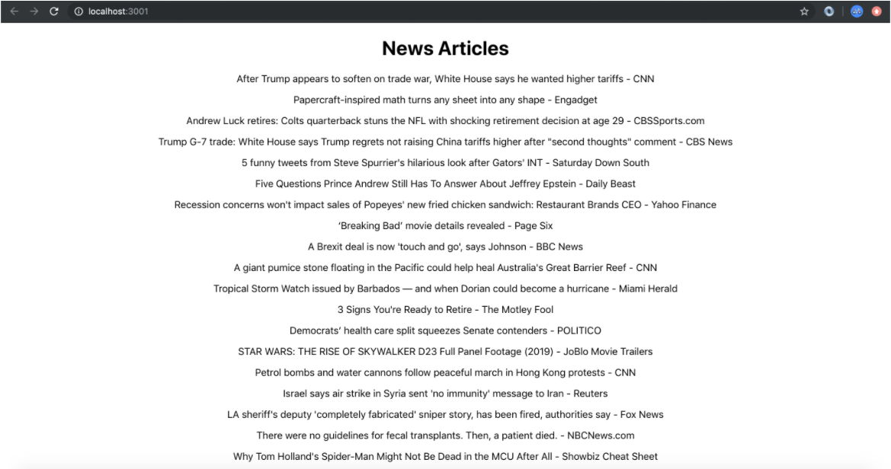

# Redux Thunk

*Light tomorrow with today. —Elizabeth Barrett Browning*

## Review and Recap

After last week, you should have a fair grasp over Redux and its few functions that make all the magic of global app state happen. This, of course, allows us to view and mutate a global state from any component we so choose. We've also learned about actions, or action creators, and reducers and how they interact with each other. Our action creators so far have been fairly simple, but what if they need to be more complex in that they could make a fetch to a remote api, wait for the response, set the state to `fetching: true` while doing it, then set the state to `fetching: false, success: true` and set the state with the data it returned? In other words, what if they needed to be asynchronous? Enter Redux Thunk.

## Overview

Why are we using Thunk? As we mentioned briefly above, our action creators currently don't support asynchronous actions (they can make a request to an API, wait for a response, then do things during and after the response does come in). What's asynchronous mean again? It means a function that doesn't have a determinate and sequential runtime. It may go out and call an API or make a connection with a database and while those functions are waiting to resolve it can move ahead and load up the screen with other functionality. These types of functions need to be handled differently from normal functions in JavaScript and so far haven't built an action creator that can handle these callbacks or promises (Remember, we've used these `fetch` and `axios` in 211 to do async calls). We are going to do the same thing inside our action creators, but in order for Redux to understand these async function we need to add the `thunk` middleware.

## What is Thunk?

Thunk is middleware that allows action creators to return a Function instead of an Object.

### What is Middleware?

Middleware is a function (or multiple functions) that you want to run every time a certain action happens. We've seen middleware in the last course (JS311) to handle authentication workflows in Express. Thunk works in the same way except that it happens when we call our action creators.

### Examples

Let's get into some examples. First, let's talk about how we set up Thunk. It's incredibly easy. All you do is `import thunk from "redux-thunk"`. Since this is another package you may have also guessed that we need to install `"redux-thunk"` into our application with the following command: `npm i redux-thunk.`

To use redux-thunk we also need to import the `applyMiddleware` tool from Redux so we can tie the thunk into the `createStore` function call. All of this happens in the ``store.js`` file. Here's what it looks like:

=== "`redux/store.js`"

    ```javascript
    // import the `applyMiddlware` tool
    import { createStore, applyMiddleware } from 'redux'
    // import the `thunk` tool
    import thunk from 'redux-thunk'
    import reducers from './reducers'
    import state from './state'

    // pass them as a third argument to the `createStore` call
    export default createStore(reducers, state, applyMiddleware(thunk))
    ```

As we can see, there are only three small changes between this `store.js` file and the one we used last class. They involve the introduction of `applyMiddleware`, `thunk` and the application of `thunk` as the third parameter in `createStore()`, `applyMiddleware(thunk)`.

Ok that's it, we are set up to use Thunk. So now how do we use it? Well . . . we need create a new property on state, a new action, and a new reducer - just like we're used to!

### State

In the example below we've updated the state for our cars application to include a property called `makes` to store the available makes of cars. Its default value will be an empty array. It looks like this: `makes: []`

=== "`redux/state.js`"

    ```javascript
    export default {
      user: null,
      cars: [ '1', '2', '3' ,'4' ],
      makes: [] // <-- Just a place to hold new data
    }
    ```

### Action

The new action creators we add will return a function instead of an object. They will look like this:

=== "`redux/actions.js`"

    ```javascript
      // Remember what our previous action creators looked like:
      export const removeCar = (index) => {
        return {
          type: 'REMOVE_CAR',
          value: index
        }
      }

      // ...more action creators here...

      export const fetchMakes = () => {
        return (dispatch) => {
          fetch('https://vpic.nhtsa.dot.gov/api/vehicles/getallmakes?format=json')
            .then(res => res.json())
            .then(response => {
              const action = {
                type: 'FETCH_MAKES',
                value: response.Results
              }
              dispatch(action)
            })
        }
      }
    ```

=== "with comments"

    ```javascript
      // ...more action creators here...

      export const fetchMakes = () => {
        // returning a function that has `dispatch` as its only parameter
        return (dispatch) => {
          // making an asynchronous API call
          fetch('https://vpic.nhtsa.dot.gov/api/vehicles/getallmakes?format=json')
            .then(res => res.json())
            .then(response => {
              // create a variable to hold an Object for the results
              const action = {
                type: 'FETCH_MAKES',
                value: response.Results
              }
              // call `dispatch` to send the action Object to the reducer
              dispatch(action)
            })
        }
      }
    ```

So what's happening here? We're returning a function that has `dispatch` as its only parameter. We can write `dispatch` there because `thunk` will inject into our action creator automatically.

Inside of that function, we are making an asynchronous API call to a government API with `fetch`. Then we create a variable to hold an Object to store the results of that API call. Lastly, we call `dispatch` at the end to send our action Object to our reducer. Speaking of . . . let's set that up.

### Reducer

Since we have a new property called `makes` in our state, we need a new reducer called `makes` to match. Here's what it looks like:

=== "redux/reducers.js"

    ```javascript
    const makes = (state = [], action) => {
        switch(action.type) {
            case 'FETCH_MAKES':
                return action.value
            default:
                return state
        }
    }

    // ... more reducers here ...
    ```

The Switch/Case statement handles the `FETCH_MAKES` action that we specified above. Since we know the results of our API is an array, we're able to simply return the `action.value` (the array of `makes` in `reducers/state.js`).

### Wrapping Up

Now that we've added this action into one of our components using the `mapDispatchToProps` function like normal, we can call it. When we do, the function will go out and make an API call and then add the results to our global state. The result would look like this:

```javascript
  makes: [
      {
          Make_ID: 440,
          Make_Name: "Aston Martin"
      },
      {
          Make_ID: 441,
          Make_Name: "Tesla"
      },
      {
          Make_ID: 442,
          Make_Name: "Jaguar"
      },
      {
          Make_ID: 443,
          Make_Name: "Maserati"
      },
      {
          Make_ID: 444,
          Make_Name: "Land Rover"
      },
      {
          Make_ID: 445,
          Make_Name: "Rolls Royce"
      },
      {
          Make_ID: 446,
          Make_Name: "Buell (EBR)"
      }
      // ...etc...
  ]
```

This is how we would generally start our application if we are fetching data from a database. We would have a state with an empty value and then we would use Redux Thunk to make the call to our database and return the results to it.

> NOTE: The biggest change here is just getting used to what the new **action creator** look like.

## See It - Redux Thunk

<!-- ! Video Contents: YT, techsith - React Redux Series Pt.7  -->
<iframe width="655" height="368" src="https://www.youtube.com/embed/Sqkm39rqmEg" title="YouTube video player" frameborder="0" allow="accelerometer; autoplay; clipboard-write; encrypted-media; gyroscope; picture-in-picture" allowfullscreen></iframe>

## Practice It



- [ ] Clone the following repo: [https://github.com/AustinCodingAcademy/411_news_articles](https://github.com/AustinCodingAcademy/411_news_articles)

- [ ] Call the News API to populate a list of news articles using Redux Thunk

- [ ] Look at the `state.js` file under the redux folder. You should see just one property called articles with an empty array present. We will populate (or replace) the array with data from the News API.
- [ ] In the `reducers.js` file you should see the current reducer function for `articles`. Add a case for `FETCH_ARTICLES` that simply returns `action.value`
    * [ ] In the `store.js` file you need to do three things:
    * [ ] `import applyMiddleware`
    * [ ] `import thunk`
    * [ ] pass `applyMiddleware(thunk)` to the `createStore` function
- [ ] Finally (for the `redux/` folder), in `actions.js`, fill the `fetchArticles` function so that it calls the API endpoint (with `fetch`) and then `dispatch`es the `articleAction` action creator. You will need to pass `response.articles` (the result of the `fetch` call) to that action creator can fulfill the `articles` parameter. The API endpoint to call is at the top of the file.
- [ ] Now, in our `List` container we should see that there is already a `mapStateToProps` function that is sending in the `articles` array. We need to make a `mapDispatchToProps` function that returns a property with key: `fetchArticles` and value: `() => dispatch(fetchArticles())`. 

    > Remember to `import` the `fetchArticles` action at the top of the page.

- [ ] In the `List` component we simply need to create a `componentDidMount` function and call `this.props.fetchArticles`, which is the redux action we just connected. You should see a list of news articles appear on the page.

## Additional Resources

- [ ] [YT, TechSith - React Redux Series Pt.7](https://www.youtube.com/Sqkm39rqmEg)
- [ ] [Article, FreeCodeCamp - Understanding Redux](https://www.freecodecamp.org/news/understanding-redux-the-worlds-easiest-guide-to-beginning-redux-c695f45546f6/)

## Know Your Docs

Be sure to reference the Redux documentation on GitHub

- [ ] [Redux-Thunk Docs - Home](https://github.com/reduxjs/redux-thunk)
