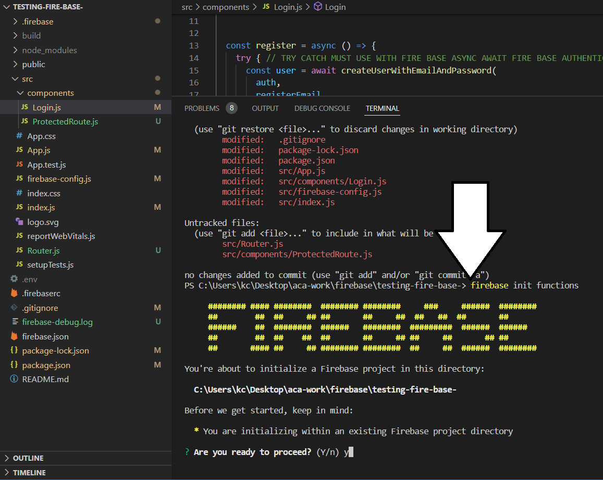
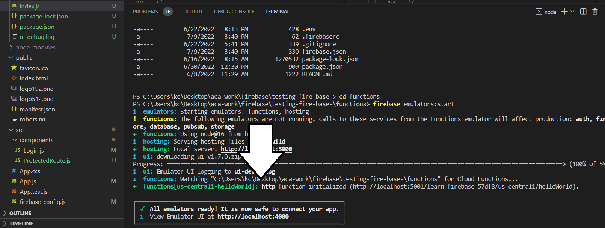

# Intro To Serverless Functions

Remember back at the beginning when we learned about the difference between back-end and front-end? Remember how we said a server is the part of the app that reaches into the database to put, change, or get data for the front-end UI to use and display? Alright, most of the time we have to build a server to do this as well as to make security verifications and interface with other servers (APIs/micro-services). Turns out we didn't have to build a server because there are services like FireBase that enable us to create database stores and servers with just some clicks of the mouse. However, there are a few actions we'll need to do now and in the future that require a server/back-end code running to interface with other back-ends. In this lesson we're going to learn how to do this without a server using things called: **serverless functions**. 

*Serverless* refers to functions that run on the back end to help developers build and run applications without having to manage servers. They are no different from the functions you have written in the past.

There are still "servers" running these *serverless functions*, but you do not have set them up or manage them. Instead, a cloud provider handles the routine work of provisioning, maintaining, and scaling the server infrastructure. Simply write your code in a designated folder provided by FireBase.

You can think of the ***serverless functions*** as setting up your own API (like the APIs you used in JS211 to fetch data like beer, Star Wars or Marvel characters) However, instead of using fetch to communicate with the back-end you use FireBase's built in methods. You will be writing ***serverless functions*** in ***node.js*** so it is considered part of the back-end along with your database.

## Why Serverless?

1. **Security**: Every thing is exposed on the front-end client including your code and variables. Having a back-end to handle sensitive operations behind a wall is very important.
1. **Versatility**: You can have your back-end do something independent of the front-end.
1. **Low code setup**: FireBase does all the infrastructure and server side code for you. The only thing you need to focus on is the task you are trying to accomplish with the code.
1. **API usage**: Some API's require back-end code like **node.js** to utilize them. Having this knowledge in your pocket will be useful as you branch out and build larger projects.

## Set up Serverless 

We will walk through the steps to use your first **serverless function**. FYI, FireBase refers to their serverless functions as "[Cloud Functions](https://FireBase.google.com/docs/functions)".

- [ ] 0. Open and `cd` into the root directory of the [learn-FireBase project](./../module-2/implement-fireBase.md) you have been learning with. `cd learn-FireBase`

- [ ] 1. Run this command first `npm install -g firebase-tools` 

- [ ] 2. Run the command `firebase login` if you are not logged in just type ++n++ for no tracking and then it will take you to the browser login with the same account/email you used for firebase. 

- [ ] 4. In the root directory of the [learn-FireBase project](./../module-2/implement-fireBase.md) run `firebase init functions`.

    

- [ ] 5. Initialize this directory: `Are you ready to proceed? (Y/n)` type ++y++. 

- [ ] 6. Next press ++enter++ and select `> Use an existing project`.

- [ ] 7. Use the arrow keys to select your project name from FireBase.

- [ ] 8. For language to write Cloud Functions select `JavaScript`.

- [ ] 9. Use ESLint to catch probable bugs and enforce style? Type ++y++

- [ ] 10. Install dependencies with npm now. Type ++y++

- [ ] 11. You should see a `functions/` folder and if you look inside it notice that it has a separate `package.json` of its own and `node_modules/` and its very own `index.js`.

- [ ] 12. Look in `functions/index.js`. This is where we will write our first serverless function. You will see a commented out function. We are going to run this function so uncomment it now.

- [ ] 13. Next point your terminal at this directory by running `cd functions`. Then type `firebase emulators:start`

- [ ] 14. You should see a message in the terminal like this `functions[us-central1-helloWorld]: http function initialized (http://localhost:5001/learn-FireBase-57df8/us-central1/helloWorld).` with your project name in the middle after the port number.

    

- [ ] 15. Copy/paste that URL into your browser. What do you see? What happen?

We now have the power of an entire back-end and server infrastructure just by writing our common JS functions. In future lessons we will use this style of a back-end with our front-end code and do operations and tasks that require the security of a back-end environment.

## Additional Resources

- [ ] [How do Cloud Functions work?](https://www.youtube.com/watch?v=rERRuBjxJ80)

## Know Your Docs

- [ ] [Cloud Functions](https://FireBase.google.com/docs/functions)
