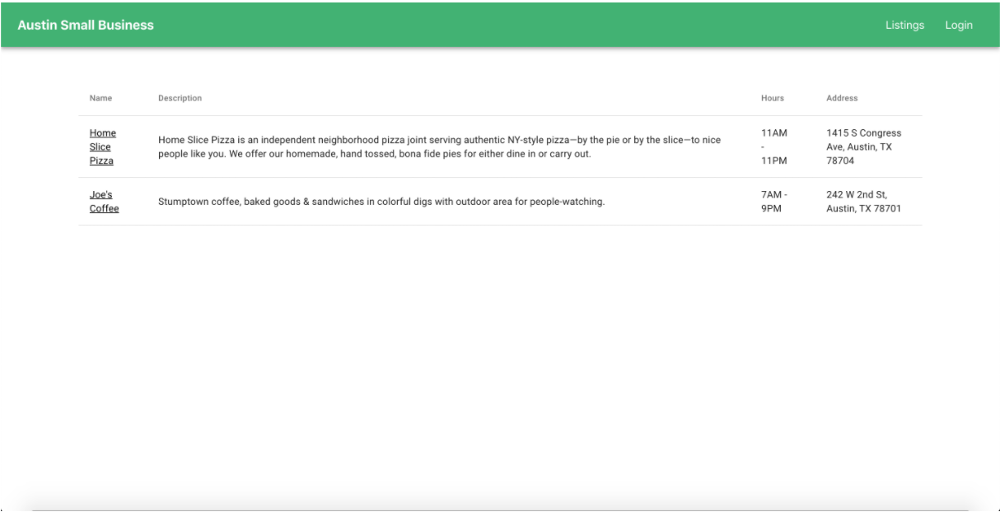
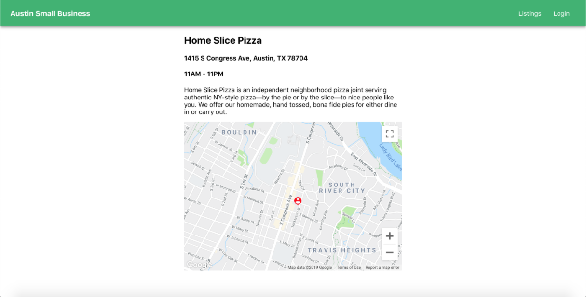
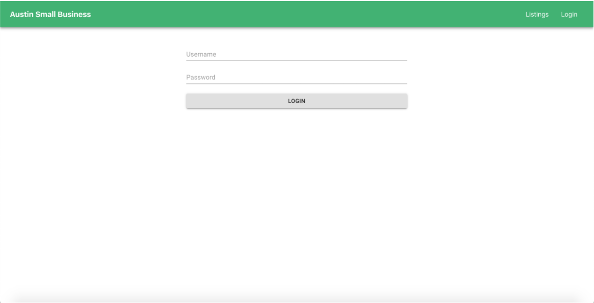
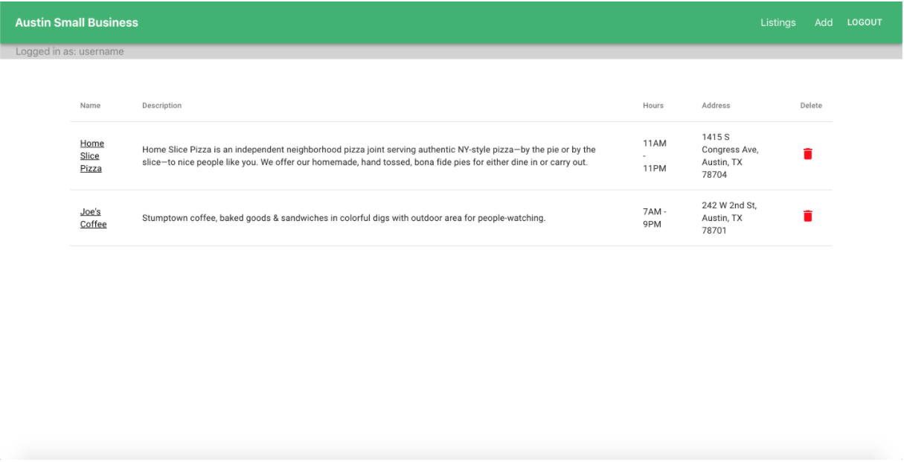
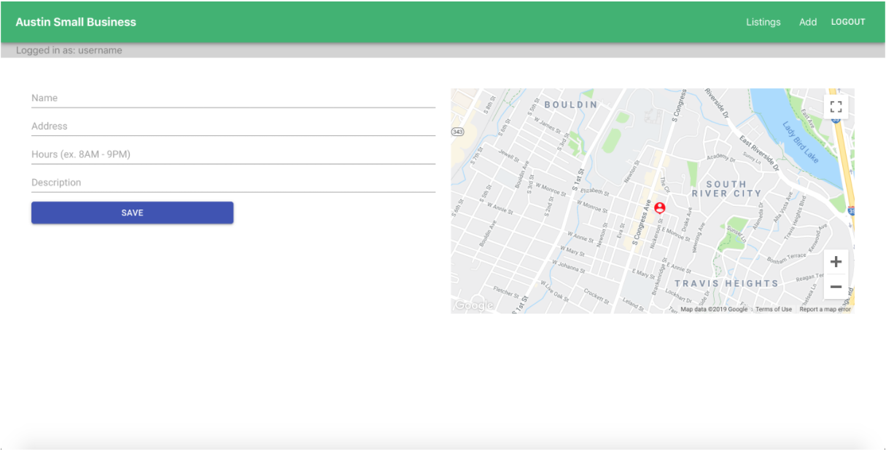

# Checkpoint Two: Small Biz App

This week we will build our second and final application from scratch. It will be a small business app that integrates everything we've learned up until now. During the creation of this app we will make use of `state`, `props`, life cycle methods, conditional rendering, Material UI, React Router, authentication and FireBase.

We are going to create an App that shows a list of small businesses and their details when you click on the them. Additionally, a user can log in and if they are logged in they can add or delete a listing. You will use an external API, as we integrate the Google Maps API into this project.

You will have both class days this week to complete the project and upload your github URL turn it in. Keep in mind that with this project, the goal is to use our existing knowledge of React to build something that looks very similar to the following example images. Unlike some homework assignments where the exact steps are laid out, this project is intentionally vague in some places. It's to get you to learn how to look up things and implement the right resources. That being said, hints will be given in various sections. Just like last time, do your best and have fun!

## Examples

=== "Listings"

    

=== "Biz Details"

    

=== "Sign-In"

    

=== "Admin View"

    

=== "Add New Listing"

    

## Setup

#### Reminder
This will be a group project for 2-3 people. Each firebase account has 3 open slots. We have used 1-2 in this class so far. Pick one person to log in to their account and start the process of setting up the firebase project for everyone else. They should follow [Authenticate with Firebase](./../module-2/implement-fireBase.md) use `npx create-react-app small-business` when you get to the react section in the folder of your choice to create a project called `small-business` that will house your application. Then make a repo for everyone to fork and clone Then share your FireBase credentials so every one can put them in their .env file. Use the [working together](https://github.com/instructorKC/workingTogether) directions to build this app together.


### 1. Initializing

Once your app is set up, navigate to the folder and `npm install` the following dependencies:

=== "Checklist of Dependencies"
    - [ ] `@emotion/react`
    - [ ] `@emotion/styled`
    - [ ] `@mui/icons-material`
    - [ ] `@mui/material`
    - [ ] `google-map-react (optional)`
    - [ ] `react-router`
    - [ ] `react-router-dom`


=== "All-in-One"

    ```console
    npm i @mui/material @mui/icons-material @emotion/styled @emotion/react google-map-react react-router react-router-dom 
    ```

******

### 2. Description of Parts

The app will consist of two parts. Parts that are accessible to the public and parts that require a login.

#### Accessible to the Public

This will include the Listing component and the Details component. Note that you can call these whatever you like. These correspond to examples 1 and 2.

#### Require a Login

Certain functionality on the website should require the user to log in. A login screen is shown in example 3. You'll also want to use some conditional rendering to change the navbar so that if a user is logged in it no longer shows the "login" link and instead shows "logout". Other things a user can do when logged in are delete a listing and navigate to the "/add" page which should be protected by a private route.

******

### 3. Parts Breakdown

#### Listing Screen - Example 1

The listing screen should show a table of the small businesses you selected. Please list 4 or 5. Try to take some data from real businesses in town or from another town of your choice. At minimum, the data that is required are:

- [ ] business name
- [ ] description
- [ ] address
- [ ] operating hours

It is not a requirement that this table is paginated. You may do so if you like if you intend to add numerous businesses and you think it will degrade the user experience.

#### Details Screen - Example 2

This screen should rearrange the data that is presented in the listing table. It should present it in a user-friendly way and incorporate an outside API to go along with it. Each person will need to sign up for a Google Cloud [account](https://developers.google.com/maps). Google gives you $200 a month in free credit to use google maps data. Each person will put their api key in their own .env file and use a variable the same way we did with FireBase but, follow the google documentation to find out where the api key goes it will be different. I will provide more details about the Google Maps API below.

#### Login Screen - Example 3

This is a simple login form with two fields, a username and a password. Make sure that you use a `type` of password on the "password" input so that we cannot see which characters we are typing.

On submit, the form should set a user cookie and possibly store the user in the Redux state. That's up to you. Once logged in, add a small bar below the navbar (it should exist on every page) that notifies the user they are logged in and shows their username.

#### Logged In Listing - Example 4

Conditionally render a "delete" column on the table with an icon so that the user can delete a given row.

#### Add Listing Page - Example 5

Provide a form with which the logged-in user can enter data about a new small business and save it. Once saved, it should be added to the Redux store and should automatically be populated in the Listing table when you navigate back to that page. This "Add" page should be protected by a private route which means a user can't navigate to it if they are not logged in.

Also, it would be cool if you update the Google Map as you fill out the address field so that the user gets a preview regarding the address. You would do something like that using the `useEffect` with a dependency array functionality of a component.

#### Logout

When a user clicks the logout button, remove the the "user" state in FireBase like from class 8 assignment.

******

### 4. More Technical


- [ ] **React Router**

As far as React Router goes, find an example on the web of using private routes. You can search "Private Routes React" in Google or look at your previous homework assignments.

Your "isAuthenticated" function that complements the private route may use the FireBase user object reference class 8 assignment if stuck.

- [ ] **Google Maps**

Make sure to reference the [Google Maps Documentation](https://developers.google.com/maps/documentation/javascript/get-api-key).

You will need to get an API key. Here's a URL example that will retrieve the coordinates for your map given a certain address: `https://maps.google.com/maps/api/geocode/json?key=<API_KEY>&address=1600+Amphitheatre+Parkway,+Mountain+View,+CA`. You will want to follow the instructions closely on setting up credentials for your API key. Remember then put that api key into the .env file and use it from their. Each person should have their own api key.

Finally on Google Maps, you can use the sample code they provided or use an NPM package that helps incorporate Maps into React. An example of such an NPM package can be found at `google-map-react`.

- [ ] **Login**

On the login page, you do not actually have to validate the login. Using any username and password combination is fine for this project.

- [ ] **Add Listing**

If you use `useEffect` you'll know when certain properties of state have changed. You'll probably be changing these properties as you type in the Text field. If the address has changed, you can use this to call your `getCoordinates` action (or whatever you named it) and get the lat/lng for your map. This will allow you to update your map in real time.

******

## Rubric

- [ ] **20pts** - Without logging in a user can:

    * [ ] view a list of small businesses

    * [ ] view details of each small business

- [ ] **25pts** - After a user logs in they can:

    * [ ] delete a business listing

    * [ ] add a business listing

    * [ ] logout

- [ ] **25pts** - FireBase

    * [ ] properly setup authentication

    * [ ] properly use .env file for all firebase keys and google api key

- [ ] **30pts** - Google Maps API is integrated to show small business location
