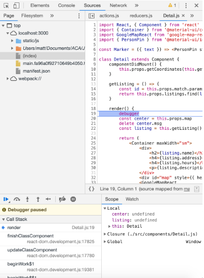
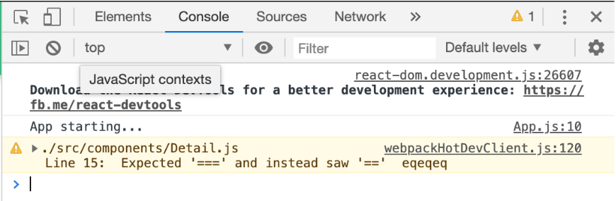

# Intro to Debugging

*In a gentle way, you can shake the world. —Mahatma Gandhi*

## Recap and Review

Remember to stay on task! All of this planning is not for naught! It's intended to teach you actual professional practices which are intended to keep you focused and mentally organized. Any time you're feeling overwhelmed it's because you're thinking of all the things to do after what you need to do next.

## Overview

Sometimes our applications are doing what we want them to do and we can't figure out why. The process of figuring out what's wrong with our code and fixing it is called "debugging".

There are various ways to debug things depending on if you are working on the frontend or the backend. Additionally, some debugging tools even tie into your IDE/text editor (VS Code) and allow you to step through your code line by line. For our purposes we will keep this debugging session focused on the frontend.

## The Debugger Statement

You may have already picked this up along the way but if you want to stop the execution of your code on a certain line you can simply type debugger anywhere in your code. For example:

=== "Debugger Statement Example"

    ```javascript
      const App = (props) => {
          const count = props.count
          debugger // <-- JavaScript keyword

          return (
              <div>
                  <h1>Here's our App</h1>
              </div>
          )
      }
    ```

The `debugger` will stop your code after the ``count` variable is initialized. You might put a debugger there to analyze your props if the count is not what you expect. An important thing to note however is that you cannot place the `debugger` statement inside of HTML code. It needs to be in the JavaScript logic. So that means you can't do something like this:

=== "Broken Debugger Statement Example"

    ```javascript
      const App = (props) => {
          const count = props.count

          return (
              <div>
              debugger // <-- JavaScript keyword
                  <h1>Here's our App</h1>
              </div>
          )
      }
    ```

However, there are still a lot of options for places to use this especially when you are using class components with multiple methods. For example:

=== "Another user of the `debugger` Keyword"

    ```javascript
      class App extends Component {
          state = {
              text: ''
          }

          submit = (e) => {
              e.preventDefault()
              // check text
              const text = this.state.text
              debugger
              // make an api call with a redux action: submitForm
              this.props.submitForm(text)
          }

          render() {
              return (
                  <div>
                      <form onSubmit={this.submit}>
                          <TextField value={this.text} />
                          <Button type="submit">Submit</Button>
                      </form>
                  </div>
              )
          }
      }
    ```

And yes it also means you can use the `debugger` statement in your Redux actions or reducers.

=== "`debugger` used in Redux Action"

    ```javascript
    const users = (state = [], action) => {
      switch(action.type) {
          case 'ADD_USER':
              // check value
              debugger
              return [ ...state, action.value ]
          default:
              return state
      }
    }
    ```



Once the debugger stops, you can then "step over", "step into" or "step out of" different functions and lines of code. These are shown by the buttons on the bottom left. The "play" button will resume execution and take you either to the next debugger statement or simply stop debugging if there's nothing left to do. The most common operation is the "step over" button indicated by the circular arrow. Clicking that button will take you to the next line of code.

### Console Log

Another way of debugging is to make use of `console.log` statements. This is another thing you've already seen but we can brush up on where to use it and how to see it in the browser. In your JS311 class, when you `console.log`ged something it showed up in the terminal. That's not how it works with code on the front-end. When you use the `console.log` statement in React the items that you logged appear in the browser's console just like in 101.



Again, just like the `debugger` statement, this can be placed anywhere in the JavaScript context of your code. So for example in our reducer:

=== "Log Statement in a Redux Reducer"

    ```javascript
    const users = (state = [], action) => {
      switch(action.type) {
        case 'ADD_USER':
          console.log('The user: ', action.value)
          return [ ...state, action.value ]
        default:
          return state
      }
    }
    ```

And now the `user` will be logged to the console window.

## See It - Debugging in VS Code

<!-- ! Video Contents: Vimeo, Ihatetomatoes - How to Debug React Apps in VS Code -->
<iframe width="655" height="368" src="https://www.youtube.com/embed/PJeNReqyH88" title="YouTube video player" frameborder="0" allow="accelerometer; autoplay; clipboard-write; encrypted-media; gyroscope; picture-in-picture" allowfullscreen></iframe>

## Know Your Docs

- [ ] [MDN Docs - Debugger Statement](https://developer.mozilla.org/en-US/docs/Web/JavaScript/Reference/Statements/debugger)
- [ ] [VS Code Docs - Debugging](https://code.visualstudio.com/docs/editor/debugging)