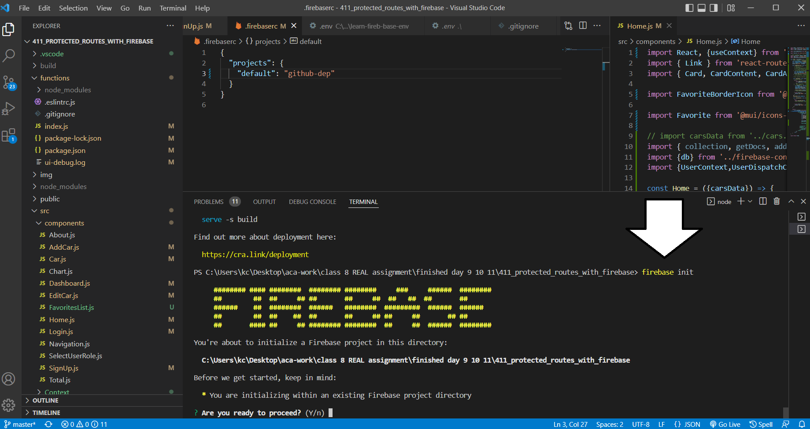
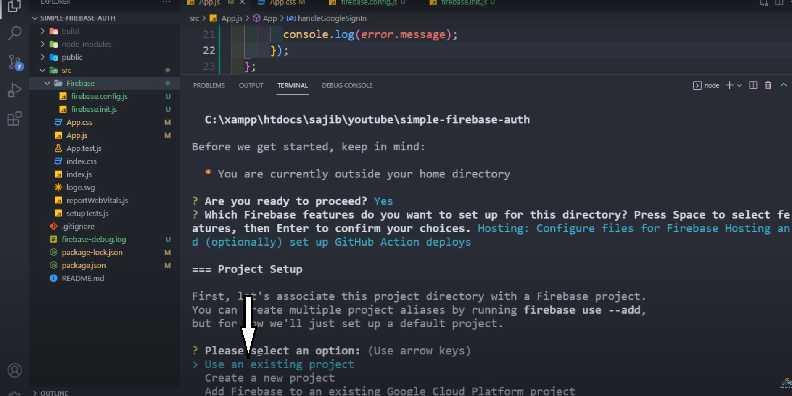
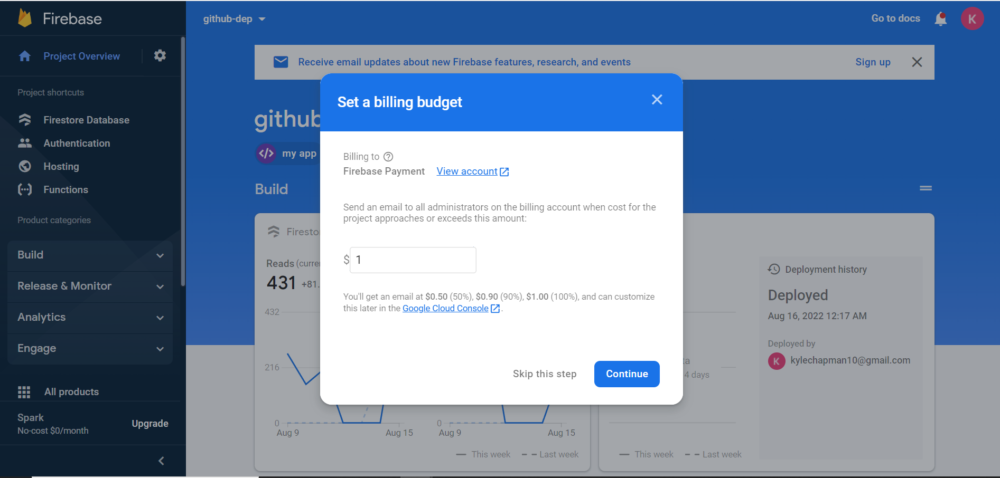

## Overview
Use to deploy your capstone. Same directions from  [pre-class 14](./deploytFireBase.md) but, just the deploy directions and nothing more.

### Pre-Deployment and Preparation

- [ ] If you have the functions emulator line of code, (whether you are going to use functions or not) comment out the emulator code.

- [ ] You should have Firebase tools installed already from the directions in the [serverless function](./../module-3/serverless.md) lesson. If not run `npm install -g firebase-tools`.
- [ ] Same with Login to firebase CLI. Run `firebase login` to see if you are logged-in. If not, do so with the same email/account as used for your firebase account.

## Deploying with FireBase

 Directions to deploy any React project including your Capstone App. 

> NOTE: If you're unable to see them clearly zoom-in on the picture with ++ctrl++ + ++plus++ .

- [ ] Make sure you're in the root directory of your project.

- [ ] Run `npm run build`

- [ ] initialize the project `firebase init`

- [ ] Are you ready to proceed? Type ++y++ 

- [ ] Select Hosting: Configure files for Firebase Hosting and *optionally* set up GitHub Action deploys. Use arrow keys to move and  ++space++ to make selection then press ++enter++ to confirm selection and to continue.

- [ ] Select "use an existing project"

- [ ] Then select your project by name, Fake Cars...etc.

- [ ] What do you want to use as your public directory? (public) type  `build`

- [ ] Configure as a single-page app (rewrite all URLs to /index.html)? Press ++y++

- [ ] Set up automatic builds and deploys with GitHub? Press ++n++

- [ ] File build/index.html already exists. Overwrite? Press ++n++

- [ ] Run `firebase deploy --only hosting`

You will get a URL with the link to your deployed site in the terminal and can also be found on your FireBase console under "Build" >> "Hosting".

### Serverless Cloud Functions Deploy

If your app is using serverless cloud functions use the following directions. **You will have to upgrade to a paid plan.** This is very common with cloud deploys involving back-end server side code. Remember there is a free tier with no charge if your app stays under a certain amount of data usage and you can set a budget later. Reference the [pricing guide](https://firebase.google.com/pricing) for more details.

 - [ ] Click "Upgrade project" under the functions menu and follow the directions and prompts with your relevant information.

 

 - [ ] Set your budget.

 

- [ ] In your terminal run `firebase deploy --only functions`. If you get errors follow directions below; otherwise, go test your app and see if your live deployed app works as expected.

#### Errors

- [ ] If you get the **CLRF LF error**: click on `.eslintrc.js` and comment out the entire file. Eslint is just for formatting and code styling; it will not change how your app works. Also, this `.eslintrc.js` file only works for our `functions/index` file. The eslint used for all our React/front-end code will not be affected. There is a potential bug with line formatting and the version of eslint used in functions folder, so this will help us get our app deployed. 

#### Re-Run Deploy

When you've built a new version of your app and you just need to update the deployed version, without having to go through all the previous steps again, just run these:

- [ ] Run `npm build`
- [ ] Run  `firebase deploy --only hosting`
- [ ] And or run `firebase deploy --only functions` for cloud functions changes. 