# App Deployment

*Happiness is a butterfly, which when pursued, is always just beyond your grasp, but which, if you will sit down quietly, may alight upon you. —Nathaniel Hawthorne*

## Overview and Intro to Hosting

*When the best things are not possible, the best may be made of those that are. —Richard Hooker*

Hosting is the process of making your application accessible to the internet. In the past, this involved buying a piece of hardware (a server), deploying your application to that server and creating your own firewall rules so that people could interface with your site or API(Serverless cloud functions). Nowadays there are numerous cloud services that do these types of things for us. One of those services is FireBase, and since we have already used FireBase to create our database, we will continue working with this technology.

We've spent a lot of time in this course learning how to build APIs and we've on LOCALHOST.

  > As a reminder, localhost is basically a local server that we run our code on for testing and development purposes.

As a recap, FireBase is a service that allows us access to the hundreds of thousands of servers that Google uses to run its business. Amazon Web Services (AWS) works in a very similar way. When these big companies have extra server space they rent out the resources to us so that we can make use of them for our projects. So when we say the servers are "in the cloud", we really just mean that the actual hardware lives somewhere else and is configurable over the internet. We are going to use some of these resources to "host" our API(Serverless cloud functions).

We learned why deploying our apps is a necessity. *We want everyone on the internet to be able to access what we've created, right?* Then eventually you can use these directions and what you learn here to deploy your Capstone app and everything else you build in the future!

### Pre-Deployment and Preparation

- [ ] If you have the functions emulator line of code, (whether you are going to use functions or not) comment out the emulator code.

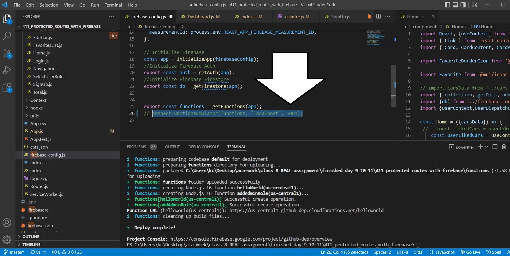

- [ ] You should have Firebase tools installed already from the directions in the [serverless function](./../module-3/serverless.md) lesson. If not run `npm install -g firebase-tools`.
- [ ] Same with Login to firebase CLI. Run `firebase login` to see if you are logged-in. If not, do so with the same email/account as used for your firebase account.

## Deploying with FireBase

We are going to deploy our [Fake Cars assignment we started in Class 8](../module-2/class-8.md). You can use these directions to deploy any React project including your Capstone App for graduation. 

> NOTE: If you're unable to see them clearly zoom-in on the picture with ++ctrl++ + ++plus++ .

- [ ] Make sure you're in the root directory of your project.

- [ ] Run `npm run build`

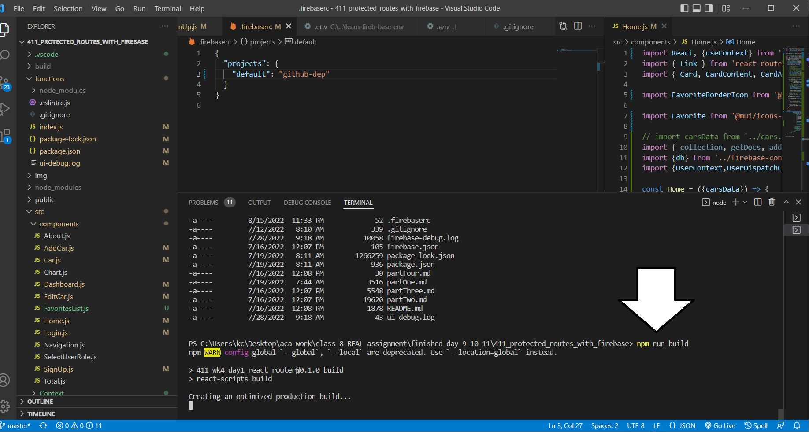

- [ ] initialize the project `firebase init`

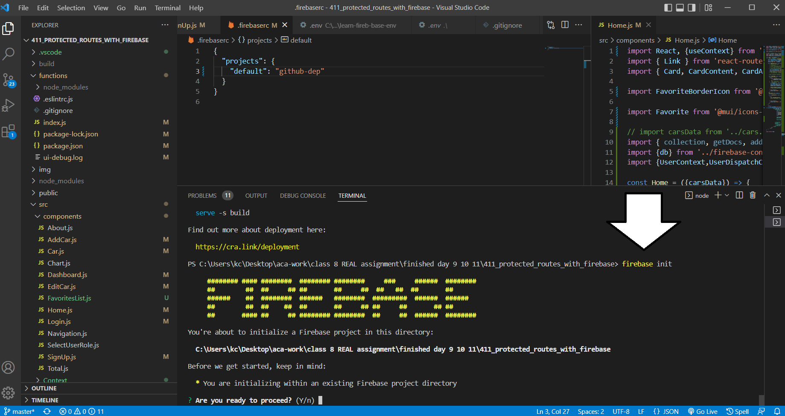

- [ ] Are you ready to proceed? Type ++y++ 

- [ ] Select Hosting: Configure files for Firebase Hosting and *optionally* set up GitHub Action deploys. Use arrow keys to move and  ++space++ to make selection then press ++enter++ to confirm selection and to continue.

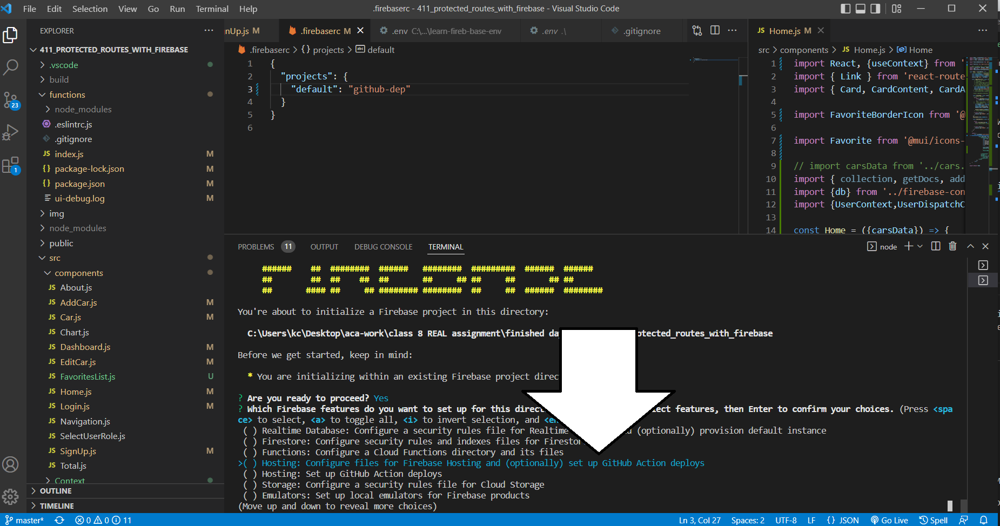

- [ ] Select "use an existing project"

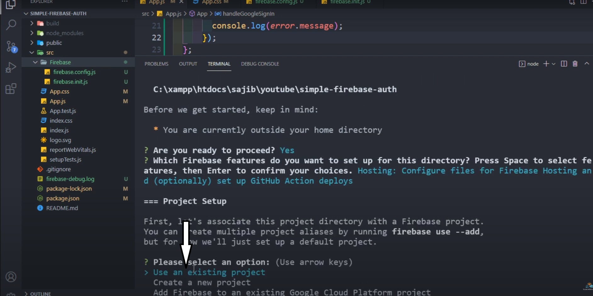

- [ ] Then select your project by name, Fake Cars...etc.

- [ ] What do you want to use as your public directory? (public) type  `build`

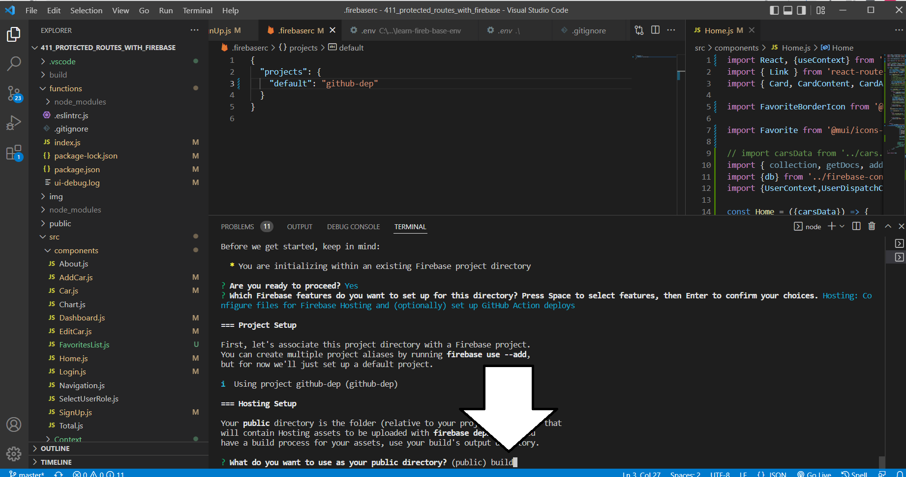

- [ ] Configure as a single-page app (rewrite all URLs to /index.html)? Press ++y++

- [ ] Set up automatic builds and deploys with GitHub? Press ++n++

- [ ] File build/index.html already exists. Overwrite? Press ++n++

- [ ] Run `firebase deploy --only hosting`

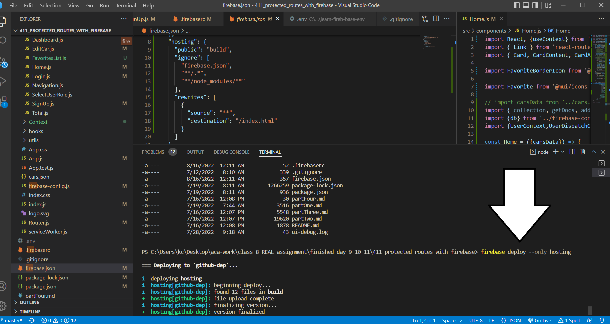

You will get a URL with the link to your deployed site in the terminal and can also be found on your FireBase console under "Build" >> "Hosting".

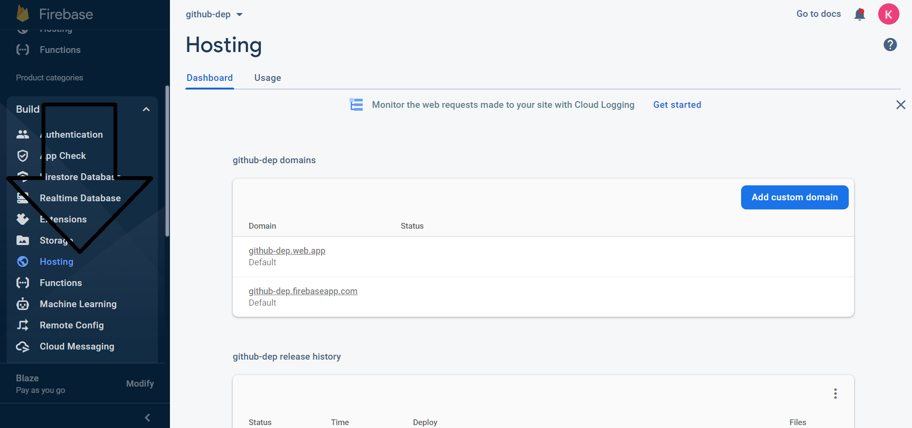

### Serverless Cloud Functions Deploy

If your app is using serverless cloud functions use the following directions. **You will have to upgrade to a paid plan.** This is very common with cloud deploys involving back-end server side code. Remember there is a free tier with no charge if your app stays under a certain amount of data usage and you can set a budget later. Reference the [pricing guide](https://firebase.google.com/pricing) for more details.

 - [ ] Click "Upgrade project" under the functions menu and follow the directions and prompts with your relevant information.

 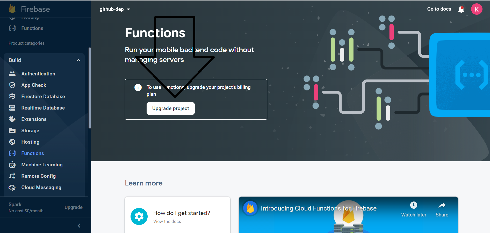

 - [ ] Set your budget.

 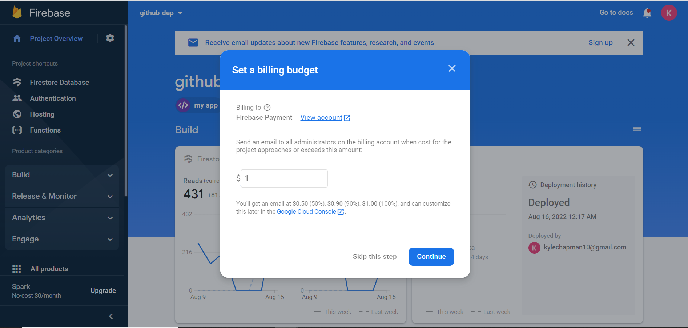

- [ ] In your terminal run `firebase deploy --only functions`. If you get errors follow directions below; otherwise, go test your app and see if your live deployed app works as expected.

#### Errors

- [ ] If you get the **CLRF LF error**: click on `.eslintrc.js` and comment out the entire file. Eslint is just for formatting and code styling; it will not change how your app works. Also, this `.eslintrc.js` file only works for our `functions/index` file. The eslint used for all our React/front-end code will not be affected. There is a potential bug with line formatting and the version of eslint used in functions folder, so this will help us get our app deployed. 

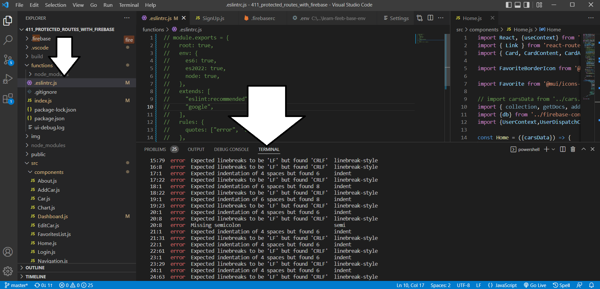

#### Re-Run Deploy

When you've built a new version of your app and you just need to update the deployed version, without having to go through all the previous steps again, just run these:

- [ ] Run `npm build`
- [ ] Run  `firebase deploy --only hosting`
- [ ] And or run `firebase deploy --only functions` for cloud functions changes. 

## Additional Resources

- [ ] [firebase](https://firebase.google.com/docs/hosting/test-preview-deploy) - Firebase Hosting enables you to view and test changes locally and interact with emulated backend project resources.
